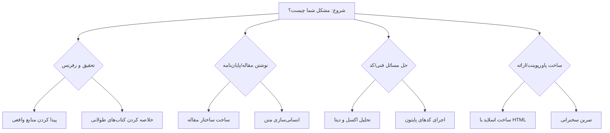



# 🏴‍☠️ جعبه‌ابزار هوش مصنوعی برای دانشجویان
### The AI Student Handbook

**گذار از "مصرف‌کننده ساده" به "مهندس دانش".**

<!-- Badges -->

---

## 🧐 چرا این مخزن وجود دارد؟ (Manifesto)

بیایید روراست باشیم: **دانشگاه‌ها عقب مانده‌اند.**
شما در حال یادگیری مهارت‌هایی هستید که شاید تا زمان فارغ‌التحصیلی‌تان توسط هوش مصنوعی منسوخ شده باشند.

از طرف دیگر، اغلب دانشجویان از هوش مصنوعی (ChatGPT) اشتباه استفاده می‌کنند. درست است که هوش مصنوعی ابزار قدرتمندی است، اما اگر ندانید چطور کار می‌کند، تبدیل به دشمن شما می‌شود.

**مشکلات اصلی کجاست؟**
1.  **توهم (Hallucination):** هوش مصنوعی با اعتماد‌به‌نفس کامل، رفرنس‌های علمی دروغین می‌سازد.
2.  **سطحی بودن:** جواب‌ها همیشه "میانگین اینترنت" هستند و نمره ۲۰ (Outlier) نمی‌گیرند.
3.  **قابل ردیابی:** متنی که کپی می‌کنید، یک "لحن رباتیک" دارد و ابزارهای تشخیص AI فوراً آن را لو می‌دهند.

**در این مخزن یاد می‌گیریم چطور از هوش مصنوعی "هوشمندانه‌تر" استفاده کنیم و خروجی‌هایی بگیریم که نه تنها تابلو نباشد، بلکه استاد فکر کند روزها روی آن وقت گذاشته‌اید.** =)

> **نکته:** مهم نیست رشته‌تان چیست یا چقدر کامپیوتر بلدید؛ این مسیر طوری طراحی شده که حتی اگر تا حالا یک خط کد هم ننویسید، بتوانید مثل یک مهندس حرفه‌ای از آن استفاده کنید. اینجا تنها چیزی که لازم دارید **کنجکاوی** است.

---

## 🗺️ مسیر یادگیری (Roadmap)

این هندبوک طوری طراحی شده که می‌توانید مستقیماً سراغ مشکل خودتان بروید. نیازی به خواندن ترتیبی نیست.

---

## 📚 محتوای دوره (What You Will Learn)

این یک کتاب درسی خسته‌کننده نیست. این یک مجموعه **"دستورالعمل جنگی"** (Battle-tested Playbooks) است.

### 🧠 [مرحله ۰: مقدمه و ذهنیت (Start Here)](docs/00-intro/)
قبل از اینکه دست به کیبورد بزنید، باید بفهمید بازی چطور عوض شده است.
*   **[`00-roadmap.md`](docs/00-intro/00-roadmap.md)**: نقشه راه استفاده از این هندبوک.
*   **[`01-mindset-and-ethics.md`](docs/00-intro/01-mindset-and-ethics.md)**: مرز باریک بین "هوشمندی" و "سرقت ادبی". چرا استاد می‌فهمد؟

### 🛠️ [مرحله ۱: زرادخانه ابزارها (The Toolkit)](docs/01-fundamentals/)
شناخت عمیق ابزارهایی که دیگران فقط سطحی از آن‌ها استفاده می‌کنند.
*   **[`02-how-llms-work.md`](docs/01-fundamentals/02-how-llms-work.md)**: چرا هوش مصنوعی دروغ می‌گوید؟ (مفهوم Next Token Prediction).
*   **[`03-model-comparison.md`](docs/01-fundamentals/03-model-comparison.md)**: جنگ مدل‌ها! GPT-4o یا Claude 3.5 یا Gemini؟ کدام برای کدنویسی و کدام برای نوشتن بهتر است؟
*   **[`04-research-tools.md`](docs/01-fundamentals/04-research-tools.md)**: معرفی ابزارهای **Perplexity** و **Consensus** برای پیدا کردن رفرنس‌های واقعی (خداحافظی با توهم).

### 🗣️ [مرحله ۲: مهندسی پرامپت (Prompt Engineering)](docs/02-prompt-engineering/)
یادگیری زبان صحبت با ماشین. تبدیل "چت کردن" به "برنامه‌نویسی به زبان طبیعی".
*   **[`05-prompt-basics.md`](docs/02-prompt-engineering/05-prompt-basics.md)**: اصول اولیه و ساختار یک دستور استاندارد.
*   **[`06-advanced-frameworks.md`](docs/02-prompt-engineering/06-advanced-frameworks.md)**: فریم‌ورک‌های حرفه‌ای مثل **RISEN** و **CO-STAR** برای خروجی‌های دقیق.
*   **[`07-system-instructions.md`](docs/02-prompt-engineering/07-system-instructions.md)**: تنظیمات "Custom Instructions" برای شخصی‌سازی دائمی ChatGPT.
*   **[`08-prompt-generation.md`](docs/02-prompt-engineering/08-prompt-generation.md)**: تکنیک متا-پرامپتینگ (Meta-Prompting): از خودِ هوش مصنوعی بخواهیم برایمان پرامپت بنویسد.

### ✍️ [مرحله ۳: تحقیق و نگارش (Writing & Research)](docs/03-research-writing/)
نوشتن مقالات و پایان‌نامه‌هایی که هم علمی باشند و هم "انسانی".
*   **[`09-academic-research.md`](docs/03-research-writing/09-academic-research.md)**: روش فیش‌برداری مدرن؛ خلاصه کردن ۵۰ مقاله در ۱۰ دقیقه.
*   **[`10-academic-writing.md`](docs/03-research-writing/10-academic-writing.md)**: معماری مقاله؛ از ساختار (Outline) تا پاراگراف‌نویسی.
*   **[`11-humanizing-text.md`](docs/03-research-writing/11-humanizing-text.md)**: **مهم!** تکنیک‌های دور زدن تشخیص هوش مصنوعی (AI Detection) با تزریق "نقص انسانی".

### 💻 [مرحله ۴: قدرت فنی (Technical Edge)](docs/04-technical-skills/)
حتی اگر برنامه‌نویس نیستید، اینجا یاد می‌گیرید مثل یک هکر عمل کنید.
*   **[`12-environment-setup.md`](docs/04-technical-skills/12-environment-setup.md)**: نصب VS Code و Python برای غیرکامپیوتری‌ها.
*   **[`13-data-analysis.md`](docs/04-technical-skills/13-data-analysis.md)**: آپلود فایل اکسل و دریافت تحلیل‌های آماری و نمودار (بدون دانستن فرمول).
*   **[`14-python-automation.md`](docs/04-technical-skills/14-python-automation.md)**: اجرای اسکریپت‌های ساده پایتون که هوش مصنوعی برایتان نوشته است.

### 🎤 [مرحله ۵: صحنه نمایش (Presentation)](docs/05-presentations/)
ارائه‌هایی که مخاطب را میخکوب می‌کند، نه خواب‌آلود.
*   **[`15-presentation-structure.md`](docs/05-presentations/15-presentation-structure.md)**: داستان‌سराई و سناریو‌نویسی برای ارائه.
*   **[`16-html-slides.md`](docs/05-presentations/16-html-slides.md)**: ساخت اسلایدهای تعاملی با HTML و Reveal.js (جایگزین پاورپوینت).
*   **[`17-speaker-notes.md`](docs/05-presentations/17-speaker-notes.md)**: تولید متن سخنرانی و یادداشت‌های مخفی برای روز ارائه.

---

## 🚀 چطور شروع کنم؟ (Quick Start)

1.  این مخزن را **Star** ⭐ کنید تا گمش نکنید.
2.  از پوشه **[00-intro](docs/00-intro/00-roadmap.md)** شروع کنید و قدم به قدم جلو بروید.
3.  تمرین‌ کنید. خواندن کافی نیست؛ باید دست به کیبورد شوید.

---

## 💡 سخن پایانی (Final Thoughts)

در عصر هوش مصنوعی، مانع اصلی دیگر «جست‌وجو» یا «کدنویسی» نیست؛ مانع اصلی، **«تخیل»** و **«منطق»** شماست. ما در حال گذار از دورانی هستیم که دانشجو باید زبان کامپیوتر را یاد می‌گرفت، به دورانی که کامپیوتر بالاخره یاد گرفته است زبان ما را بفهمد.

> "هوش مصنوعی جایگزین انسان نخواهد شد؛ اما انسانی که از هوش مصنوعی استفاده می‌کند، قطعاً جایگزین انسانی خواهد شد که از آن استفاده نمی‌کند."

برنده نهایی، قوی‌ترین کامپیوتر یا باهوش‌ترین انسان نیست؛ برنده کسی است که **بهترین تعامل** را با ماشین دارد.

روزی که ماشین حساب اختراع شد، ریاضیدانان متوقف نشدند؛ بلکه شروع به حل مسائل پیچیده‌تر کردند. امروز هوش مصنوعی **ماشین‌حسابِ عصر نوین** است. مقاومت در برابر آن، محافظت از علم نیست؛ بلکه محروم کردن خودمان از حل مسائل بزرگ‌تر است.

**یادتان باشد: دی‌جی (DJ) آهنگساز نیست! شما دارید دانش موجود را «میکس» می‌کنید، نه اینکه علم جدید «خلق» کنید.**

این ابزار به ما اجازه می‌دهد تا از سطح «انجام وظیفه» به سطح «خلق ارزش» صعود کنیم.

---

## 🤝 مشارکت (Contributing)

این مخزن برای دانشجویان ایرانی طراحی شده است. اگر تکنیک جدیدی یاد گرفتید یا پرامپت بهتری پیدا کردید، لطفاً آن را به اشتراک بگذارید (Pull Request).

**ساخته شده با AI (و کمی قهوه ☕) برای دانشجویان**

