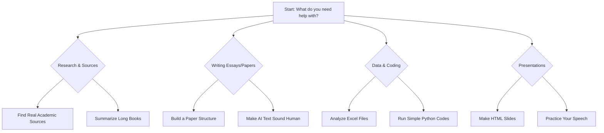

# 🏴‍☠️ The AI Student Handbook
### A Practical Guide to Using AI in University

**Go from a "simple user" to a "smart AI engineer."**

 

<!-- BIG BOLD BUTTON FOR PERSIAN VERSION -->
<h3>
  <a href="./docs/fa/README-fa.md">
   برای مطالعه نسخه فارسی کلیک کنید
  </a>
</h3>

  

<!-- Badges -->

---

## 🧐 Why Does This Guide Exist?

Let's be honest: **The way we study is changing fast.** 
You are learning skills right now that AI can already do in seconds. 

However, many students use AI (like ChatGPT) the wrong way. AI is a powerful tool, but if you don't know how it works, it can cause more problems than it solves.

**What are the main mistakes students make?**
1. **Fake Information (Hallucinations):** AI confidently makes up fake book titles and academic references.
2. **Basic Answers:** Copy-pasting from AI usually gives you an "average" answer, which won't get you top grades.
3. **Robotic Tone:** The text sounds unnatural, and professors or AI-checkers can easily catch it.

**In this repository, we will learn how to use AI the right way.** We will learn how to get high-quality results that look natural, professional, and actually help you learn. =)

> **Note:** It doesn't matter what your major is or if you have never coded before. This guide is made for everyone. All you need is **curiosity**.

---

## 🗺️ The Roadmap 

You don't need to read this from start to finish. Just click on what you need help with right now:

```mermaid
graph TD
    A[Start: What do you need help with?] --> B{Research & Sources}
    A --> C{Writing Essays/Papers}
    A --> D{Data & Coding}
    A --> E{Presentations}

    B --> B1[Find Real Academic Sources]
    B --> B2[Summarize Long Books]
    
    C --> C1[Build a Paper Structure]
    C --> C2[Make AI Text Sound Human]
    
    D --> D1[Analyze Excel Files]
    D --> D2[Run Simple Python Codes]
    
    E --> E1[Make HTML Slides]
    E --> E2[Practice Your Speech]
```

---

## 📚 Course Content (What You Will Learn)

This is a set of practical guides. Read a section, use the prompt, and see the results.

### 🧠 [Phase 0: Start Here](./docs/en/00-intro/)
Before using the tools, understand the rules of the game.
*   **[`00-roadmap.md`](./docs/en/00-intro/00-roadmap.md)**: Your map for this handbook.
*   **[`01-mindset-and-ethics.md`](./docs/en/00-intro/01-mindset-and-ethics.md)**: The line between "working smart" and "cheating." Why do professors notice AI text?

### 🛠️ [Phase 1: The Toolkit](./docs/en/01-fundamentals/)
Learn about better AI tools for students.
*   **[`02-how-llms-work.md`](./docs/en/01-fundamentals/02-how-llms-work.md)**: Why does AI lie to us? (How it predicts words).
*   **[`03-model-comparison.md`](./docs/en/01-fundamentals/03-model-comparison.md)**: Which AI is best? GPT-4o for code, Claude for writing, or Gemini?
*   **[`04-research-tools.md`](./docs/en/01-fundamentals/04-research-tools.md)**: Using tools like **Perplexity** and **Consensus** to find 100% real citations.

### 🗣️ [Phase 2: Prompt Engineering](./docs/en/02-prompt-engineering/)
Learn how to talk to AI to get exactly what you want.
*   **[`05-prompt-basics.md`](./docs/en/02-prompt-engineering/05-prompt-basics.md)**: The parts of a great AI prompt.
*   **[`06-advanced-frameworks.md`](./docs/en/02-prompt-engineering/06-advanced-frameworks.md)**: Professional frameworks like **RISEN** and **CO-STAR**.
*   **[`07-system-instructions.md`](./docs/en/02-prompt-engineering/07-system-instructions.md)**: How to personalize your ChatGPT so it always knows what you need.
*   **[`08-prompt-generation.md`](./docs/en/02-prompt-engineering/08-prompt-generation.md)**: Asking the AI to write the perfect prompt for you.

### ✍️ [Phase 3: Research & Writing](./docs/en/03-research-writing/)
Write better papers and make them sound like you.
*   **[`09-academic-research.md`](./docs/en/03-research-writing/09-academic-research.md)**: How to summarize 50 papers in 10 minutes.
*   **[`10-academic-writing.md`](./docs/en/03-research-writing/10-academic-writing.md)**: How to structure your essay from start to finish.
*   **[`11-humanizing-text.md`](./docs/en/03-research-writing/11-humanizing-text.md)**: **Important!** How to edit AI text so it sounds human and natural.

### 💻 [Phase 4: Technical Edge](./docs/en/04-technical-skills/)
Learn to use AI for tech tasks, even if you are not a computer science student.
*   **[`12-environment-setup.md`](./docs/en/04-technical-skills/12-environment-setup.md)**: A very simple guide to installing VS Code and Python.
*   **[`13-data-analysis.md`](./docs/en/04-technical-skills/13-data-analysis.md)**: How to make charts from Excel files in seconds.
*   **[`14-html-visualization.md`](./docs/en/04-technical-skills/14-html-visualization.md)**: Creating beautiful web visuals with AI.
*   **[`15-python-automation.md`](./docs/en/04-technical-skills/15-python-automation.md)**: Asking AI to write and run Python scripts for you.

### 🎤 [Phase 5: Presentations](./docs/en/05-presentations/)
Make presentations that are actually fun to watch.
*   **[`16-presentation-structure.md`](./docs/en/05-presentations/16-presentation-structure.md)**: How to tell a good story in your presentation.
*   **[`17-html-slides.md`](./docs/en/05-presentations/17-html-slides.md)**: Building interactive slides with code instead of PowerPoint.
*   **[`18-speaker-notes.md`](./docs/en/05-presentations/18-speaker-notes.md)**: Using AI to write your speech and speaking notes.

---

## 🚀 Quick Start

1. **Star** ⭐ this repository so you can easily find it later.
2. Go to the **[00-intro](./docs/en/00-intro/00-roadmap.md)** folder and start reading.
3. **Practice!** Just reading isn't enough; open your AI tool and test the prompts yourself.

---

## 💡 Final Thoughts

Today, the hardest part of university isn't "searching for information" or "coding." The hardest part is using your **imagination** and **logic**. 

> "AI will not replace humans, but humans who use AI will replace humans who don't."

When the calculator was invented, math didn't stop; people just started solving bigger problems. Today, **AI is the new calculator**. 

**Think of yourself as a DJ.** A DJ mixes different songs to create a great track. With AI, you are mixing information and ideas to create something valuable. AI takes care of the typing, so you can focus on the thinking.

---

## 🤝 Contributing

This handbook was made to help students everywhere. If you learn a new trick or find a great prompt, please share it with us! (Pull Requests are welcome).

**Built with AI (and a lot of coffee ☕) for students everywhere.**

