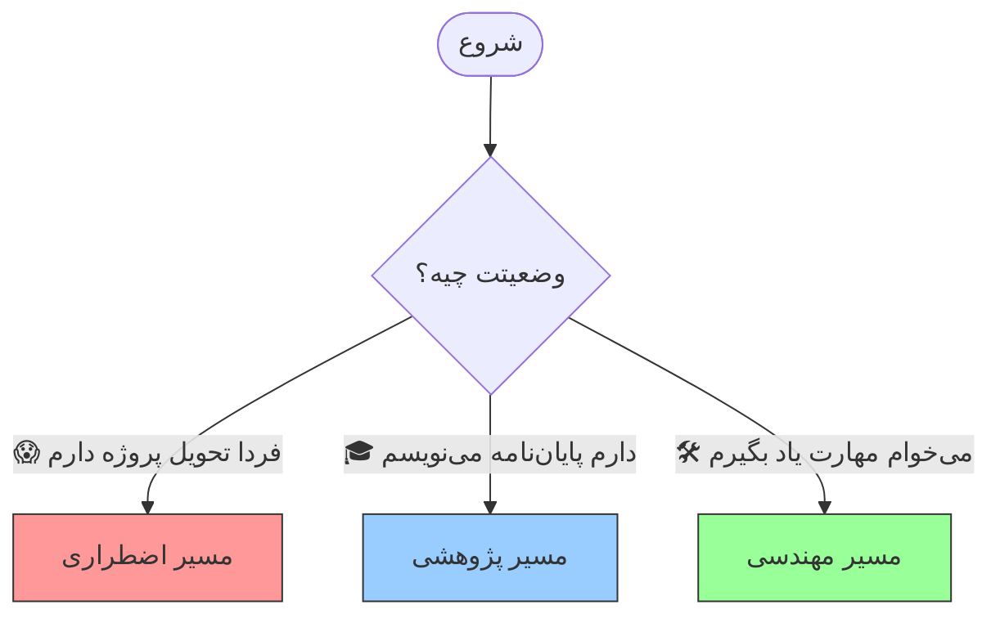



# 🗺️ نقشه راه: چطور از این هندبوک استفاده کنیم؟
### The Learning Roadmap

[🏠 بازگشت به خانه](../../README.md) | [درس بعدی: ذهنیت و اخلاق >](01-mindset-and-ethics.md)

---

## 🎯 هدف این دوره چیست؟

بگذارید همین اول خیالتان را راحت کنم:
*   ❌ **ریاضیات پیچیده؟** نداریم.
*   ❌ **برنامه‌نویسی پیشرفته؟** لازم نیست.
*   ❌ **هزینه دلاری؟** اکثر ابزارها رایگان هستند.

**هدف ما:** تبدیل شما به یک **"دانشجوی هیبریدی"** است.
کسی که لازم نیست همه چیز را حفظ باشد، بلکه می‌داند چطور "ابزارها" را مدیریت کند تا سخت‌ترین کارها (مثل تحلیل دیتا یا نوشتن مقاله) را در چند دقیقه انجام دهد.

---

## 🚦 از کجا شروع کنم؟ (مسیرهای یادگیری)

این هندبوک خطی نیست. لازم نیست از صفحه ۱ تا ۱۰۰ بخوانید. بسته به وضعیت فعلی‌تان، یکی از مسیرهای زیر را انتخاب کنید:

### ۱. مسیر اضطراری (The Night Before Deadline) 🚑
*وضعیت: وقت ندارید، استرس دارید و فقط می‌خواهید کارتان راه بیفتد.*

1.  **فایل [`05-prompt-basics`](../02-prompt-engineering/05-prompt-basics.md)**: یاد بگیرید چطور درست سوال بپرسید تا جواب پرت نگیرید.
2.  **فایل [`10-academic-writing`](../03-research-writing/10-academic-writing.md)**: برای تولید سریع متن اولیه (Draft).
3.  **فایل [`11-humanizing-text`](../03-research-writing/11-humanizing-text.md)**: **حیاتی!** تکنیک‌های دور زدن تشخیص هوش مصنوعی (وگرنه نمره صفر می‌گیرید).

### ۲. مسیر پژوهشی (The Thesis Mode) 🎓
*وضعیت: دنبال کار عمیق، دقیق و علمی هستید (برای مقاله یا پایان‌نامه).*

1.  **فایل [`04-research-tools`](../01-fundamentals/04-research-tools.md)**: ابزارهایی مثل Consensus برای پیدا کردن رفرنس‌های واقعی.
2.  **فایل [`09-academic-research`](../03-research-writing/09-academic-research.md)**: روش فیش‌برداری مدرن و دسته‌بندی با AI.
3.  **فایل [`13-data-analysis`](../04-technical-skills/13-data-analysis.md)**: تحلیل آماری داده‌ها بدون نیاز به اکسل پیشرفته.

### ۳. مسیر مهندسی (The Builder Mode) 🛠️
*وضعیت: می‌خواهید فراتر از چت کردن بروید و خروجی‌های خاص (کد، نمودار، اسلاید) بگیرید.*

1.  **فایل [`12-environment-setup`](../04-technical-skills/12-environment-setup.md)**: نصب ابزارهای لازم (VS Code).
2.  **فایل [`14-python-automation`](../04-technical-skills/14-python-automation.md)**: اجرای کدهای پایتون که AI برایتان نوشته.
3.  **فایل [`16-html-slides`](../05-presentations/16-html-slides.md)**: ساخت اسلایدهای حرفه‌ای با کد (جایگزین پاورپوینت).

---

## 🧰 چه چیزهایی شاید لازم شود؟ (Suggested Toolkit)

شما برای شروع فقط به یک "مرورگر اینترنت" نیاز دارید. اما برای اینکه حرفه‌ای کار کنید، آشنایی با این‌ها مفید است:

### ۱. مدل‌های هوش مصنوعی (AI Models)
ما فقط به ChatGPT محدود نیستیم. بسته به نیازتان از این‌ها استفاده می‌کنیم:
*   **برای چت روزمره:** ChatGPT یا Claude.
*   **برای تحقیقات عمیق:** DeepSeek (Deep Research) یا Qwen.
*   **برای تحلیل‌های سنگین:** Google AI Studio (Gemini Pro).

##### این لیست قراره خیلی بزرگ تر بشه :)

### ۲. ابزارهای اجرا (Execution Tools)
*   **VS Code:** یک محیط ساده برای اینکه کدهایی که هوش مصنوعی می‌دهد را در آن ذخیره یا اجرا کنید.
*   **Python:** زبان برنامه نویسی که هوش مصنوعی به آن مسلط است (ما فقط آن را نصب می‌کنیم تا AI بتواند کارهایش را انجام دهد).
*   **html:** یه فرمت قدرت مند برای خروجی گرفتن از هوش مصنوعی یا حتی اراعه به استاد!

> **نکته:** نگران نباشید! در بخش‌های بعدی، قدم به قدم نصب و استفاده از این‌ها را یاد می‌گیریم.

---

## 🚀 آماده پرواز؟

حالا که نقشه دستتان آمد، وقتش است که موتورها را روشن کنیم.
قبل از اینکه اولین دستور را تایپ کنید، باید یک "به‌روزرسانی" کوچک روی ذهنیت خودمان انجام دهیم تا در تله‌های رایج نیفتیم.

**[قدم بعدی: نصب سیستم عامل ذهنی جدید (Mindset & Ethics) 👉](01-mindset-and-ethics.md)**

