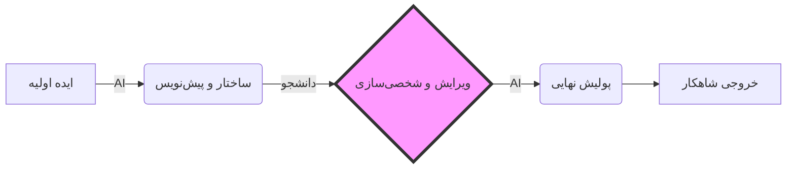



# 🧠 ذهنیت و متدولوژی: چاقوی جراحی یا چاقوی آشپزخانه؟
### The AI Methodology & Mindset

[🏠 بازگشت به خانه](../../README.md) | [درس قبلی: نقشه راه](00-roadmap.md) | [درس بعدی: هوش مصنوعی چطور کار می‌کند؟ >](../01-fundamentals/02-how-llms-work.md)

---

## 🔪 ابزار، ابزار است!

هوش مصنوعی مثل یک **چاقو** است.
می‌توانید با آن سیب‌زمینی پوست بکنید (کارهای روزمره)، می‌توانید با آن جراحی قلب انجام دهید (کارهای تخصصی)، یا می‌توانید دست خودتان را ببرید (استفاده اشتباه).

ما اینجا نیستیم که بگوییم "نکنید"؛ ما اینجاییم که **"تکنیک‌های برش زدن حرفه‌ای"** را یاد بگیریم.
هدف نهایی این است که کیفیت خروجی شما (مقاله، کد، ارائه) آنقدر بالا برود که هیچ انسانی به تنهایی نتواند با آن رقابت کند.

---

## ⛔ چرا روش‌های "کپی-پیست" دیگر جواب نمی‌دهد؟

شاید قبلا می‌توانستید با کپی کردن متن ChatGPT نمره بگیرید، اما الان بازی عوض شده است. متنی که مستقیماً از هوش مصنوعی می‌آید، ۳ نشانه مرگبار دارد که مثل آژیر خطر فریاد می‌زند:

1.  **لحن یکنواخت (Lack of Burstiness):** جملات هوش مصنوعی همیشه "متوسط" و "شیک" هستند. هیچ فراز و فرودی ندارند.
2.  **کلمات تکراری:** واژه‌هایی مثل "در دنیای امروز"، "شایان ذکر است"، "به عبارت دیگر" بیش از حد تکرار می‌شوند.
3.  **عدم عمق:** هوش مصنوعی معمولاً "کلی‌گویی" می‌کند و وارد جزئیات دقیق نمی‌شود.

> **نتیجه:** استاد با خواندن پاراگراف اول می‌فهمد متن مال شما نیست. حتی اگر ابزار تشخیص (AI Detector) نداشته باشد، "حس" متن داد می‌زند. دقیقا همونطور که شما متوجه میشید این مطالب با هوش مصنوعی ساخته شده ;).

---

## 🏗️ متدولوژی جدید: از "تولیدکننده" به "معمار"

اگر می‌خواهید در دانشگاه (و بازار کار آینده) زنده بمانید، باید دیدگاهتان را عوض کنید.
در مدل سنتی، دانشجو "کارگر" بود (تایپ می‌کرد، ترجمه می‌کرد، کد می‌زد).
در مدل جدید، شما **"معمار" (مدیر)** هستید و هوش مصنوعی **"پیمانکار (از نظر من برده)"** شماست.

### تفاوت در چیست؟
*   **معمار (شما):** نقشه را می‌کشد، استراتژی را تعیین می‌کند، کیفیت را کنترل می‌کند و مسئولیت نهایی با اوست.
*   **پیمانکار (AI):** آجرها را می‌چیند، دیوارها را بالا می‌برد و کارهای تکراری را انجام می‌دهد.

### مدل قدیمی (بازنده) ❌
*   **دانشجو:** "یه مقاله درباره تاریخ معماری بنویس."
*   **AI:** (تولید متن عمومی)
*   **دانشجو:** (کپی -> پیست -> تحویل)
*   **نتیجه:** نمره متوسط یا رد شدن.

### مدل جدید (برنده) ✅
*   **دانشجو:** "من دارم روی این ایده کار می‌کنم. این ۳ تا مقاله رو بخون و نکات کلیدی‌شون رو استخراج کن."
*   **AI:** (خلاصه سازی و تحلیل)
*   **دانشجو:** (ترکیب ایده‌ها، اضافه کردن نظر شخصی و اصلاح متن)
*   **نتیجه:** یک اثر منحصر به فرد با سرعت ۱۰ برابر.

> [!TIP]
> **قانون ۲۰/۸۰ :**
> ۸۰٪ زمانتان را صرف "طراحی سوال درست" و "بررسی خروجی" کنید. فقط ۲۰٪ زمان را صرف "نوشتن یا کدنویسی دستی" کنید.

---

## ⚖️ چالش کپی‌رایت و رفرنس‌دهی (Plagiarism & Citation)

یکی از بزرگترین مشکلات فنی کار با AI، بحث **مالکیت معنوی** و **رفرنس** است. نه به خاطر "اخلاق"، بلکه به خاطر "اعتبار علمی".

### ۱. مشکل کجاست؟ (The Black Box Problem)
مدل‌های زبانی (LLMs) جملات را بر اساس احتمالات می‌سازند، نه بر اساس "کپی کردن از یک کتاب خاص". بنابراین وقتی متنی تولید می‌کنند، ممکن است این متن:
*   ناخواسته شبیه متن یک نویسنده دیگر باشد (Plagiarism تصادفی).
*   رفرنس‌هایی بسازد که وجود خارجی ندارند (Hallucination).

### ۲. راهکار فنی (The Citation Workflow)
برای اینکه کارتان از نظر آکادمیک و قانونی تمیز باشد، باید این چرخه را رعایت کنید:

1.  **منابع را خودتان پیدا کنید:** از ابزارهایی مثل **Consensus** یا **Google Scholar** استفاده کنید تا ۵ مقاله معتبر پیدا کنید.
2.  **تزریق منبع (Source Injection):** متن مقالات یا چکیده آن‌ها را به هوش مصنوعی بدهید.
3.  **دستور استناد:** به AI بگویید: *"فقط بر اساس این متن‌هایی که فرستادم بنویس و هر جا ادعایی کردی، طبق فرمت APA (نویسنده، سال) رفرنس بده."*

> **نتیجه:** متنی دارید که هوش مصنوعی نوشته، اما اعتبار علمی آن **تضمین شده** است و رفرنس‌ها واقعی هستند.

---

## 🚀 چه کارهای پیشرفته‌ای می‌توان کرد؟ (Advanced Capabilities)

بیایید سطح توقعمان را از "یک مقاله بنویس" بالاتر ببریم. ببینید چه کارهای عجیبی می‌توانید انجام دهید:

### ۱. شبیه‌ساز مناظره (The Devil's Advocate) 😈
قبل از دفاع پایان‌نامه، طرح خود را به AI بدهید و بگویید:
*"تو سخت‌گیرترین استاد داور هستی. بی‌رحمانه به منطق این متن حمله کن و ۳ تا سوال بپرس که نتوانم جواب دهم."*
(این کار شما را برای هر جلسه‌ای ضدگلوله می‌کند).

### ۲. تبدیل فرمت (Data Transformation) 🔄
یک فایل PDF پنجاه صفحه‌ای دارید؟ کپی کنید و بگویید:
*"این متن را بخوان و تمام آمار و ارقامش را تبدیل به یک فایل CSV (اکسل) کن تا بتوانم نمودار بکشم."*
(البته این کار مشکل دقت داره بهتره با python انجام بشه!).

### ۳. مترجم کد به زبان انسان (The Code Explainer) 💻
یک کد پیچیده پیدا کردید و نمی‌فهمید چطور کار می‌کند؟
کد را به AI بدهید و بگویید: *"این کد را خط به خط تحلیل کن و منطقش را مثل یک داستان ساده توضیح بده."*

---

## 🔑 قانون طلایی مالکیت (The Ownership Rule)

چطور بفهمیم مرز بین "استفاده هوشمندانه" و "بی‌سوادی" کجاست؟ یک قانون ساده وجود دارد:

> [!WARNING]
> **تست ۳۰ ثانیه:**
> هر بخشی از پروژه (متن، کد، اسلاید) که تحویل می‌دهید، باید بتوانید در **۳۰ ثانیه** توضیح دهید که "چرا" اینجاست و "چطور" کار می‌کند.
> اگر استاد بپرسد "این پاراگراف یعنی چی؟" و شما نتوانید توضیح دهید، یعنی شما نویسنده نیستید؛ شما فقط دکمه Copy را زده‌اید.
> **مالکیت، یعنی درک کامل.**

**[درس بعدی: موتور این ماشین چطور کار می‌کند؟ (Fundamentals) 👉](../01-fundamentals/02-how-llms-work.md)**

