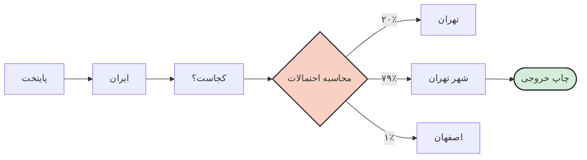



# ⚙️ موتور ماشین چطور کار می‌کند؟ (بدون ریاضیات)
### Under the Hood: How LLMs Actually Work

[🏠 بازگشت به خانه](../../README.md) |[درس قبلی: ذهنیت و متدولوژی](../00-intro/01-mindset-and-ethics.md) | [درس بعدی: مقایسه مدل‌ها >](03-model-comparison.md)

---

## 🤯 توهم دانایی: این موجود اصلاً "باهوش" نیست!

بزرگترین اشتباه دانشجویان این است که فکر می‌کنند ChatGPT یک **"پایگاه داده"** یا یک **"کتابخانه هوشمند"** است که می‌رود اطلاعات را می‌خواند، می‌فهمد و جواب می‌دهد.
**اصلاً اینطور نیست.**

بگذارید خیلی رک بگویم:
مدل‌های زبانی بزرگ (LLMs)، در واقع نسخه‌ی **استروئیدیِ کیبورد گوشی شما** هستند.

یادتان است در گوشی وقتی تایپ می‌کنید "سلام"، کلمه بعدی را پیشنهاد می‌دهد "خوبی"؟
هوش مصنوعی دقیقاً همین کار را می‌کند، فقط به جای اینکه ۲-۳ کلمه قبل را ببیند، میلیاردها کلمه را دیده و می‌تواند حدس بزند "محتمل‌ترین" کلمه بعدی چیست.

---

## 🎲 مکانیزم پشت پرده: پیش‌بینی کلمه بعدی (Next Token Prediction)

وقتی به او می‌گویید: `پایتخت ایران کجاست؟`
او به معنای "پایتخت" یا "ایران" فکر نمی‌کند. او فقط محاسبه می‌کند که در دیتایی که آموزش دیده، بعد از این کلمات، چه کلمه‌ای بیشترین احتمال (Probability) را دارد.

> **💡 تعریف ساده:** هوش مصنوعی یک ماشین **"حدس کلمه‌ی بعدی"** است، نه یک ماشین "دانشمند". او کلمات را بر اساس آمار کنار هم می‌چیند تا متنی تولید کند که **به لحاظ ساختاری درست به نظر برسد**.

---

## ⚠️ ۳ باگ ذاتی که اگر ندانید، نابود می‌شوید

چون این سیستم بر اساس "احتمالات" کار می‌کند نه "حقایق"، چند باگ بزرگ دارد که باید آن‌ها را بشناسید تا بتوانید دورشان بزنید:

### ۱. توهم (Hallucination): دروغگوی با اعتماد به نفس 🤥
همانطور که در بخش‌های قبل اشاره کردیم، هوش مصنوعی برای "گفتن حقیقت" طراحی نشده؛ برای "تکمیل کردن متن" طراحی شده.
اگر جواب را نداند، سکوت نمی‌کند (چون یاد گرفته همیشه کلمه بعدی را حدس بزند). او چیزی می‌سازد که **شبیه** به جواب درست باشد.

*   **مثال فاجعه‌بار:** درخواست معرفی ۵ مقاله درباره "معماری بادگیرهای یزد".
*   **عملکرد ماشین:** او می‌داند کلمات "بادگیر"، "یزد"، "اقلیم" و اسم "دکتر پیرنیا" معمولاً با هم می‌آیند. پس این‌ها را ترکیب کرده و یک رفرنس کاملاً جعلی با فرمت دقیق APA تولید می‌کند! ظاهرش بی‌نقص است، اما وجود خارجی ندارد.

### ۲. تله محاسباتی و منطقی 🔢
هوش مصنوعی ماشین‌حساب نیست! او اعداد را مثل "حروف" می‌بیند.
وقتی می‌پرسید `2+2`، محاسبه نمی‌کند؛ یادش می‌آید که کلمه "4" همیشه بعد از آن بوده.
اما اگر دو عدد ۶ رقمی را ضرب کنید، چون این ترکیب را قبلاً ندیده، سعی می‌کند عددی را "حدس" بزند که قیافه‌اش شبیه یک عدد ۱۲ رقمی باشد!

> [!TIP]
> **راه‌حل:** برای کارهای ریاضی و منطقی، همیشه به AI بگویید: **"برای حل این مسئله کد پایتون بنویس و اجرا کن."** (در بخش‌های بعدی این را عملی یاد می‌گیریم).

### ۳. حافظه ماهی قرمزی (Context Window) 🐟
مدل‌های زبانی حافظه ابدی ندارند. آن‌ها یک "پنجره دید" محدود (Context Window) دارند.
فکر نکنید اگر یک کتاب ۵۰۰ صفحه‌ای به او دادید، تمام جزئیاتش را همزمان در ذهن دارد. اگر در صفحه ۴۰۰ سوالی از صفحه ۵ بپرسید، احتمالاً جواب پرت‌وپلا می‌گیرید چون صفحه ۵ از حافظه کوتاه‌مدتش (Context Window) پاک شده تا جا برای متن جدید باز شود.

> [!WARNING]
> **قانون طلایی:** چت‌هایتان را کوتاه و متمرکز نگه دارید. هر وقت موضوع پروژه یا بحث عوض شد، لطفاً یک **New Chat** باز کنید. کش دادن یک چت باعث خنگ شدن مدل می‌شود.

---

## 🎛️ پارامتر مخفی: دما (Temperature)

این یک مفهوم نیمه‌تخصصی است اما در ابزارهایی که دسترسی API می‌دهند (مثل Playgroundها) بسیار مهم است. پارامتری وجود دارد به اسم **Temperature** که بین ۰ تا ۱ تنظیم می‌شود:

*   **دمای نزدیک ۰:** مدل همیشه محتمل‌ترین کلمه را انتخاب می‌کند. (خروجی: دقیق، منطقی، خسته‌کننده، مناسب برای **کدنویسی و ریاضی**).
*   **دمای نزدیک ۱:** مدل ریسک می‌کند و کلمات با احتمال کمتر را هم برمی‌گزیند. (خروجی: خلاق، شاعرانه، غیرقابل پیش‌بینی، مناسب برای **ایده‌پردازی و داستان‌نویسی**).

در ChatGPT معمولی، این دما حدود ۰.۷ قفل شده است (متعادل).

---

## 🛠️ نتیجه‌گیری: تغییر استراتژی

حالا که فهمیدیم زیر کاپوت این ماشین چه خبر است، استراتژی ما باید تغییر کند:

<table align="center" width="100%">
  <tr>
    <th align="center">❌ روش بازنده (ندانستن مکانیزم)</th>
    <th align="center">✅ روش برنده (مهندسی مکانیزم)</th>
  </tr>
  <tr>
    <td align="right">پرسیدن "حقایق" (فکت‌ها و رفرنس‌ها) از AI.</td>
    <td align="right">دادن حقایق به AI و درخواست "پردازش و خلاصه‌سازی" آن.</td>
  </tr>
  <tr>
    <td align="right">پرسیدن سوالات پیچیده ریاضی به صورت متنی.</td>
    <td align="right">درخواست نوشتن کد پایتون برای حل دقیق مسئله.</td>
  </tr>
  <tr>
    <td align="right">تلمبار کردن ده‌ها موضوع مختلف در یک چت طولانی.</td>
    <td align="right">شکستن کارها به چت‌های مجزا و کوتاه (مدیریت Context Window).</td>
  </tr>
</table>

 

حالا که موتور ماشین را شناختیم، وقت آن است که ببینیم کدام ماشین در بازار برای کار ما بهتر است. آیا همیشه باید از ChatGPT استفاده کنیم؟ خیر!

**[درس بعدی: جنگ مدل‌ها (کدام AI برای کدام کار؟) 👉](03-model-comparison.md)**

