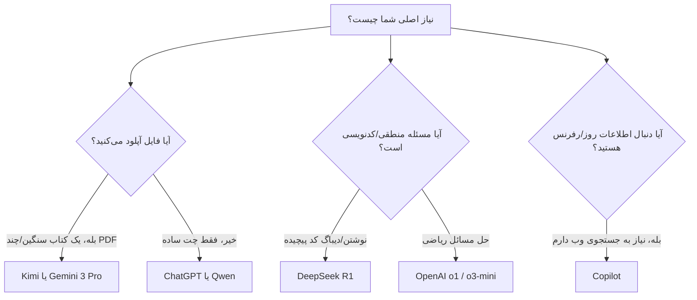



# ⚔️ جنگ مدل‌ها: کدام هوش مصنوعی برای کار شماست؟
### AI Models Showdown: Pick Your Weapon[🏠 بازگشت به خانه](../../README.md) | [درس قبلی: هوش مصنوعی چطور کار می‌کند؟](02-how-llms-work.md) | [درس بعدی: ابزارهای تحقیق >](04-research-tools.md)

---

## 🛑 تعصب را کنار بگذارید!

بزرگترین اشتباه یک دانشجو این است که روی یک ابزار (معمولاً ChatGPT) تعصب داشته باشد.
در دنیای امروز (سال ۲۰۲۶)، استفاده از ChatGPT برای همه کارها، مثل این است که با ماشین فراری بروید زمین را شخم بزنید! هر مدلی برای یک کار خاص ساخته شده است. بعضی‌ها ریاضیدان هستند، بعضی‌ها کتاب‌خوان، و بعضی‌ها برنامه‌نویس.

>[!WARNING]
>در این بخش، قدرتمندترین مدل‌های حال حاضر جهان را کالبدشکافی می‌کنیم تا بدانید برای هر پروژه دانشگاهی دقیقاً باید سراغ کدام بروید.

---

## 🧠 معرفی قهرمانان (The Heavyweights)

### ۱. ChatGPT (خانواده GPT-4o و مدل‌های o)
*   **سازنده:** OpenAI
*   **ویژگی بارز:** مدل‌های جدید OpenAI (خانواده o) برای کارهای عمیق ساخته شده‌اند. برخلاف GPT-4o که سریع جواب می‌دهد، مدل o1 زمان می‌گذارد تا فکر کند.
*   **بهترین کاربرد برای دانشجو:** هر کاری که نیاز به استدلال چند مرحله‌ای دارد. اگر صورت پروژه شما ۳ صفحه است و پر از شروط مختلف است، o1/o3 بهترین درک منطقی را از آن خواهد داشت.

### ۲. Gemini 3 Pro / Flash
*   **سازنده:** Google
*   **ویژگی بارز:** دارای **۱ تا ۲ میلیون توکن** پنجره محتوا! یعنی می‌توانید ۱۰ تا کتاب رفرنس، کل کدهای یک پروژه نرم‌افزاری، یا حتی یک ویدیوی ۱ ساعته را مستقیماً داخل آن آپلود کنید و از آن سوال بپرسید.
*   **بهترین کاربرد برای دانشجو:** مرور ادبیات (Literature Review) برای پایان‌نامه. آپلود کردن ده‌ها مقاله PDF و درخواست استخراج جدول مقایسه‌ای از آن‌ها. تحلیل ویدیوهای آموزشی یوتیوب.
*   **نقطه ضعف:** گاهی در رعایت دستورات بسیار دقیق و محدودکننده (Prompt Constraints) لجبازی می‌کند.

### ۳. DeepSeek (خانواده R1 و V3)
*   **سازنده:** DeepSeek (چین)
*   **ویژگی بارز:** این مدل چینی در اوایل سال ۲۰۲۵ و ۲۰۲۶ دنیا را تکان داد. R1 یک مدل **استدلال‌گر (Reasoning)** است. یعنی قبل از اینکه جواب بدهد، در یک بلوک `<think>` با خودش فکر می‌کند، راه حل را خطایابی می‌کند و بعد جواب نهایی را می‌نویسد.
*   **دقت علمی:** در بنچمارک MATH-500 امتیازی بالای ۹۷٪ دارد که حتی از مدل‌های پولی OpenAI هم جلوتر است.
*   **بهترین کاربرد برای دانشجو:** حل معادلات پیچیده، اثبات‌های ریاضی، دیباگ کردن کدهای سنگین (پایتون، C++) و حل الگوریتم.
*   **نقطه ضعف:** برای کارهای خلاقانه، داستان‌نویسی یا تحلیل فایل‌های متنی خیلی بزرگ مناسب نیست.

### ۴. Qwen (خانواده 2.5 Max و 3.0)
*   **سازنده:** Alibaba Cloud
*   **ویژگی بارز:** مدل Qwen 3 دارای ویژگی "تفکر هیبریدی" است (می‌توانید به آن بگویید عمیق فکر کند یا سریع جواب دهد). همچنین نسخه Coder آن به شدت در برنامه‌نویسی قدرتمند است.
*   **بهترین کاربرد برای دانشجو:** اگر می‌خواهید با ابزارهای لوکال (مثل Ollama یا LM Studio) هوش مصنوعی را **روی لپ‌تاپ خودتان** (بدون نیاز به اینترنت) اجرا کنید، نسخه‌های سبک Qwen 3 بهترین کیفیت را به نسبت حجم می‌دهند.
### ۵. Kimi
*   **سازنده:** Moonshot AI
*   **ویژگی بارز:** این هوش مصنوعی چینی تخصص عجیبی در خواندن اسناد طولانی و جستجوی دقیق در اینترنت دارد. Kimi می‌تواند پی‌دی‌اف‌های سنگین را بخورد و بدون توهم (Hallucination) آن‌ها را خلاصه کند.
*   **بهترین کاربرد برای دانشجو:** مصاحبه با کتاب! وقتی استاد یک کتاب رفرنس انگلیسی ۵۰۰ صفحه‌ای معرفی کرده و فردا امتحان دارید، Kimi بهترین گزینه برای درک سریع مفاهیم است.

### ۶. Copilot
*   **سازنده:** Microsoft

*   **ویژگی بارز:** از موتورهای قدرتمند OpenAI استفاده می‌کند اما **مستقیماً به موتور جستجوی Bing متصل است**. 
*   **بهترین کاربرد برای دانشجو:** پیدا کردن اطلاعات **به‌روز**. اگر دیتای مربوط به "آمار اقتصادی ماه گذشته" را می‌خواهید، ChatGPT ممکن است توهم بزند، اما Copilot سایت‌ها را می‌گردد و لینک منابع (Citations) را در پانویس به شما می‌دهد.

---

## 📊 جدول مقایسه فنی (The Ultimate Matrix)

بیایید این مدل‌ها را در یک جدول بی‌رحمانه مقایسه کنیم. 
*(توجه: اعداد "پنجره حافظه" نشان می‌دهد که مدل چند کلمه را می‌تواند همزمان در یک چت به خاطر بسپارد. هر ۱ میلیون توکن معادل حدود ۳۰۰۰ صفحه کتاب است).*

| نام مدل (Model) | ظرفیت حافظه (Context) | ریاضی و منطق | برنامه‌نویسی | تحلیل فایل حجیم | دسترسی اینترنت |
| :--- | :--- | :--- | :--- | :--- | :--- |
| **DeepSeek R1** | ۱۲۸,۰۰۰ توکن | 🥇 شاهکار | 🥇 عالی | 🥉 ضعیف | ❌ ندارد |
| **Gemini 3 Pro** | ۱,۰۰۰,۰۰۰+ توکن | 🥈 خیلی خوب | 🥈 خیلی خوب | 🥇 بی‌رقیب | ✅ عالی |
| **ChatGPT (o1/o3)** | ۱۲۸,۰۰۰ تا ۲۰۰,۰۰۰ توکن | 🥇 شاهکار | 🥇 عالی | 🥈 خوب | ✅ دارد |
| **Qwen 3 (Max)** | ۱۲۸,۰۰۰ تا ۲۵۶,۰۰۰ توکن | 🥈 خیلی خوب | 🥈 عالی | 🥈 خوب | ❌/✅ متغیر |
| **Kimi (K2.5)** | ۲۵۶,۰۰۰+ توکن | 🥉 متوسط | 🥉 متوسط | 🥇 فوق‌العاده | ✅ عالی |
| **MS Copilot** | متکی به جستجوی وب | 🥈 خوب (موتور GPT)| 🥈 خوب | 🥈 خوب | 🥇 بی‌رقیب |
---

## 🧭 درخت تصمیم‌گیری: الان از کدوم استفاده کنم؟

اگر گیج شده‌اید، از این فلوچارت استفاده کنید تا در ۳ ثانیه تصمیم بگیرید:

---

## 🏆 از کجا بفهمیم کدام مدل "واقعاً" بهتر است؟

شرکت‌های سازنده AI همیشه در تبلیغاتشان دروغ می‌گویند. تنها راه فهمیدن قدرت واقعی یک مدل، استفاده از پلتفرم **[LMSYS Chatbot Arena](https://lmarena.ai/)** است.

> [!TIP]
> **میدان نبرد (Chatbot Arena) چیست؟**
> این سایت مثل رنکینگ فیفا برای هوش مصنوعی است. دو مدل بدون اسم (ناشناس) به شما جواب می‌دهند، شما به عنوان داور انسانی رای می‌دهید کدام بهتر است. بر اساس میلیون‌ها رای، مدل‌ها در یک جدول (Leaderboard) رتبه‌بندی می‌شوند. همیشه قبل از شروع پروژه‌های بزرگ، به این سایت سر بزنید تا ببینید پادشاه فعلی دنیا کیست.

<b>🔍 کلیک کنید: چرا مدل‌های "Reasoning" (مثل DeepSeek R1 و o1) دنیای دانشجویی را عوض کردند؟</b>

 

مدل‌های سنتی مثل GPT-4o سعی می‌کنند کلمه بعدی را در **کسری از ثانیه** حدس بزنند. به همین دلیل در معماهای منطقی اشتباه می‌کنند.
اما مدل‌های Reasoning (مثل `o1` و `DeepSeek-R1`):
1. قبل از جواب دادن مکث می‌کنند (گاهی تا ۱ دقیقه).
2. در ذهن خودشان یک "زنجیره تفکر" (Chain of Thought) می‌سازند.
3. راه‌حل‌های خودشان را نقد می‌کنند و اگر غلط بود، برمی‌گردند و روش جدیدی تست می‌کنند.

**کاربرد دانشجویی:** اگر یک تمرین ریاضی یا الگوریتم پیچیده دارید که ChatGPT معمولی آن را اشتباه حل می‌کند، آن را به DeepSeek R1 بدهید. خواهید دید که چطور قدم به قدم فرمول‌ها را باز می‌کند و به جواب قطعی می‌رسد.

---

## 🎯 نتیجه‌گیری

* اگر **پول ندارید** و بهترین کیفیت کدنویسی و ریاضی را می‌خواهید: **DeepSeek R1**
* اگر می‌خواهید **پایان‌نامه ۵۰ صفحه‌ای** خود را یکجا ویرایش کنید: **Gemini 3 Pro**
* اگر به دنبال **سرچ اینترنتی رایگان** با موتور GPT-4o هستید: **Copilot**

## نظر شخصی 
به نظر من بهترینش می تونه gemini pro باشه چون می تونه فایل های بزرگ رو بدونه توهم زدن هندل کنه و در مورد هوش مصنوعی های چینی هم خیلی خوبن ولی تا جواب بدن پیرت می کنن. 

**[درس بعدی: ابزارهای هوش مصنوعی 👉](04-AI-tools.md)**

