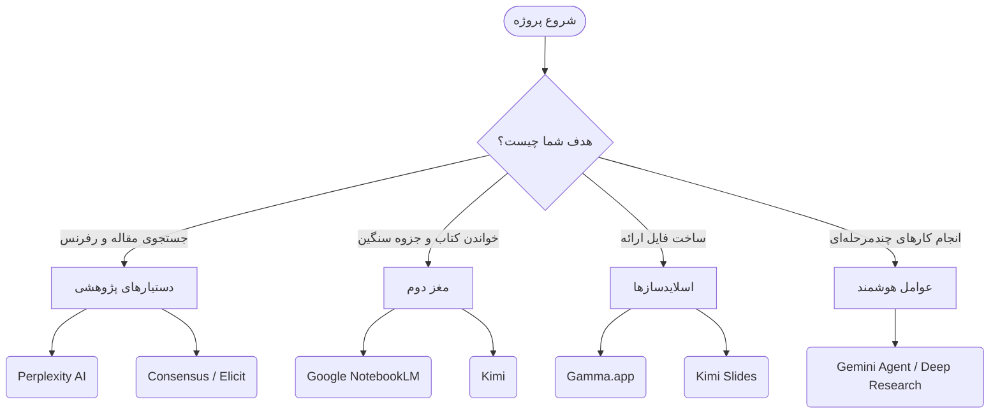



# 🛠️ ابزارهای هوش مصنوعی: فراتر از چت‌بات‌های ساده
### AI Platforms & Specialized Tools[🏠 بازگشت به خانه](../../README.md) | [درس قبلی: جنگ مدل‌ها](03-model-comparison.md) | [درس بعدی: اصول پرامپت‌نویسی >](../02-prompt-engineering/05-prompt-basics.md)

---

## 🛑 توقف کنید! ChatGPT برای همه چیز نیست

یکی از بزرگترین اشتباهاتی که دانشجویان مرتکب می‌شوند، استفاده از یک ابزار (معمولاً ChatGPT) برای تمام کارهای دانشگاهی است. 
دنیای هوش مصنوعی به سمت **"تخصص‌گرایی"** رفته است. ابزاری که بهترین پاورپوینت را می‌سازد، لزوماً بهترین مقاله‌های علمی را پیدا نمی‌کند.

در این بخش، جعبه‌ابزار طلایی یک دانشجوی مدرن را معرفی می‌کنیم. ابزارهایی که هر کدام در یک کار خاص **جادو** می‌کنند.

---

## 🗺️ درخت تصمیم‌گیری: الان به چه ابزاری نیاز دارم؟

---

## 🔬 دسته اول: ابزارهای تحقیق عمیق (Deep Research)

اگر برای پایان‌نامه یا مقاله نیاز به رفرنس‌های **واقعی** دارید، دور ChatGPT معمولی خط بکشید. ابزارهای زیر برای جستجوی علمی ساخته شده‌اند:

<table align="center" width="100%" border="0">
  <tr>
    <td width="50%" valign="top">
      <h3>🌐 Perplexity AI</h3>
      <b>بهترین برای: جستجوی سریع با رفرنس دقیق</b> 
      پرپلکسیتی یک موتور جستجوی هوشمند است. وقتی سوالی می‌پرسید، اینترنت را می‌گردد و جواب را همراه با <b>لینک‌های قابل کلیک (Citations)</b> در متن به شما می‌دهد.  
      <i>نکته کنکوری:</i> از قابلیت <b>Focus Mode</b> آن استفاده کنید و آن را روی حالت Academic بگذارید تا فقط در مقالات معتبر بگردد.
    </td>
    <td width="50%" valign="top">
      <h3>🎓 Consensus / Elicit</h3>
      <b>بهترین برای: پیدا کردن اجماع علمی</b> 
      این ابزارها فقط در دیتابیس مقالات علمی (بیش از ۲۰۰ میلیون مقاله) جستجو می‌کنند. اگر بپرسید "آیا فلان دارو تاثیر دارد؟"، Consensus مقالات را می‌خواند و به شما می‌گوید چند درصد مقالات موافق و چند درصد مخالف بوده‌اند!
    </td>
  </tr>
</table>

<b>🕵️‍♂️ قابلیت جدید: Deep Research (تحقیق عمیق) چیست؟</b> <i>(کلیک کنید)</i>

در سال ۲۰۲۶، شرکت‌هایی مثل OpenAI و Google قابلیتی به نام <b>Deep Research</b> معرفی کردند. به جای اینکه یک جواب کوتاه بگیرید، هوش مصنوعی مثل یک دستیار پژوهشی عمل می‌کند:
<ol>
  <li>ده‌ها سایت را می‌خواند.</li>
  <li>لینک‌ها را دنبال می‌کند تا به منبع اصلی برسد.</li>
  <li>پس از ۱۰ الی ۲۰ دقیقه، یک گزارش جامع ۲۰ صفحه‌ای با تمام منابع برای شما می‌نویسد.</li>
</ol>
<b>Gemini Deep Research</b> و <b>ChatGPT Pro</b> سردمداران این تکنولوژی هستند.

---

## 🧠 دسته دوم: مغز دوم و تحلیل اسناد (The Second Brain)

استاد یک کتاب PDF پانصد صفحه‌ای انگلیسی داده و فردا امتحان دارید؟ این ابزارها جان شما را نجات می‌دهند.

> [!TIP]
> **🌟 شاهکار گوگل: NotebookLM**
> نوت‌بوک‌ال‌ام یک فضای کاری شخصی است. شما می‌توانید ده‌ها PDF، لینک یوتیوب یا جزوه را در آن آپلود کنید. 
> <b>چرا بی‌نظیر است؟</b> 
> ۱. <b>توهّم صفر:</b> فقط و فقط بر اساس فایل‌های شما جواب می‌دهد و دقیقاً شماره صفحه را رفرنس می‌دهد.
> ۲. <b>پادکست ساز (Audio Overview):</b> با یک کلیک، جزوه خسته‌کننده شما را تبدیل به یک پادکست صوتی دو نفره و جذاب می‌کند تا در مسیر دانشگاه گوش دهید!

>[!NOTE]
> **🤖 دستیار Kimi (کتابخوان خستگی‌ناپذیر)**
> هوش مصنوعی <b>Kimi</b> (محصول Moonshot AI) دارای پنجره محتوای عظیمی است. می‌توانید فایل‌های حجیم را به آن بدهید و بخواهید ساختار کتاب را استخراج کند یا مفاهیم سخت را به زبان ساده توضیح دهد.

---

## 📊 دسته سوم: ساخت پاورپوینت در ۵ دقیقه (Presentation Generators)

ساخت اسلاید، تنظیم فونت، و پیدا کردن عکس، وقت‌گیرترین بخش ارائه است. این کار را به ابزارهای زیر بسپارید:

| نام ابزار | ویژگی اصلی | مناسب برای... |
| :--- | :--- | :--- |
| **Gamma.app** | گرافیک خیره‌کننده و خروجی وب | وقتی یک ارائه فوق‌العاده زیبا و مدرن می‌خواهید. کافیست متن خام را بدهید، گاما خودش عکس می‌سازد و اسلایدها را دیزاین می‌کند. (قابلیت خروجی PDF و PPT). |
| **Kimi Slides** | سریع و ساختاریافته | وقتی محتوای خام (یک فایل Word) دارید و می‌خواهید سریع آن را به اسلاید تبدیل کنید. Kimi اول یک Outline قابل ویرایش به شما می‌دهد و سپس اسلایدها را می‌سازد. |

---

## 🤖 دسته چهارم: عوامل هوشمند (AI Agents)

عوامل هوشمند (Agents) صرفاً به شما جواب متنی نمی‌دهند؛ آن‌ها **وارد عمل می‌شوند**.

> [!IMPORTANT]
> **Gemini Agent**
> گوگل، Gemini را به برنامه‌های روزمره متصل کرده است. یک Agent می‌تواند چند کار را پشت سر هم انجام دهد. 
> <b>مثال دانشجویی:</b> <i>"ایمیل‌های امروز استاد را بخوان، تاریخ تحویل پروژه را پیدا کن، آن را در Google Calendar من ثبت کن، و یک فایل Docs برای شروع پروژه بساز."</i> 
> هوش مصنوعی تمام این کارها را به صورت خودکار در پس‌زمینه انجام می‌دهد!

---

## 🎯 جمع‌بندی ابزارها

برای اینکه همیشه مجهز باشید، این ترکیب طلایی را در بوکمارک مرورگر خود ذخیره کنید:
1. **جستجوی فکت و مقاله:** `Perplexity` / `Consensus`
2. **خواندن جزوه و کتاب:** `NotebookLM`
3. **ساخت اسلاید:** `Gamma`
4. **نوشتن و استدلال:** `ChatGPT (o1)` / `DeepSeek R1`

**[بخش بعدی: اصول پرامپت‌نویسی (چطور با این ابزارها حرف بزنیم؟) 👉](../02-prompt-engineering/05-prompt-basics.md)**

