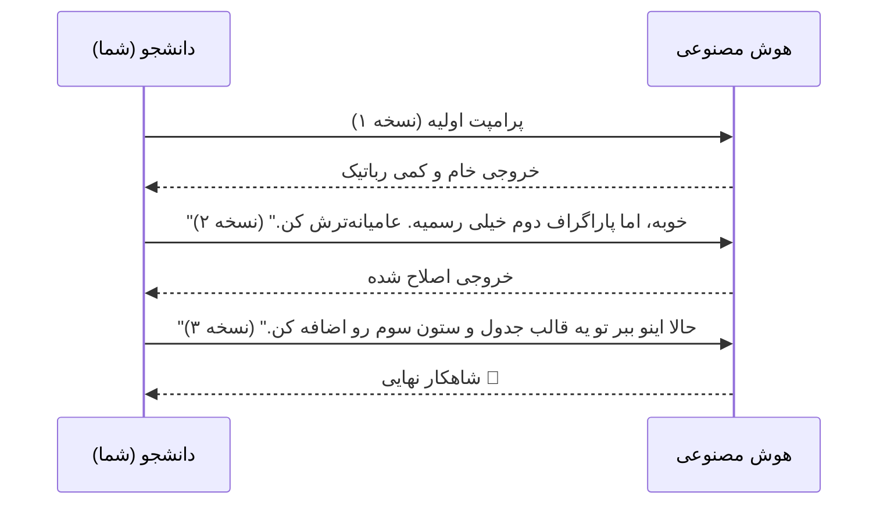




<div dir="rtl">
<div align="center">

# 🗣️ اصول اولیه پرامپت‌نویسی: زبان ماشین
### Prompt Basics: From Chatting to Commanding

[🏠 بازگشت به خانه](../../README.md) | [درس قبلی: ابزارهای هوش مصنوعی](../01-fundamentals/04-research-tools.md) | [درس بعدی: فریم‌ورک‌های پیشرفته >](06-advanced-frameworks.md)

</div>

---

## 💀 واقعیت تلخ: خروجی زباله، نتیجه ورودی زباله است (GIGO)

بیایید صادق باشیم. شما الان تب جدید مرورگر را باز می‌کنید، وارد ChatGPT می‌شوید و چیزی شبیه این می‌نویسید:
> *"یه مقاله درباره تغییرات آب و هوا بنویس."*

و بعد که هوش مصنوعی یک متن خشک، تکراری و ویکی‌پدیایی تحویلتان داد، می‌گویید: "این که خیلی مصنوعیه!"
**خب نه! مشکل از هوش مصنوعی نیست؛ مشکل از دستور (Prompt) شماست.**

> [!WARNING]
> در علوم کامپیوتر قانونی داریم به نام **GIGO** (Garbage In, Garbage Out). یعنی اگر ورودی شما "زباله" و مبهم باشد، خروجی قطعاً "زباله" خواهد بود. هوش مصنوعی ذهن‌خوانی بلد نیست؛ او فقط چیزی را به شما می‌دهد که دقیقاً خواسته‌اید.

---

## 🧠 تغییر ذهنیت: گوگل در برابر کارآموز

بزرگترین اشتباه ما این است که با هوش مصنوعی مثل "موتور جستجوی گوگل" رفتار می‌کنیم.
در گوگل ما کلمات کلیدی تایپ می‌کنیم (`دانلود مقاله معماری پایدار`). اما در پرامپت‌نویسی، شما باید با هوش مصنوعی مثل یک **"کارآموز باهوش اما فراموش‌کار"** رفتار کنید.

شما به یک کارآموز روز اول کاری نمی‌گویید "درباره معماری بنویس". به او می‌گویید: *"من مدیر فلان بخش هستم. برای فردا یک گزارش ۳ صفحه‌ای درباره معماری پایدار در مناطق گرمسیر می‌خواهم. مخاطب ما مدیران غیرفنی هستند، پس از اصطلاحات سخت استفاده نکن و خروجی را در یک جدول به من بده."*

---

## 🧱 ۴ ستون یک پرامپت پایه (The 4 Pillars)

قبل از اینکه در بخش بعدی سراغ فرمول‌های پیشرفته (مثل RISEN) برویم، باید این ۴ بلوک اصلی را در هر درخواستی که به ماشین می‌دهید رعایت کنید:

<table align="center" width="100%" border="0">
  <tr>
    <td width="25%" align="center">
      <h3>🎯 ۱. هدف (Task)</h3>
      دقیقاً چه می‌خواهید؟ از <b>افعال واضح</b> استفاده کنید.<br>
      <i>(خلاصه کن، مقایسه کن، کد بنویس، بازنویسی کن)</i>
    </td>
    <td width="25%" align="center">
      <h3>🌍 ۲. زمینه (Context)</h3>
      شما کی هستید؟ مخاطب کیست؟ چرا این را می‌نویسید؟<br>
      <i>(من دانشجوی ترم ۳ هستم، برای ارائه کلاسی می‌خواهم...)</i>
    </td>
    <td width="25%" align="center">
      <h3>🚧 ۳. محدودیت‌ها (Constraints)</h3>
      چه کارهایی را <b>نباید</b> انجام دهد؟<br>
      <i>(بیشتر از ۳۰۰ کلمه نشود، از کلمات کلیشه‌ای استفاده نکن)</i>
    </td>
    <td width="25%" align="center">
      <h3>🗂️ ۴. فرمت خروجی (Format)</h3>
      شکل نهایی جواب چطور باشد؟<br>
      <i>(جدول، لیست، کد پایتون، فایل مارک‌داون)</i>
    </td>
  </tr>
</table>

---

## ⚖️ مقایسه پرامپت‌ها در عمل

بیایید تفاوت یک پرامپت "گوگلی" (آماتور) و یک پرامپت "مهندسی شده" (حرفه‌ای) را روی یک پروژه واقعی دانشگاهی بررسی کنیم:

### ❌ پرامپت آماتور (The Rookie)
```text
"تفاوت‌های بازاریابی سنتی و دیجیتال رو بگو."
```
*   **خروجی:** یک متن طولانی، خسته‌کننده، پر از کلمات قلمبه‌سلمبه که استاد با یک نگاه می‌فهمد کار AI است. هیچ ساختار مشخصی برای کپی کردن در پاورپوینت ندارد.

### ✅ پرامپت مهندسی شده (The Pro)

* **زمینه**: من دانشجوی رشته مدیریت هستم و برای ارائه فردا نیاز به یک مقایسه سریع دارم. مخاطب هم‌کلاسی‌های من هستند.
* **هدف**: تفاوت‌های بازاریابی سنتی و دیجیتال مارکتینگ را مقایسه کن.
* **محدودیت**: فقط روی ۳ فاکتور اصلی (هزینه، سرعت، قابلیت اندازه‌گیری) تمرکز کن. متن ثقیل نباشد و لحن صمیمی و علمی داشته باشد.
* **فرمت**: خروجی را در یک جدول ۳ ستونه به من بده.

>**خروجی:** یک جدول شیک و آماده، با لحن انسانی، که مستقیماً قابل انتقال به اسلایدهای شماست.

---

## 🔄 قانون اول پرامپتینگ: دیالوگ، نه مونولوگ

هوش مصنوعی یک جادوگر نیست که با یک بار تکان دادن چوبدستی، کار را تمام کند. پرامپت‌نویسی یک **فرآیند تکرارپذیر** است. 

اگر خروجی اول خوب نبود، چت را نبندید! آن را اصلاح کنید:



> [!TIP]
> **تکنیک Push-Back (هل دادن به عقب):**
> هیچوقت به جواب اول راضی نشوید. همیشه یک دستور تکمیلی بدهید: *"این جواب خوب بود، اما حالا تصور کن قرار است این را برای یک استاد بسیار سخت‌گیر بفرستم. چه ایراداتی به آن می‌گیرد؟ متن را بر اساس آن ایرادات بازنویسی کن."*

<div align="center">

**[درس بعدی: فریم‌ورک‌های پیشرفته (RISEN و CO-STAR) 👉](06-advanced-frameworks.md)**

</div>

</div>