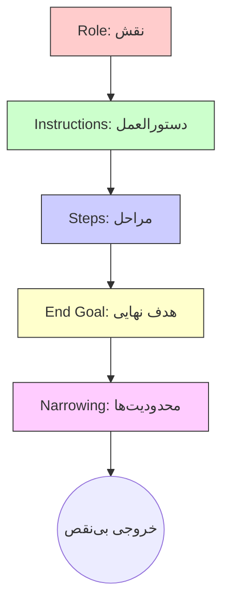



# 🏗️ فریم‌ورک‌های پیشرفته: معماری ذهن ماشین
### Advanced Prompt Frameworks: RISEN & Beyond

[🏠 بازگشت به خانه](../../README.md) |[درس قبلی: اصول اولیه پرامپت‌نویسی](05-prompt-basics.md) |[درس بعدی: تنظیمات سیستمی (System Instructions) >](07-system-instructions.md)

---

## 🏛️ چرا به فریم‌ورک نیاز داریم؟

در درس قبل یاد گرفتیم که چطور از حالت "جستجوی گوگلی" خارج شویم. اما وقتی پای پروژه‌های سنگین (مثل نوشتن فصل دوم پایان‌نامه، تحلیل یک دیتاسِت بزرگ، یا طراحی یک اپلیکیشن) به میان می‌آید، دستورات ۴ خطی دیگر جواب نمی‌دهند.

هوش مصنوعی مثل یک پردازنده قدرتمند اما **بی‌نظم** است. اگر برایش یک قالب (فریم‌ورک) ذهنی نسازید، وسط کار گیج می‌شود، توهم می‌زند و از مسیر خارج می‌شود.
حرفه‌ای‌ها برای کنترل این هیولا از فرمول‌های استانداردی استفاده می‌کنند که معروف‌ترینِ آن‌ها برای کارهای دانشگاهی، فرمول **RISEN** است.

---

## 🧬 آناتومی یک پرامپت حرفه‌ای: فرمول RISEN

کلمه RISEN مخفف ۵ کلمه است. اگر این ۵ بخش را در پرامپت خود (به خصوص برای کارهای متنی و تحلیلی) رعایت کنید، خروجی شما از "متن یک ربات" به "شاهکار یک متخصص" تبدیل می‌شود.

### 🎭 ۱. نقش (Role: هوش مصنوعی کیست؟)
**این مهم‌ترین بخش ماجراست.** وقتی به AI یک نقش می‌دهید، کل شخصیتش، دایره لغاتش و نوع استدلالش عوض می‌شود.
*   ❌ **بد:** "یک متن درباره معماری مدرن بنویس." (خروجی: ویکی‌پدیایی و خسته‌کننده)
*   ✅ **حرفه‌ای:** `[Role]: تو یک معمار ارشد با ۲۰ سال سابقه و استاد دانشگاه هستی که منتقد سرسخت معماری مدرن است. لحنت باید علمی، بدبینانه و کمی طنزآمیز باشد. مثل کسی که همه چیز را دیده و دیگر با شعارها قانع نمی‌شود.`

### 📝 ۲. دستورالعمل و زمینه (Instructions)
هوش مصنوعی ذهن‌خوانی بلد نیست. باید دقیقاً به او بگویید مخاطب کیست و این متن کجا استفاده می‌شود.
*   ✅ **حرفه‌ای:** `[Instructions]: من در حال آماده کردن ارائه‌ای برای دانشجویان ترم ۵ هستم. تمرکز ما روی 'تاثیرات اقلیمی' است، نه تاریخچه. مخاطب‌ها پیش‌زمینه تئوری دارند اما خیلی حرفه‌ای نیستند.`

### 👣 ۳. مراحل (Steps: الگوریتم اجرا)
اگر کار پیچیده است، **اجازه ندهید هوش مصنوعی یک‌باره بپرد وسط جواب**. برایش "الگوریتم" تعریف کنید. این کار جلوی گیج شدن مدل را می‌گیرد (به این تکنیک Chain of Thought هم می‌گویند).
*   ✅ **حرفه‌ای:** 
    `[Steps]: این کار را مرحله به مرحله انجام بده:`
    `۱. اول یک آمار تکان‌دهنده برای شروع (Hook) بنویس.`
    `۲. مشکل را از ۳ زاویه (اقتصادی، اجتماعی، محیط‌زیستی) تحلیل کن.`
    `۳. یک مطالعه موردی (Case Study) واقعی و کوتاه بیاور.`
    `۴. سه راه‌حل عملی ارائه بده.`

### 🏁 ۴. خروجی نهایی (End Goal)
شکل فیزیکی جوابی که می‌خواهید را ترسیم کنید.
*   ✅ **حرفه‌ای:** `[End Goal]: خروجی نهایی باید یک فایل Markdown باشد. شامل ۳ جدول مقایسه‌ای و حداقل ۱۲۰۰ کلمه متن پیوسته. از Bullet point استفاده نکن.`

### 🚧 ۵. محدودیت‌ها (Narrowing: چه کار نکند!)
**این فوت کوزه‌گری است!** اینجا جلوی "اضافه‌گویی" و "لو رفتن" متن را می‌گیرید. محدودیت گذاشتن، خلاقیت هوش مصنوعی را در چارچوب شما متمرکز می‌کند.
*   ✅ **حرفه‌ای:** 
    `[Narrowing]:`
    `- از کلمات کلیشه‌ای مثل "در دنیای امروز"، "شایان ذکر است" و "در نهایت" مطلقاً استفاده نکن.`
    `- نتیجه‌گیری اخلاقی یا شعار ننویس.`
    `- از جملات با طول‌های متفاوت (کوتاه، متوسط، بلند) استفاده کن تا متن لحن انسانی بگیرد.`

---

## 🔥 تکنیک‌های مکمل (فراتر از RISEN)

حالا که ساختار اصلی را یاد گرفتید، باید با دو تکنیک طلایی آشنا شوید که وقتی با RISEN ترکیب می‌شوند، هوش مصنوعی را تبدیل به یک هیولای شکست‌ناپذیر می‌کنند.

### ۱. تکنیک Few-Shot Prompting (هدایت با نمونه)
گاهی اوقات هرچقدر هم که لحن را در بخش `[Role]` توضیح دهید، هوش مصنوعی دقیقاً منظور شما را نمی‌فهمد. راه حل چیست؟ به جای "توضیح دادن"، به او **"نشان دهید"**.

وقتی چند نمونه (مثال) از خروجی ایده‌آل خود را به مدل می‌دهید، او سریعاً الگو، لحن و قالب شما را کشف می‌کند و دقیقاً در همان استاندارد جواب می‌دهد.

> [!TIP]
> **مثال Few-Shot:**
> "من می‌خواهم یک چکیده مقاله بنویسی. برای اینکه دقیقاً لحن مرا بفهمی، به این دو نمونه که خودم نوشته‌ام دقت کن:
> *مثال ۱:* [متن نمونه شما]
> *مثال ۲:* [متن نمونه شما]
> حالا با همین لحن و ساختار، چکیده‌ای برای موضوع 'تاثیر AI بر اقتصاد خرد' بنویس."

### ۲. تکنیک Chain of Thought (زنجیره تفکر)
مدل‌های زبانی در معماهای منطقی و استدلال‌های چندمرحله‌ای ضعف دارند (مگر اینکه از مدل‌های Reasoning مثل DeepSeek R1 یا o1 استفاده کنید).
برای مدل‌های معمولی (مثل GPT-4o یا Claude 3.5 Sonnet)، اضافه کردن یک جمله جادویی به انتهای پرامپت، احتمال خطای آن‌ها را به شدت کاهش می‌دهد:
**"قدم به قدم فکر کن و مراحل استدلالت را بنویس." (Let's think step by step).**

### ۳. تکنیک "توقف و ادامه" (Chunking & The "Next" Protocol)
آیا تا به حال کلافه شده‌اید که از هوش مصنوعی یک متن بلند (مثلاً یک فصل کامل از پایان‌نامه) بخواهید و او یا وسط جمله ناگهان قطع شود، یا بدتر از آن، برای اینکه متن را در یک پیام جا بدهد، کل محتوا را به شدت خلاصه کند و سمبل کند؟

**مشکل اینجاست:** همه مدل‌های زبانی یک "محدودیت توکن خروجی" (Output Limit) دارند (معمولاً حدود ۴۰۰۰ کلمه در هر پیام). اگر کار بزرگی از آن‌ها بخواهید، یا توهم می‌زنند تا زودتر تمامش کنند، یا کلا قطع می‌شوند.

**راه‌حل (تکنیک شخصی):** شما باید به مدل دستور دهید که متن را **"تکه تکه" (Chunk by Chunk)** تولید کند و منتظر کلمه عبور شما بماند.

> [!TIP]
> **دستور جادویی برای متون طولانی:**
> این پاراگراف را دقیقاً به انتهای پرامپت خود (در بخش `[Steps]` یا `[Instructions]`) اضافه کنید:
> 
> *"به دلیل محدودیت کاراکتر در خروجی، سعی نکن تمام این متن را در یک پیام تمام کنی. بخش اول را با جزئیات کامل و عمیق بنویس و در انتهای یک پاراگراف منطقی، کار را **متوقف کن**. من هر بار که کلمه **«بعدی»** (یا Next) را تایپ کردم، آخرین جمله‌ای که نوشتی را نگاه کن و دقیقاً از ادامه همان نقطه، نوشتن را از سر بگیر."*

با این تکنیک ساده، شما می‌توانید یک مقاله ۱۰۰ صفحه‌ای را بدون افت کیفیت، قطعی، یا توهم (Hallucination) از هوش مصنوعی بیرون بکشید!

---

## 🛠️ یک پرامپت کامل: تلفیق RISEN و تکنیک‌ها

بیایید تمام چیزهایی که یاد گرفتیم را در یک پرامپت شاهکار (Master Prompt) ترکیب کنیم. این پرامپت را می‌توانید مستقیماً کپی کرده و استفاده کنید:

<b>🔥 باز کردن پرامپت آماده برای نوشتن بخش مرور ادبیات (Literature Review)</b> <i>(کلیک کنید)</i>

> **Role**: 

تو یک پژوهشگر ارشد و دستیار استاد در دانشگاه تهران هستی که تخصصش نوشتن مقالات ISI با لحن کاملاً آکادمیک، بی‌طرفانه و تحلیلی است.

> **Instructions**: 

من ۵ چکیده مقاله درباره "ارزهای دیجیتال بانک مرکزی (CBDC)" به تو می‌دهم. وظیفه تو این است که یک بخش "مرور پیشینه تحقیق" یکپارچه برای پایان‌نامه من بنویسی. فقط و فقط از اطلاعات همین ۵ متن استفاده کن و هیچ چیز از خودت (یا اینترنت) به آن اضافه نکن.

> **Steps**: 

بیایید قدم به قدم پیش برویم:
۱. ابتدا تمام ۵ متن را بخوان و نقاط اشتراک و تضاد آن‌ها را پیدا کن.
۲. یک پاراگراف مقدمه بنویس که سیر کلی تحقیقات را نشان دهد.
۳. مقالات را به صورت موضوعی (نه نویسنده به نویسنده) ترکیب کن. مثلاً بگو "در زمینه امنیت، مقالات A و B معتقدند که... اما مقاله C مخالفت می‌کند."
۴. در پایان، یک "شکاف تحقیقاتی" (Research Gap) که در این مقالات به آن پرداخته نشده را پیشنهاد بده.
۵. قوانین توقف: متن را در بخش‌های ۵۰۰ کلمه‌ای تولید کن. در انتهای هر بخش متوقف شو تا من کلمه "بعدی" را بفرستم.

> **End Goal**: 

خروجی باید یک متن پیوسته به زبان فارسی روان باشد. در پایان متن نهایی، یک جدول ۳ ستونه (نام مقاله، ایده اصلی، نقطه ضعف) اضافه کن.

> **Narrowing**: 

- از ترجمه‌های ماشینی کلمات تخصصی پرهیز کن (مثلاً Blockchain را همان بلاک‌چین بنویس، نه زنجیره بلوکی).
- از عباراتی مثل "شایان ذکر است"، "در نتیجه می‌توان گفت" و "امروزه با پیشرفت تکنولوژی" اکیداً خودداری کن.
- هر جا ادعایی از مقالات آوردی، نام نویسنده را در پرانتز ذکر کن.

---

## 🚀 قدم بعدی: اتوماسیون این فرآیند

نوشتن چنین پرامپت‌هایی برای هر پروژه زمان‌بر است. آیا باید هر بار که پنجره چت را باز می‌کنیم، نقش و لحن و محدودیت‌هایمان را از اول به هوش مصنوعی دیکته کنیم؟
خیر! اینجا جایی است که لایه پنهان مدل‌ها یعنی **System Instructions (دستورالعمل‌های سیستمی)** وارد عمل می‌شوند تا هوش مصنوعی را برای همیشه به کارآموز شخصی شما تبدیل کنند.

**[درس بعدی: دستورالعمل‌های سیستمی (System Instructions) 👉](07-system-instructions.md)**

