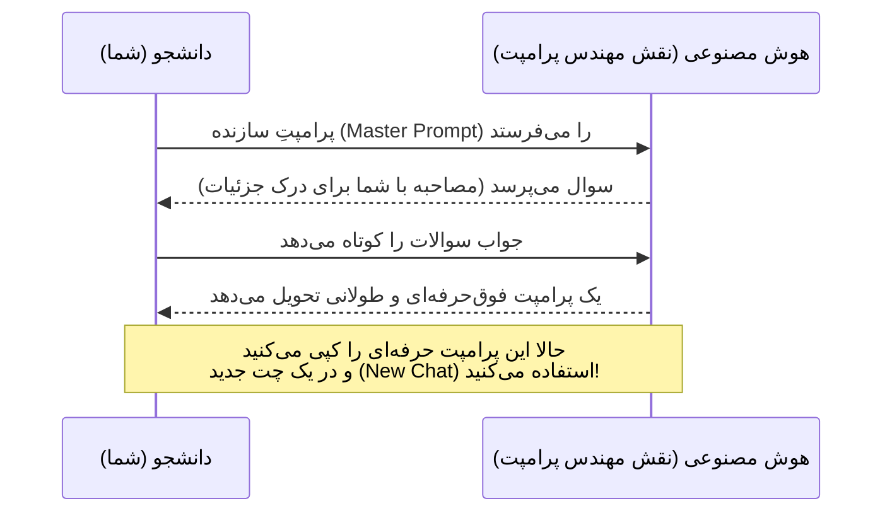




<div dir="rtl">
<div align="center">

# 🪄 متا-پرامپتینگ: هک کردن ماشین با ماشین
### Prompt Generation: Let the AI Write the Prompt[🏠 بازگشت به خانه](../../README.md) | [درس قبلی: تنظیمات سیستمی](07-system-instructions.md) | [درس بعدی: تحقیق و پژوهش دانشگاهی >](../03-research-writing/09-academic-research.md)

</div>

---

## 🤯 بزرگ‌تر فکر کنید! (پایان نوشتن دستی)

تا الان یاد گرفتیم چطور برای "خلاصه کردن یک متن" یا "نوشتن یک ایمیل" پرامپت بنویسیم. اما بیایید سطح بازی را بالاتر ببریم. 
تصور کنید با پروژه‌های غول‌پیکری مثل این موارد روبه‌رو هستید:

*   📱 **توسعه نرم‌افزار:** می‌خواهید صفر تا صد یک اپلیکیشن موبایل را بسازید ولی برنامه‌نویسی بلد نیستید و به یک برنامه‌ریز دقیق نیاز دارید.
*   🏋️ **لایف‌استایل:** می‌خواهید یک برنامه تمرینی و غذایی ۱۶ هفته‌ای، دقیقاً بر اساس آزمایش خون، بودجه دانشجویی و تایم‌های خالی کلاس‌هایتان طراحی کنید.
*   📈 **تحلیل داده:** می‌خواهید صورت‌حساب‌های مالی ۵ سال گذشته یک شرکت را تحلیل کنید، الگوهای پنهان را پیدا کنید و یک گزارش مدیریتی با نمودار تحویل دهید.
*   ✍️ **تولید محتوای خلاق:** می‌خواهید یک رمان علمی-تخیلی بنویسید و نیاز به یک دستیار برای خلق دنیای داستان (World-building)، قوانین فیزیکِ آن دنیا و شخصیت‌پردازی دارید.
*   **شبیه‌سازی تاریخ:** یک مناظره زنده بین "آلبرت اینشتین" و "ابن سینا" درباره مفهوم زمان راه بیندازید تا برای یک ارائه کلاسی ایده بگیرید.

نوشتن یک پرامپت دقیق (با فرمول RISEN) برای چنین کارهای پیچیده‌ای، خودش چند ساعت زمان می‌برد. مغز انسان در طراحی تمام مراحل، محدودیت‌ها و جزئیات کم می‌آورد. 

> **پس راه‌حل چیست؟** اصلاً پرامپت ننویسید! اجازه دهید هوش مصنوعی (که زبان خودش را بهتر از شما می‌فهمد) این پرامپت را برایتان بسازد. به این تکنیک **Meta-Prompting** می‌گویند.

---

## 🔁 چرخه متا-پرامپتینگ چطور کار می‌کند؟

ایده بسیار ساده اما به شدت قدرتمند است: شما به جای اینکه مستقیماً از هوش مصنوعی بخواهید کار را انجام دهد، از او می‌خواهید **"بهترین دستورالعمل (Prompt) ممکن را برای انجام آن کار بنویسد"**.


### قدم ۱: ایده خام را داشته باشید
نیازی نیست ایده‌تان ساختاریافته باشد. کافیست بدانید تهِ دلتان چه می‌خواهید. مثلاً: *"می‌خوام یه ارائه درباره گرمایش زمین بدم که توش گرافیک و آمار باشه و استاد رو میخکوب کنه."*

### قدم ۲: استفاده از "پرامپتِ سازنده پرامپت" (Master Prompt)
شما یک متن آماده (که در ادامه آورده‌ام) را به AI می‌دهید و ایده خامتان را ته آن می‌چسبانید. هوش مصنوعی تبدیل به یک "مهندس پرامپت" می‌شود و شروع می‌کند به مصاحبه با شما!

### قدم ۳: کپی و اجرا
وقتی هوش مصنوعی پرامپت نهایی (مثلاً بر اساس فرمول RISEN) را به شما داد، آن را کپی می‌کنید، یک **New Chat** باز می‌کنید و آن را اجرا می‌کنید.


این چرخه ۳ مرحله دارد:



---

## 🗝️ پرامپتِ سازنده (The Master Prompt)

این پرامپت، **"کد تقلب"** شماست. هر زمان که ایده بزرگی داشتید اما نمی‌دانستید چطور آن را به زبان ماشین ترجمه کنید، یک صفحه چت جدید باز کنید و دقیقاً متن زیر را کپی کنید:

<details open>
<summary><b>🔥 باز کردن Master Prompt (آماده کپی کردن)</b></summary>

```text
تو یک "مهندس پرامپت ارشد" (Expert Prompt Engineer) هستی. هدف تو این است که به من کمک کنی تا بهترین و دقیق‌ترین پرامپت ممکن را برای نیازم بنویسم. این پرامپت نهایی قرار است توسط خودت استفاده شود تا یک خروجی بی‌نقص به من بدهد.

روند کار ما به این شکل است:

۱. ابتدا از من می‌پرسی: "دقیقاً چه پروژه‌ای داری و چه خروجی‌ای می‌خواهی؟"
۲. من جواب کوتاهی می‌دهم.
۳. تو بر اساس جواب من، یک پرامپت اولیه بر اساس فریم‌ورک RISEN (Role, Instructions, Steps, End Goal, Narrowing) می‌نویسی.
۴. سپس در زیر آن پرامپت، ۳ تا ۵ سوال کلیدی از من می‌پرسی تا جزئیاتی که فراموش کرده‌ام را از من بگیری (مثلاً لحن دقیق، فرمت خروجی، محدودیت‌های خاص).
۵. ما این فرآیند (اصلاح پرامپت و سوال پرسیدن) را تکرار می‌کنیم تا زمانی که من بگویم پرامپت کامل است.
6. پرامپت نهایی که به من می‌دهی باید داخل یک Code Block باشد تا بتوانم راحت آن را کپی کنم.`

اگر متوجه شدی، فقط تایید کن و سوال های اولت را بپرس.
```

</details>

---

## 🎬 یک مثال واقعی (چطور اجرا کنیم؟)

بیایید ببینیم اگر بخواهیم یک **"دستیار مصاحبه شغلی/اپلای"** بسازیم، این فرآیند چطور پیش می‌رود:

1.  **شما:** (Master Prompt بالا را کپی و ارسال می‌کنید).
2.  **هوش مصنوعی:** "متوجه شدم. لطفاً بگو دقیقاً چه پروژه‌ای داری و چه خروجی‌ای می‌خواهی؟"
3.  **شما:** *"من هفته دیگه با یک استاد تو دانشگاه تورنتو مصاحبه آنلاین دارم برای پوزیشن دکتری هوش مصنوعی. می‌خوام باهام مصاحبه رو تمرین کنی."*
4.  **هوش مصنوعی:** (یک پرامپت اولیه می‌نویسد و سپس می‌پرسد):
    *   *سوال ۱: آیا می‌خواهی مصاحبه صوتی باشد یا متنی؟*
    *   *سوال ۲: استاد روی چه مقالاتی کار کرده تا من سوالاتم را شبیه‌سازی کنم؟*
    *   *سوال ۳: آیا می‌خواهی بعد از هر جواب، فیدبک بدم یا آخر مصاحبه؟*
5.  **شما:** (جواب سوالات را می‌دهید).
6.  **هوش مصنوعی:** (پرامپت نهایی، مهندسی‌شده و فوق‌العاده دقیق را به شما تحویل می‌دهد).

**قدم نهایی:** حالا شما یک پرامپت ۳۰۰ کلمه‌ایِ بی‌نقص دارید. آن را کپی کنید، یک **New Chat** باز کنید، پرامپت را پیست کنید و از جادوی کار لذت ببرید!

---

## 🎯 چرا این روش معجزه می‌کند؟

*   **کشف نقاط کور (Blind Spots):** هوش مصنوعی سوالاتی از شما می‌پرسد که اصلاً به ذهن خودتان نرسیده بود (مثلاً می‌پرسد: "آیا در این فایل اکسل، داده‌های گمشده (Null) هم داریم که باید مدیریت کنم؟").
*   **زبان بومی ماشین:** هوش مصنوعی دقیقاً می‌داند کدام کلمات کلیدی (Keywords) و ساختارها باعث می‌شود خودش بهتر کار کند.
*   **صرفه‌جویی در زمان:** به جای نیم ساعت کلنجار رفتن و خروجی بد گرفتن، در ۵ دقیقه بهترین دستور ممکن را می‌سازید.


## 💎 تکنیک فوق‌پیشرفته: تولید پرامپت‌های چندمرحله‌ای (Multi-Phase Prompting)

برای پروژه‌های عظیم (مثل نوشتن یک پایان‌نامه کامل، ساخت یک اپلیکیشن یا طراحی یک کمپین مارکتینگ)، حتی بهترین پرامپت تک‌مرحله‌ای هم جواب نمی‌دهد و ماشین وسط کار سردرگم می‌شود. 

در این حالت، شما می‌توانید از هوش مصنوعی بخواهید که به جای یک پرامپت، یک **"پکیج پرامپت" (Prompt Suite)** برای شما تولید کند! به پرامپت‌ساز (در همان Master Prompt) می‌گویید:
*"پروژه من بسیار بزرگ است. آن را به چند فاز بشکن و برای من یک پکیج پرامپت در ۳ سطح زیر تولید کن:"*

۱. **پرامپت سیستمی (System Prompt):** یک دستور برای تنظیم قوانین کلی و نقش ثابت (Global Rules) که آن را در تنظیمات پنهان (Custom Instructions) قرار دهم تا مدل تا آخر پروژه لحنش را فراموش نکند.
۲. **پرامپت مادر (Master Prompt):** اولین دستوری که در چت می‌نویسم تا کل نقشه راه، کانتکست (Context) و معماری پروژه را یک‌جا به هوش مصنوعی بفهمانم.
۳. **پرامپت‌های فازبندی شده (Phase 1 to N Prompts):** دستورات مجزا و مرحله‌به‌مرحله برای انجام کارها. 
مثلاً :
*پرامپت فاز ۱: تولید فهرست و ساختار*
 *پرامپت فاز ۲: نوشتن مقدمه*
، *پرامپت فاز ۳: استخراج رفرنس‌ها*

> [!TIP]
> **ترکیب تکنیک‌ها (The Ultimate Combo):**
> فراموش نکنید که می‌توانید از تکنیک‌هایی که در درس‌های قبل یاد گرفتیم اینجا هم استفاده کنید! مثلاً به پرامپت‌ساز بگویید: *"هنگام نوشتن پرامپت‌های فازبندی شده (Phase Prompts)، حتماً ساختار RISEN را رعایت کن و تکنیک «توقف و ادامه با کلمه Next» را در آن‌ها بگنجان تا در خروجی‌های طولانی، متن قطع نشود."*

---

## 🏁 جمع‌بندی بخش پرامپت‌ها

به شما تبریک می‌گویم! شما اکنون از ۹۵٪ دانشجویان دیگر در زمینه برقراری ارتباط با ماشین جلوتر هستید. شما یاد گرفتید که چطور به جای چت کردنِ ساده، **معماری ذهن ماشین** را در دست بگیرید و حتی از خودِ هوش مصنوعی برای برنامه‌ریزی هوش مصنوعی استفاده کنید.

اما مهندسی پرامپت تازه شروع کار بود. ما تا اینجا یاد گرفتیم چطور "فرمان" بدهیم. حالا وقت آن است که این فرمان‌ها را وارد دنیای واقعی و پروژه‌های دانشگاهی کنیم. در بخش بعدی وارد یکی از سخت‌ترین چالش‌های دانشگاه می‌شویم: **تحقیق، فیش‌برداری و نوشتن متون علمی بدون اینکه به سرقت ادبی (Plagiarism) متهم شویم.**

<div align="center">

**[بخش بعدی: کاربرد در تحقیق و نگارش (Research & Writing) 👉](../03-research-writing/09-academic-research.md)**

</div>

</div>