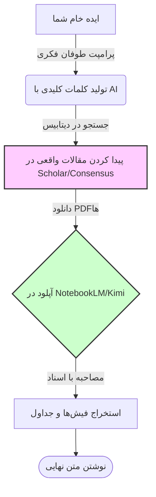



# 🔎 روش تحقیق علمی: فیش‌برداری مدرن در عصر AI
### Academic Research: Finding, Filtering, and Synthesizing

[🏠 بازگشت به خانه](../../README.md) |[درس قبلی: تولید پرامپت](../02-prompt-engineering/08-prompt-generation.md) |[درس بعدی: نگارش آکادمیک >](10-academic-writing.md)

---

## 🛑 مرگ روش‌های سنتی تحقیق

در گذشته، نوشتن بخش "مرور ادبیات" (Literature Review) یا پیدا کردن یک موضوع ناب برای پایان‌نامه، ماه‌ها زمان می‌برد. شما باید ۵۰ مقاله PDF را دانلود می‌کردید، خط به خط می‌خواندید و روی کاغذ یادداشت برمی‌داشتید تا شاید در صفحه ۱۴ یک مقاله، یک جمله به درد بخور پیدا کنید.

این روش در سال ۲۰۲۶ منسوخ است. 
امروز، ما به جای "خواندن" مقالات، با آن‌ها **"مصاحبه"** می‌کنیم. ما از هوش مصنوعی استفاده می‌کنیم تا مقالات بی‌ربط را در عرض چند ثانیه حذف کند و عصاره مقالات مفید را برای ما استخراج کند.

---

## 🗺️ جریان کار یک پژوهشگر سایبورگ (The Modern Workflow)

برای اینکه در تله توهم (Hallucination) نیفتید و رفرنس‌های واقعی داشته باشید، باید این چرخه را دقیقاً رعایت کنید:

---

## 🕵️ فاز اول: مهندسی جستجو (پیدا کردن مقالات واقعی)

بزرگترین اشتباه: *"ChatGPT، پنج تا مقاله درباره تاثیر هوش مصنوعی در معماری برام پیدا کن."* (خروجی: ۵ مقاله کاملاً دروغین که وجود خارجی ندارند).

**روش درست:** هوش مصنوعی موتور جستجو نیست؛ او **مترجم ایده به زبان جستجو** است.

شما ایده خود را به زبان ساده به AI می‌دهید و از او می‌خواهید **"کوئری‌های جستجوی پیشرفته" (Advanced Search Queries)** برای دیتابیس‌هایی مثل Google Scholar، Scopus یا PubMed بسازد.

> [!TIP]
> **پرامپت برای استخراج کلمات کلیدی (Keyword Engineering):**
> `"من می‌خواهم درباره [موضوع شما] تحقیق کنم. لطفاً ۱۰ کلمه کلیدی اصلی (Keywords) و ۵ ترکیب جستجوی پیشرفته (Boolean Search Strings) با استفاده از عملگرهای AND/OR/" " برای من بنویس تا بتوانم آن‌ها را مستقیماً در دیتابیس‌های علمی کپی و جستجو کنم. کلمات کلیدی باید کاملاً تخصصی و به زبان انگلیسی آکادمیک باشند."`

پس از گرفتن این کلمات کلیدی، آن‌ها را در ابزارهایی مثل **Consensus** یا **Perplexity** (که در بخش ابزارها معرفی کردیم) جستجو کنید تا مقالات ۱۰۰٪ واقعی و رفرنس‌دار را صید کنید.

---

## 🎙️ فاز دوم: مصاحبه با مقالات (Chatting with Papers)

حالا شما ۱۰ مقاله PDF روی سیستم خود دارید. آیا باید همه را بخوانید؟ خیر.
اینجا جایی است که ابزارهای **"مغز دوم"** (مثل Google NotebookLM یا Kimi یا Claude) وارد می‌شوند. تمام ۱۰ فایل PDF را در یک محیط آپلود کنید (به این کار ایجاد یک Knowledge Base می‌گویند).

حالا به جای خواندن، شروع به پرسیدن سوالات استراتژیک می‌کنید:

<table align="center" width="100%" border="1" style="border-collapse: collapse;">
  <tr>
    <th width="30%" align="center">هدف شما</th>
    <th width="70%" align="center">پرامپتی که باید به اسناد آپلود شده بدهید</th>
  </tr>
  <tr>
    <td align="center"><b>غربالگری سریع</b></td>
    <td>"فقط چکیده و نتیجه‌گیری این ۱۰ مقاله را بخوان. کدام یک از آن‌ها مستقیماً به [موضوع خاص شما] پرداخته‌اند؟ مقالات نامرتبط را حذف کن و دلیلش را بگو."</td>
  </tr>
  <tr>
    <td align="center"><b>استخراج روش‌شناسی</b></td>
    <td>"مقاله شماره ۳ و ۵ از چه متدولوژی آماری استفاده کرده‌اند؟ جامعه آماری آن‌ها چند نفر بوده است؟"</td>
  </tr>
  <tr>
    <td align="center"><b>پیدا کردن تضادها</b></td>
    <td>"آیا بین نتایج این ۱۰ مقاله، اختلاف نظر علمی (Contradiction) وجود دارد؟ دقیقاً سر چه موضوعی با هم مخالفند؟"</td>
  </tr>
</table>

---

## 🧩 فاز سوم: استخراج و سنتز (Literature Matrix)

حالا که مقالات مفید را جدا کردید و فهمیدید هر کدام چه می‌گویند، وقت آن است که داده‌ها را برای نوشتن آماده کنید. پراکنده‌گویی در پایان‌نامه ممنوع است. شما باید تمام این مقالات را در یک **"ماتریس ادبیات" (Literature Matrix)** یکپارچه کنید.

> [!TIP]
> **پرامپت جادویی برای ساخت ماتریس (Matrix Prompt):**
> این دستور را به ابزاری که مقالات در آن آپلود شده (مثل NotebookLM، Kimi یا Claude) بدهید:
> 
> `"بر اساس مقالاتی که آپلود کرده‌ام، یک جدول ترکیبی (Synthesis Matrix) با ستون‌های زیر رسم کن:`
> `۱. نام نویسنده و سال انتشار`
> `۲. هدف اصلی پژوهش`
> `۳. روش‌شناسی (Methodology)`
> `۴. متغیرهای اصلی`
> `۵. مهم‌ترین یافته‌ها`
> `۶. محدودیت‌های پژوهش (Limitations)`
> `لطفاً اطلاعات تمام مقالات را استخراج کن و در این جدول قرار بده. اگر اطلاعات ستونی در یک مقاله وجود نداشت، بنویس 'ذکر نشده'."`

شما الان جدولی دارید که اساتید برای استخراج دستیِ آن هفته‌ها وقت می‌گذارند! این جدول، استخوان‌بندی (اسکلت) فصل دوم پایان‌نامه یا بخش پیشینه تحقیق شماست.

---

## ⚠️ هشدار: ماشین‌حساب، نویسنده نیست!

فیش‌برداری و سنتز اطلاعات (کاری که تا اینجا کردیم) کاملاً قانونی، علمی و اخلاقی است. شما فقط سرعت خواندن و استخراج اطلاعات را بالا برده‌اید. اما یادتان باشد: هوش مصنوعی هنوز **متن نهایی** شما را ننوشته است. 

جدولی که در فاز سوم گرفتید، فقط مواد اولیه (آجر و سیمان) است. ما حق نداریم این جدول را کپی-پیست کنیم و تحویل استاد بدهیم. حالا باید این مواد خام را طوری روی هم بچینیم و با هم ترکیب کنیم که تبدیل به یک متن روان آکادمیک شود.

چطور این مواد خام را به یک مقاله تبدیل کنیم که هم علمی باشد و هم لحن رباتیک نداشته باشد؟

**[درس بعدی: نگارش متون دانشگاهی (از اسکلت تا شاهکار) 👉](10-academic-writing.md)**

