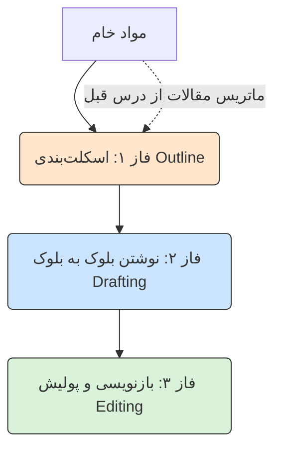




<div dir="rtl">
<div align="center">

# ✍️ نگارش متون دانشگاهی: معماری مقاله از صفر تا صد
### Academic Writing: Drafting from Skeleton to Masterpiece[🏠 بازگشت به خانه](../../README.md) | [درس قبلی: روش تحقیق علمی](09-academic-research.md) | [درس بعدی: انسانی‌سازی متن >](11-humanizing-text.md)

</div>

---

## 📝 سندروم صفحه سفید و وسوسه بزرگ

سخت‌ترین بخش هر پروژه، خیره شدن به یک صفحه سفید در نرم‌افزار Word است.
در این لحظه، یک وسوسه شیطانی به سراغ شما می‌آید: *"ولش کن، به ChatGPT می‌گم کل ۱۰ صفحه رو برام بنویسه!"*

**نتیجه این کار فاجعه است.** وقتی از هوش مصنوعی می‌خواهید یک متن طولانی را یک‌جا بنویسد:
۱. ساختار منطقی از هم می‌پاشد.
۲. پر از جملات کلیشه‌ای مثل "در دنیای پرشتاب امروزی" می‌شود.
۳. عمق علمی ندارد و صرفاً کلمات را کش می‌دهد (آب می‌بندد).

> [!WARNING]
> **قانون طلایی نگارش با AI:**
> هرگز از ماشین نخواهید "متن" بنویسد؛ از او بخواهید **"پاراگراف"** بنویسد. ما مقاله را مثل یک ساختمان می‌سازیم: اول اسکلت فلزی (Outline)، بعد آجرچینی اتاق به اتاق.

---

## 🏗️ متدولوژی بلوک‌های لگو (The Lego Methodology)

یک نویسنده حرفه‌ای (سایبورگ) فرآیند نگارش را به ۳ مرحله تقسیم می‌کند:



### فاز ۱: مهندسی اسکلت (The Outline)
قبل از نوشتن حتی یک خط متن، باید نقشه راه را با هوش مصنوعی بچینید.

**پرامپت اسکلت‌ساز:**
> `تو یک استاد راهنمای سخت‌گیر هستی. من می‌خواهم مقاله‌ای با موضوع [موضوع شما] بنویسم که هدف اصلی آن [هدف مقاله] است.`
> `یک ساختار درختی (Outline) بسیار دقیق برای این مقاله طراحی کن. ساختار باید شامل تیترهای اصلی (H1) و زیرتیترها (H2 و H3) باشد. برای هر زیرتیتر، در یک جمله بنویس که دقیقاً چه چیزی باید در آن بخش گفته شود و از چه نوع داده‌ای (آمار، مثال، تئوری) باید استفاده کرد.`

**خروجی:** شما حالا یک نقشه بی‌نقص دارید که منطق مقاله را تضمین می‌کند. اگر استاد ایرادی بگیرد، در همین مرحله اسکلت را عوض می‌کنید، نه وقتی که ۱۰ صفحه نوشته‌اید!

---

### فاز ۲: ساخت طبقه به طبقه (Section-by-Section Drafting)
حالا که نقشه را دارید، به هوش مصنوعی می‌گویید: *"فقط بخش ۲ (پیشینه تحقیق) را برای من بنویس."*
این روش به هوش مصنوعی فضای کافی می‌دهد تا متن یکپارچه و عمیقی تولید کند، بدون اینکه به محدودیت خروجی (Token Limit) برخورد کند. اینجا باید از **"مواد خام"** (ماتریس مقالاتی که در درس قبل ساختیم) استفاده کنید تا متن شما مستند باشد.

<table align="center" width="100%" border="0">
  <tr>
    <td width="100%">
      <b>پرامپت تولید بخش (کپی کنید):</b><br>
      <code>من در حال نوشتن بخش [نام تیتر، مثلاً روش‌شناسی] از مقاله‌ام هستم. وظیفه تو این است که فقط و فقط همین بخش (شامل تمام زیرتیترهایش) را در حدود ۸۰۰ تا ۱۲۰۰ کلمه بنویسی.</code><br><br>
      <code>مواد خام تو برای این بخش، این اطلاعات است:[داده‌های ماتریس یا فیش‌برداری‌های خودتان را اینجا پیست کنید].</code><br><br>
      <code><b>محدودیت‌ها:</b></code><br>
      <code>- از هیچ اطلاعات خارجی غیر از مواد خامی که دادم استفاده نکن.</code><br>
      <code>- با یک پاراگراف مقدمه کوتاه برای همین بخش شروع کن تا ذهن خواننده آماده شود.</code><br>
      <code>- هر جا ادعایی کردی، حتماً رفرنس آن را (طبق مواد خام) در پرانتز ذکر کن.</code><br>
      <code>- بین پاراگراف‌های این بخش، پیوستگی (Flow) منطقی ایجاد کن تا متن تکه‌تکه به نظر نرسد.</code>
    </td>
  </tr>
</table>


### فاز ۳: رفع سندروم فرانکنشتاین (Transitions & Flow)

وقتی بخش به بخش جلو می‌روید، یک مشکل جدید پیش می‌آید: مقاله شما شبیه "هیولای فرانکنشتاین" می‌شود! وقتی بخش‌های مختلف (مثلاً مقدمه، پیشینه تحقیق، و روش‌شناسی) را جداگانه تولید کردید، یک مشکل کوچک پیش می‌آید: درزهای بین طبقات ساختمان مشخص است! پرش منطقی بین پایان بخش اول و شروع بخش دوم توی ذوق می‌زند.

اینجاست که دوباره از هوش مصنوعی در نقش **"ویراستار پیونددهنده"** استفاده می‌کنیم.

> [!TIP]
> **پرامپت ایجاد جریان بین بخش‌ها (Flow Builder):**
> `این پاراگراف آخرِ بخش قبلی من، و پاراگراف اولِ بخش جدید من است. ارتباط معنایی و منطقی بین پایان آن بخش و شروع این بخش ضعیف است. لطفاً بدون تغییر محتوای اصلی و داده‌ها، یک یا دو جمله انتقالی (Transition Sentence) بین آن‌ها اضافه کن و اتصال این دو بخش را طوری بازنویسی کن که خواننده اصلاً متوجه پرش موضوع نشود و متن مثل آب روان باشد.`

---

## 🪞 آینه هوشمند: نقد قبل از تحویل (Peer Review Simulator)

قبل از اینکه فایل Word را ذخیره کنید و برای استاد بفرستید، یک مرحله حیاتی باقی مانده است. اساتید معمولاً دنبال نقاط ضعف، مغالطه‌های منطقی یا کمبود رفرنس می‌گردند.
چرا قبل از استاد، خودمان مقاله را زیر تیغ نقد نبریم؟

**تکنیک "داور سخت‌گیر" (The Reviewer Persona):**
کل متن مقاله‌ای که تا اینجا نوشته‌اید را کپی کنید و به هوش مصنوعی (ترجیحاً مدلی مثل Claude 3.5 Sonnet یا o1) بدهید:

```text
[Role]: تو یک داور (Reviewer) بسیار سخت‌گیر در یک ژورنال علمی معتبر (Q1) هستی.
[Task]: این پیش‌نویس مقاله من است. آن را با دقت بخوان و بی‌رحمانه نقد کن.
[Constraints]:
- حداقل ۳ ایراد منطقی، پرش موضوعی، یا کمبود استدلال در متن پیدا کن.
- اگر جمله‌ای مبهم است یا ادعای بزرگی دارد که رفرنس ندارد، آن را مشخص کن.
- فقط ایراد نگیر؛ برای هر ایراد، یک پیشنهاد عملی برای اصلاح بده. خروجی را در یک جدول ارائه کن.
```

شما با این کار، **پیشاپیش** تمام بهانه‌های استاد برای کم کردن نمره را از بین برده‌اید!

---

## 🚨 زنگ خطر نهایی

با رعایت متدولوژی بلوک‌های لگو (اسکلت ➔ آجرچینی ➔ پیوند و نقد)، مقاله شما از نظر علمی، ساختاری و منطقی بی‌نقص است و مهم‌تر از همه: **حاوی رفرنس‌های واقعی است.**

**اما یک چالش مرگبار هنوز پابرجاست.**

متن شما هنوز بوی "هوش مصنوعی" می‌دهد. تقارن کلمات، ساختار یکنواخت جملات و نظم بیش از حد آن، باعث می‌شود نرم‌افزارهای تشخیص تقلب (AI Detectors) مثل Turnitin یا GPTZero فوراً روی آن برچسب "تولید شده توسط AI" بزنند.
اگر متن را همین‌طور تحویل دهید، تمام زحماتتان بر باد می‌رود.

برای اینکه مقاله از این فیلترها رد شود و روح انسانی پیدا کند، باید به آن **"نقص انسانی"** تزریق کنیم.

<div align="center">

**[درس بعدی: انسانی‌سازی متن (دور زدن نرم‌افزارهای تشخیص AI) 👉](11-humanizing-text.md)**

</div>

</div>