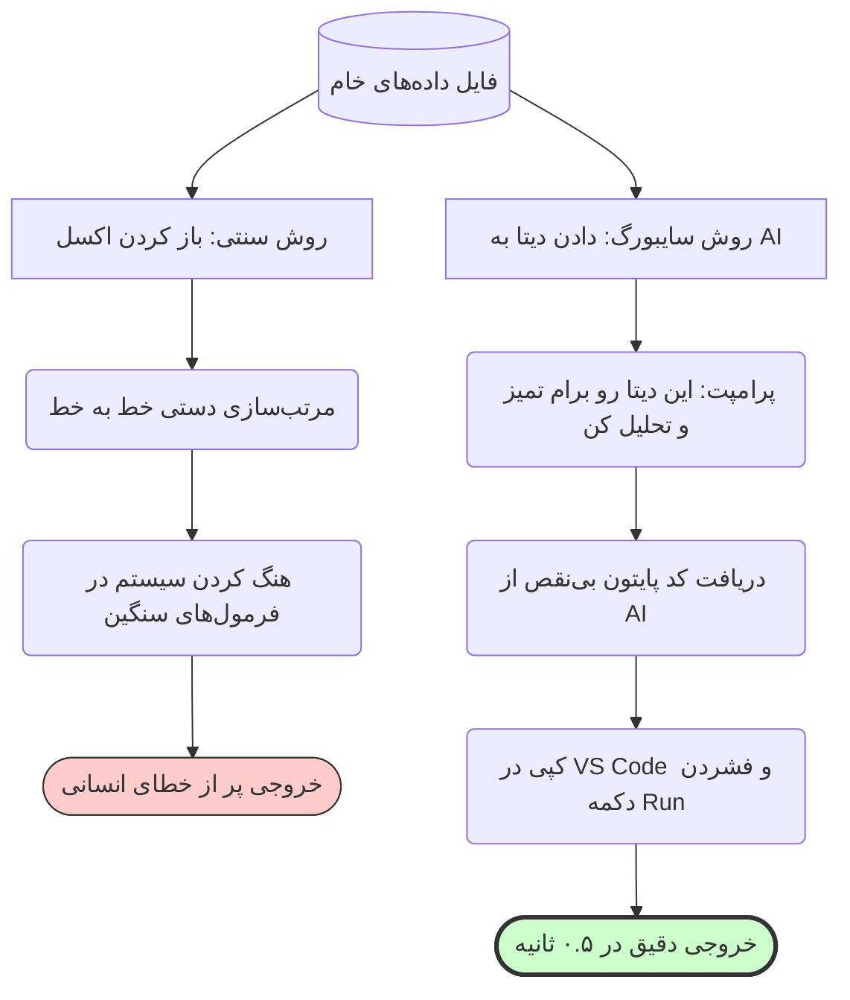




<div dir="rtl">
<div align="center">

# 📊 کیمیاگری داده‌ها: تحلیل CSV با پایتون (بدون کدنویسی)
### Data Analysis: From Messy Excel to Python Insights

[🏠 بازگشت به خانه](../../README.md) |[درس قبلی: راه‌اندازی محیط کار](12-environment-setup.md) |[درس بعدی: جادوی HTML و مصورسازی >](13.5-html-visualization.md)

</div>

---

## 📉 مرگ اکسل در پروژه‌های دانشگاهی

بیایید یک سناریوی تکراری را بررسی کنیم: استاد به شما یک فایل اکسل با ۲۰,۰۰۰ ردیف داده خام و به‌هم‌ریخته (مثلاً نتایج یک پرسشنامه یا دیتای سنسورهای آزمایشگاهی) می‌دهد. 
روش سنتی چیست؟ باز کردن Excel، نوشتن فرمول‌های طولانی (`VLOOKUP`)، پاک کردن دستیِ سلول‌های خالی، و در نهایت هنگ کردن سیستم! 

**این روش کارگری است، نه مهندسی.**
در دنیای مدرن، ما داده‌های خام را به عنوان یک فایل `CSV` ذخیره می‌کنیم و از هوش مصنوعی می‌خواهیم یک اسکریپت **پایتون** (Python) برای ما بنویسد تا در ۲ ثانیه تمام دیتا تمیز، فیلتر و تحلیل شود.

شما نیازی به دانستن توابع پایتون ندارید؛ شما فقط منطق را به AI می‌گویید و کدی که به شما می‌دهد را در VS Code (که در درس قبل نصب کردیم) `Run` می‌کنید.

---

## 🗺️ مقایسه دو مسیر (کارگر در برابر معمار)



---

## 🧹 فاز اول: تمیزکاری داده‌ها (Data Cleaning)

داده‌های واقعی همیشه کثیف‌اند. ستون‌های خالی دارند، تاریخ‌ها فرمت‌های مختلفی دارند و بعضی اعداد پرت (Outliers) هستند.
اولین قدم این است که چند سطر از فایل CSV خود را کپی کنید و به هوش مصنوعی (مثل ChatGPT 4o یا Claude 3.5 Sonnet) بدهید تا ساختار آن را بفهمد.

>[!TIP]
> **تکنیک Data Snippet (نمونه داده):**
> نیازی نیست کل فایل ۲۰ هزار خطی را در چت کپی کنید (چون محدودیت کاراکتر اجازه نمی‌دهد). فقط ۵ خط اول (ردیف عناوین + ۴ ردیف داده) را کپی کنید تا AI بفهمد نام ستون‌ها چیست.

<table align="center" width="100%" border="0">
  <tr>
    <td width="100%">
      <b>🤖 پرامپت مهندس داده (کپی کنید):</b><br>
      <code>تو یک تحلیل‌گر ارشد داده (Data Scientist) هستی که با کتابخانه Pandas در پایتون کار می‌کنی.</code><br><br>
      <code>من یک فایل داده به نام <b>data.csv</b> دارم. این ۵ خط اول فایل من است تا با ساختار ستون‌ها آشنا شوی:</code><br>
      <code>[۵ خط اول فایل خود را اینجا پیست کنید]</code><br><br>
      <code><b>ماموریت تو (Instructions):</b></code><br>
      <code>یک اسکریپت کامل پایتون بنویس که کارهای زیر را به ترتیب انجام دهد:</code><br>
      <code>۱. فایل data.csv را بخواند.</code><br>
      <code>۲. تمام ردیف‌هایی که در ستون[نام ستون مهم] خالی (NaN) هستند را حذف کند.</code><br>
      <code>۳. داده‌های پرت (Outliers) در ستون [نام ستون اعداد] را با استفاده از روش میانگین فیلتر کند.</code><br>
      <code>۴. داده‌های تمیز شده را در یک فایل جدید به نام <b>cleaned_data.csv</b> ذخیره کند.</code><br><br>
      <code><b>محدودیت‌ها:</b></code><br>
      <code>- روی تمام خطوط کد، کامنت فارسی بگذار تا بفهمم هر خط چه کار می‌کند.</code><br>
      <code>- از هیچ کتابخانه عجیبی استفاده نکن، فقط pandas و numpy.</code>
    </td>
  </tr>
</table>


### ⚙️ فاز دوم: اجرای جادو در VS Code

وقتی هوش مصنوعی کد پایتون را به شما داد، اصلاً نیازی نیست خطوط آن را خط به خط بخوانید یا بفهمید (شما معمار هستید، نه تایپیست!). فقط این ۳ قدم ساده را طی کنید:

۱. یک پوشه (Folder) جدید در کامپیوتر خود بسازید (مثلاً `Uni_Project`).
۲. فایل اکسل خام خود را با نام `data.csv` داخل این پوشه قرار دهید.
۳. نرم‌افزار **VS Code** را باز کنید و این پوشه را در آن باز کنید (`File > Open Folder`).
۴. یک فایل جدید به نام `cleaner.py` بسازید، کدی که AI داده را در آن Paste کنید و آن را ذخیره کنید (`Ctrl+S`).
۵. در گوشه بالا سمت راست VS Code، روی دکمه مثلثی شکل **Run (اجرا)** کلیک کنید.

> [!TIP]
> **نتیجه:** در کسری از ثانیه، یک فایل جدید به نام `cleaned_data.csv` در پوشه شما ظاهر می‌شود که تمام ایرادات، سلول‌های خالی و داده‌های پرت آن پاک شده است! کاری که در اکسل ساعت‌ها زمان می‌بُرد.

---

## 🧮 فاز سوم: استخراج بینش و تحلیل آماری (Data Insights)

حالا که داده‌های تمیزی داریم، وقت آن است که فرمول‌های سنگین آماری را پیاده کنیم. استاد از شما می‌خواهد که "همبستگی (Correlation) بین متغیر A و B" را پیدا کنید یا "پیش‌بینی روند آینده (Trend Prediction)" را انجام دهید.

دوباره سراغ کارمند ارشد خود (AI) می‌رویم:

<details>
<summary><b>🔥 باز کردن پرامپت تحلیل آماری پیشرفته</b> <i>(کلیک کنید)</i></summary>

```text
[Role]: 
تو یک متخصص تحلیل داده (Data Analyst) و آمار زیستی/مهندسی/اقتصادی هستی.[Instructions]: 
ما در مرحله قبل یک فایل داده تمیز شده به نام 'cleaned_data.csv' ساختیم. ستون‌های این فایل شامل [نام ستون‌های مهم را اینجا بنویسید] است.
من از تو می‌خواهم یک اسکریپت پایتون جدید به نام 'analysis.py' بنویسی که این فایل را بخواند و محاسبات زیر را روی آن انجام دهد:

[Steps]:
۱. میانگین، واریانس و انحراف معیار ستون [نام ستون X] را محاسبه و چاپ (Print) کند.
۲. ضریب همبستگی پیرسون (Pearson Correlation) را بین ستون [X] و [Y] محاسبه کند و بگوید آیا ارتباط معناداری دارند یا نه.
۳. داده‌ها را بر اساس ستون [Z] دسته‌بندی (Group By) کند و میانگین هر دسته را نشان دهد.
۴. نتایج این تحلیل‌ها را در یک فایل متنی ساده (results.txt) ذخیره کند تا بتوانم آن را در مقاله خود کپی کنم.

[Narrowing]:
- کد باید بسیار بهینه (Optimized) باشد و در صورت بروز خطا (مثلاً پیدا نشدن فایل)، ارورهای قابل فهم (Try-Except) چاپ کند.
- از کتابخانه‌های pandas و scipy/numpy استفاده کن.
```

</details>

پس از اجرای این کد در VS Code، شما یک فایل متنی (`results.txt`) دریافت می‌کنید که تمام اعداد و ارقام دقیق، بدون هیچ خطای انسانی، در آن نوشته شده است.

---

## 🚨 یک قدم تا ارائه: اعداد خسته‌کننده‌اند!

ما توانستیم یک فایل کثیف ۲۰ هزار خطی را در چند ثانیه تمیز کنیم و پیچیده‌ترین محاسبات آماری را روی آن پیاده کنیم، آن هم **بدون نوشتن حتی یک خط کد**.

اما یک مشکل بزرگ وجود دارد:
اساتید و داوران با دیدن فایل متنی `results.txt` یا اعداد خشک و خالی هیجان‌زده نمی‌شوند. اگر می‌خواهید نمره کامل را بگیرید و نشان دهید که یک سر و گردن از بقیه دانشجویان بالاتر هستید، باید این اعداد را **مصورسازی (Visualize)** کنید.

بیشتر دانشجویان در این مرحله داده‌ها را به اکسل می‌برند و یک نمودار دایره‌ای (Pie Chart) ساده و بی‌روح می‌کشند.
اما ما قرار است از هوش مصنوعی بخواهیم داده‌های ما را تبدیل به یک **داشبورد سه‌بعدی و تعاملی (Interactive HTML)** کند؛ جایی که استاد بتواند با موس روی نمودارها حرکت کند و اعداد تغییر کنند!

<div align="center">

**[درس بعدی: جادوی HTML  👉](13.5-html-visualization.md)**

</div>

</div>