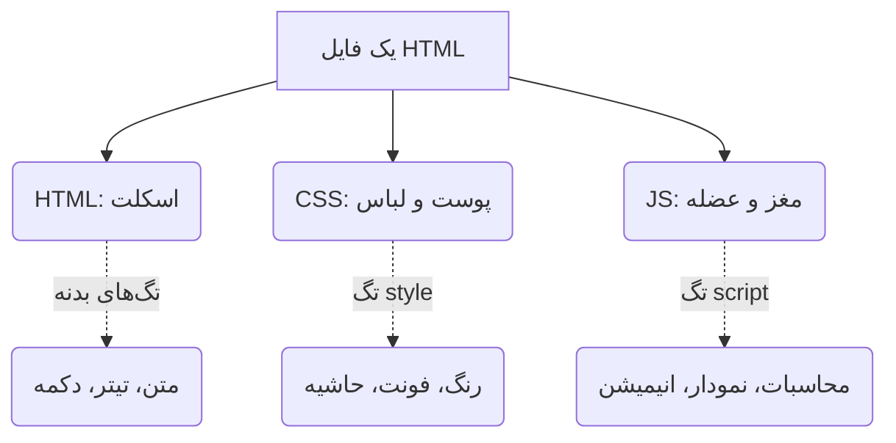

# 🌐 جادوی HTML: بوم نقاشی نامحدود شما
### The HTML Canvas: Beyond Simple Data Visualization

[🏠 بازگشت به خانه](../../README.md) |[درس قبلی: تحلیل داده با پایتون](13-data-analysis.md) |[درس بعدی: اتوماسیون با پایتون >](14-python-automation.md)

---

## 🛑 ورد و پی‌دی‌اف (Word & PDF) متعلق به قرن گذشته‌اند!

شما داده‌هایتان را با پایتون تحلیل کردید و یک سری عدد و رقم به دست آوردید. حالا می‌خواهید این‌ها را به استاد تحویل دهید. 
روش سنتی چیست؟ کپی کردن در یک فایل Word، کشیدن یک جدول خشک و بی‌روح، و تبدیل آن به PDF. 

**اما اگر به شما بگویم می‌توانید فایل تکالیف، گزارش‌کار یا پروژه‌تان را تبدیل به یک "نرم‌افزار زنده" کنید چه؟**
فایلی که استاد بتواند در آن روی نمودارها موس را حرکت دهد، اعداد را تغییر دهد تا نتیجه را زنده ببیند، و ظاهر آن شبیه سایت‌های مدرن شرکت‌های تکنولوژی (مثل اپل یا گوگل) باشد!

راز این کار، استفاده از فرمت **HTML** است. 
شما قرار نیست طراح سایت شوید؛ هوش مصنوعی کل کد را می‌نویسد. شما فقط باید "آناتومی" این موجود را بشناسید تا بدانید کدهایی که AI می‌دهد را کجا کپی کنید.

---

## 🦴 آناتومی یک فایل HTML (سه تفنگدار)

هر صفحه وب (یا فایل HTML) از ۳ زبان مختلف تشکیل شده است که مثل اعضای یک بدن با هم کار می‌کنند. نیازی به حفظ کردن کُدها نیست، فقط مفهوم را درک کنید:

۱. **اسکلت (HTML):** ساختار اصلی است. به مرورگر می‌گوید "اینجا یک تیتر است"، "اینجا یک دکمه است". همه چیز داخل تگ `<body>` قرار می‌گیرد.
۲. **لباس و ظاهر (CSS):** فایل شما را خوشگل می‌کند. رنگ‌ها، سایه‌ها و انحناها کار CSS است. کدهای آن معمولاً داخل تگ `<style>` در بخش `<head>` فایل قرار می‌گیرند.
۳. **مغز و منطق (JavaScript یا JS):** به صفحه شما جان می‌دهد. اگر می‌خواهید با کلیک روی یک دکمه، نموداری رسم شود یا محاسبه‌ای (مثل خطای نسبی در آزمایشگاه فیزیک) انجام شود، این کُدها داخل تگ `<script>` قرار می‌گیرند.

> [!TIP]
> **قانون طلایی اجرای وب:**
> برای اجرای یک فایل HTML به هیچ نرم‌افزار خاصی نیاز ندارید! فقط کدها را در یک فایل متنی ساده (مثل Notepad یا VS Code) پیست کنید، با پسوند `.html` ذخیره کنید و روی آن **دوبار کلیک کنید** تا در مرورگر (Chrome) باز شود.

---

## 🚀 با HTML چه شاهکارهایی می‌توانیم بسازیم؟

فکر نکنید HTML فقط برای "طراحی سایت" است. شما می‌توانید هر تکلیف دانشگاهی را به یک شاهکار تعاملی تبدیل کنید. در اینجا ۴ نمونه از کارهایی که می‌توانید از AI بخواهید برایتان کدنویسی کند را بررسی می‌کنیم:

### ۱. گزارش‌کار آزمایشگاهِ "زنده" (Interactive Lab Reports)
فرض کنید گزارش آزمایشگاه فیزیک (مثلاً اندازه‌گیری ولتاژ و جریان) دارید. 
به جای جدول کشیدن در Word، از هوش مصنوعی بخواهید یک فایل HTML بسازد که در آن فیلدهایی برای وارد کردن اعداد (V و I) وجود داشته باشد. با زدن یک دکمه، جاوا اسکریپت خودش مقاومت (R) و **درصد خطای نسبی** را حساب کرده و در لحظه **نمودار رگرسیون خطی (Best Fit Line)** را با کتابخانه `Chart.js` رسم کند! (استاد با دیدن این فایل کف می‌کند).

### ۲. گزارش کارآموزی و مستندات فوق‌حرفه‌ای (Modern Documents)
می‌توانید به AI بگویید متون و عکس‌های گزارش کارآموزی شما را بگیرد و آن را با استفاده از فریم‌ورک‌های مدرن (مثل `Tailwind CSS`) تبدیل به یک صفحه وب بسیار شیک با کارت‌های رنگی، سایه‌های نرم و تایپوگرافی زیبا کند. این فایل را می‌توانید مستقیماً به استاد ایمیل کنید.

### ۳. رسم دیاگرام‌های مهندسی بدون موس (Mermaid.js)
اگر در پروژه خود نیاز به فلوچارت، چارت سازمانی یا نقشه گانت (Gantt) دارید، نیازی به نرم‌افزارهای سنگین مثل Visio نیست. در فایل HTML، با استفاده از کتابخانه `Mermaid.js`، هوش مصنوعی فقط با نوشتن متن، نمودارهای مهندسی دقیق و زیبا برای شما رندر می‌کند.

### ۴. ساخت اسلایدهای هولوگرامی و تله‌پرامپتر (آینده ارائه‌ها)
آیا می‌دانستید می‌توانید پاورپوینت را دور بیندازید؟ با استفاده از فایل‌های HTML و کتابخانه `Reveal.js`، هوش مصنوعی می‌تواند ارائه‌های سه‌بعدی با انیمیشن‌های سینمایی بسازد. حتی می‌توانید یک فایل مجزا به عنوان "یادداشت سخنران" (تله‌پرامپتر) با تایمر و کنترلر فونت برای خودتان بسازید! *(این موضوع آنقدر مهم است که یک فصل کامل [فصل ۵] را به آن اختصاص داده‌ایم).*

---

## 🪄 پرامپت جادویی: چطور از AI یک فایل HTML بی‌نقص بگیریم؟

هوش مصنوعی گاهی تنبلی می‌کند و کدهای HTML، CSS و JS را در ۳ فایل جداگانه به شما می‌دهد (که اجرای آن برای افراد مبتدی گیج‌کننده است).
برای اینکه یک خروجی تمیز و آماده اجرا بگیرید، **همیشه از این محدودیت‌ها در پرامپت خود استفاده کنید:**

<table align="center" width="100%" border="0">
  <tr>
    <td width="100%">
      <b>🤖 افزونه‌های الزامی در پرامپت‌های طراحی وب:</b>  
      <code><b>[محدودیت‌های فنی]:</b></code> 
      <code>۱. تمام کدها (HTML, CSS, JS) را <b>فقط در یک فایل یکپارچه (Single File)</b> تحویل بده.</code> 
      <code>۲. از هیچ فایل خارجی (مثل عکس‌های لوکال) استفاده نکن. اگر نیاز به آیکون داری از FontAwesome (از طریق لینک CDN) استفاده کن.</code> 
      <code>۳. برای رسم نمودار از کتابخانه‌های معتبر (مثل Chart.js یا Plotly.js) از طریق لینک CDN استفاده کن.</code> 
      <code>۴. ظاهر برنامه باید بسیار مدرن، مینیمال و دارای حالت تاریک (Dark Mode) باشد.</code> 
      <code>۵. فونت صفحه را روی 'Vazirmatn' تنظیم کن و جهت صفحه حتماً RTL (راست‌چین) باشد.</code>
    </td>
  </tr>
</table>

### 🛠️ روش اجرا در ۳ ثانیه:
۱. کد تولید شده توسط AI را کپی کنید.
۲. در VS Code (یا حتی Notepad) یک فایل جدید به نام `project.html` بسازید و کد را داخل آن پیست کنید.
۳. فایل را Save کنید.
۴. روی فایل `project.html` دوبار کلیک کنید. مرورگر شما باز می‌شود و نرم‌افزار شخصی شما آماده کار است!

---

## 🏁 جمع‌بندی ابزارهای فنی

تا اینجا یاد گرفتیم چطور داده‌ها را با **پایتون** حلاجی کنیم و چطور با **HTML** آن‌ها را به زیباترین شکل ممکن به نمایش بگذاریم. 

اما پایتون فقط برای "محاسبات و آمار" نیست. پایتون می‌تواند کارهای تکراری روزمره شما را انجام دهد! (مثلاً دانلود خودکار ۱۰۰ مقاله، یا تغییر نام ۵۰۰ فایل به صورت همزمان). در درس بعدی به سراغ "اتوماسیون" می‌رویم تا ببینیم چطور پایتون می‌تواند نقش یک ربات کارگر را برای ما بازی کند.

**[درس بعدی: اتوماسیون با پایتون (سپردن کارهای تکراری به ماشین) 👉](14-python-automation.md)**

