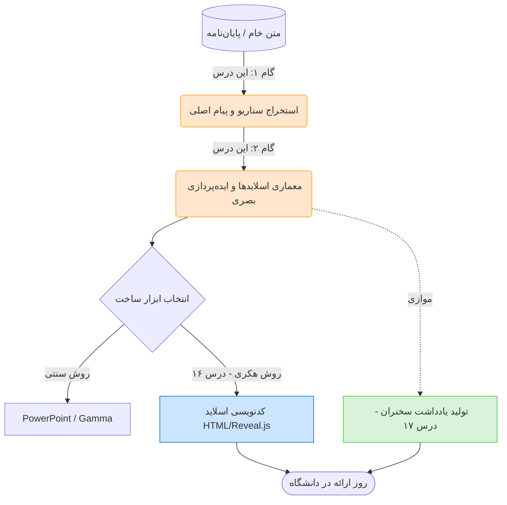




<div dir="rtl">
<div align="center">

# 🎤 معماری ارائه: داستان‌سرایی قبل از طراحی
### Presentation Structure: Crafting the Storyline
[🏠 بازگشت به خانه](../../README.md) |[درس قبلی: اتوماسیون با پایتون](../04-technical-skills/14-python-automation.md) |[درس بعدی: ساخت اسلاید تعاملی با HTML >](16-html-slides.md)

</div>

---

## 🛑 تله‌ی نرم‌افزار: چرا ارائه‌های شما خواب‌آور است؟

بزرگترین اشتباه دانشجویان این است: وقتی می‌خواهند برای یک دفاع یا سمینار آماده شوند، **مستقیماً نرم‌افزار PowerPoint را باز می‌کنند!**
نتیجه چیست؟ یک صفحه سفید می‌بینند، هول می‌شوند و شروع می‌کنند به کپی کردنِ پاراگراف‌های طولانی از فایل Word به داخل اسلایدها. در روز ارائه هم دقیقاً همان متن روی پرده را برای استاد روخوانی می‌کنند. 

> [!WARNING]
> **قانون طلایی ارائه‌های مدرن (TED Style):**
> اسلایدها برای **مخاطب** هستند، نه برای روخوانی شما. اگر قرار است کل متن را روی پرده بنویسید، خب فایل Word را به استاد ایمیل کنید تا خودش بخواند؛ چرا اصلاً ارائه می‌دهید؟
> اسلاید ها قراره ارئه شما را بهتر کنند نه جای شما ارائه بدهند!

برای داشتن یک ارائه بی‌نقص، ما فرآیند را از هم جدا می‌کنیم. هوش مصنوعی قرار است ابتدا نقش یک **"کارگردان سینما"** را برای ما بازی کند و سناریو بنویسد.

---

## 🗺️ جریان کار: از متن خشک تا صحنه نمایش

در این بخش و دو بخش آینده، ما این چرخه مهندسی‌شده را طی خواهیم کرد:



---

## 🧠 فاز اول: استخراج سناریو (The Storyline)

هوش مصنوعی بهترین ابزار برای فشرده‌سازی اطلاعات است. فایل Word تحقیق خود را (یا مقاله‌ای که باید ارائه دهید) به AI بدهید و از او بخواهید آن را تبدیل به یک **"داستان"** کند.

**پرامپت استخراج داستان:**
> `من این مقاله/متن را برای یک ارائه کلاسی ۱۵ دقیقه‌ای آماده کرده‌ام. نمی‌خواهم آن را به صورت آکادمیک و خشک ارائه دهم. متن من را بخوان و آن را به یک "سناریوی داستان‌گو" (TED Talk Style) تبدیل کن.`
> `به من بگو: ۱. قلاب (Hook) یا جمله جذاب برای شروع چیست؟ ۲. گره یا مشکل اصلی کجاست؟ ۳. نقطه اوج (اوج نوآوری تحقیق من) چیست؟`

---

## 🏗️ فاز دوم: معماری اسلایدها (Slide Blueprint)

حالا که داستان را داریم، باید به هوش مصنوعی بگوییم متن را به "بلوک‌های اسلاید" بشکند. این مرحله بسیار حیاتی است، چون ما دقیقاً مشخص می‌کنیم که "چه چیزی باید روی پرده دیده شود".

> [!TIP]
> **قانون 6x6 در اسلاید:** 
> در استانداردهای طراحی، هر اسلاید نباید بیشتر از ۶ خط و هر خط نباید بیشتر از ۶ کلمه داشته باشد. ما این قانون را با بی‌رحمی به هوش مصنوعی دیکته می‌کنیم!

<details>
<summary><b>🔥 باز کردن پرامپت مهندسِ معماری ارائه (Presentation Architect)</b> <i>(کلیک کنید)</i></summary>

```text
[Role]
تو یک طراح ارشد ارائه‌های تجاری و علمی (Presentation Architect) هستی که ارائه‌هایی در سطح استانداردهای شرکت اپل (مینیمال، کوبنده، بدون متن اضافه) طراحی می‌کنی.[Task]
بر اساس متن مقاله‌ای که به تو می‌دهم، ساختار (Outline) کامل یک ارائه ۱۰ اسلایدی را برای من طراحی کن.

[Steps]
برای هر اسلاید، دقیقاً این خروجی‌ها را به من بده:
۱. شماره و عنوان اسلاید (بسیار کوتاه و جذاب).
۲. متن اصلی روی اسلاید: فقط و فقط ۳ کلمه کلیدی یا یک جمله بسیار کوتاه (کمتر از ۱۰ کلمه). از نوشتن پاراگراف مطلقاً خودداری کن.
۳. ایده بصری (Visual Concept): به من پیشنهاد بده که در این اسلاید چه نوع عکسی، چه رنگی، یا چه نموداری قرار دهم تا پیام منتقل شود؟
۴. آمار شوکه‌کننده: اگر در متن من عدد مهمی وجود دارد، آن را برای این اسلاید به صورت تیتر درشت پیشنهاد بده.

[Constraints]
- فراموش نکن: اسلاید برای "دیدن" است، نه برای "خواندن". متن روی اسلاید باید حداقلِ ممکن باشد.
- خروجی را در قالب یک جدول مرتب با ستون‌های (شماره، عنوان، متن روی پرده، ایده بصری) به من تحویل بده.
```

</details>

---

## 🎨 فاز سوم: استایل و تِم (Visual Theme)

علاوه بر محتوا، هوش مصنوعی می‌تواند به شما ایده‌های دیزاین (Design Direction) بدهد.
فرض کنید موضوع شما **"امنیت شبکه‌های عصبی"** است. اگر به AI بگویید یک تم برای آن پیشنهاد بدهد، ممکن است خروجی زیر را بگیرید:

*   **رنگ‌بندی (Palette):** مشکی عمیق (پس‌زمینه)، آبی نئونی (متن‌های اصلی)، قرمز هشدار (برای بخش آسیب‌پذیری‌ها).
*   **استایل فونت:** استفاده از فونت‌های بدون دندانه (Sans-Serif) مثل Inter یا Vazirmatn برای القای حس تکنولوژی.
*   **المان‌های گرافیکی:** استفاده از خطوط متصل به هم (شبکه) در پس‌زمینه.

*(دقت کنید: ما در درس بعدی از همین ایده‌های رنگی برای کدنویسی اسلایدها استفاده خواهیم کرد!)*

---

## 🎯 نتیجه این بخش چیست؟

با انجام مراحل بالا، شما اکنون **یک جدول کامل** در دست دارید. 
شما دقیقاً می‌دانید که قرار است ۱۰ اسلاید داشته باشید، در اسلاید سوم قرار است عدد "۵۲٪" بزرگ نوشته شود و پس‌زمینه آن باید قرمز باشد.

**حالا دو راه پیش رو دارید:**
1.  **راه افراد عادی:** نرم‌افزار PowerPoint یا سایت‌هایی مثل Gamma را باز کنید و بر اساس این جدول، اسلایدها را دستی بسازید.
2.  **راه سایبورگ‌ها:** اصلاً نرم‌افزاری باز نکنید! این جدول را به یک کُد HTML تزریق کنید و خفن‌ترین فایل ارائه عمرتان را که قابلیت اجرای تحت وب دارد، بسازید.

ما در این هندبوک راه دوم را انتخاب می‌کنیم.

<div align="center">

**[درس بعدی: ساخت اسلاید تعاملی با HTML (مرگ بر پاورپوینت) 👉](16-html-slides.md)**

</div>

</div>