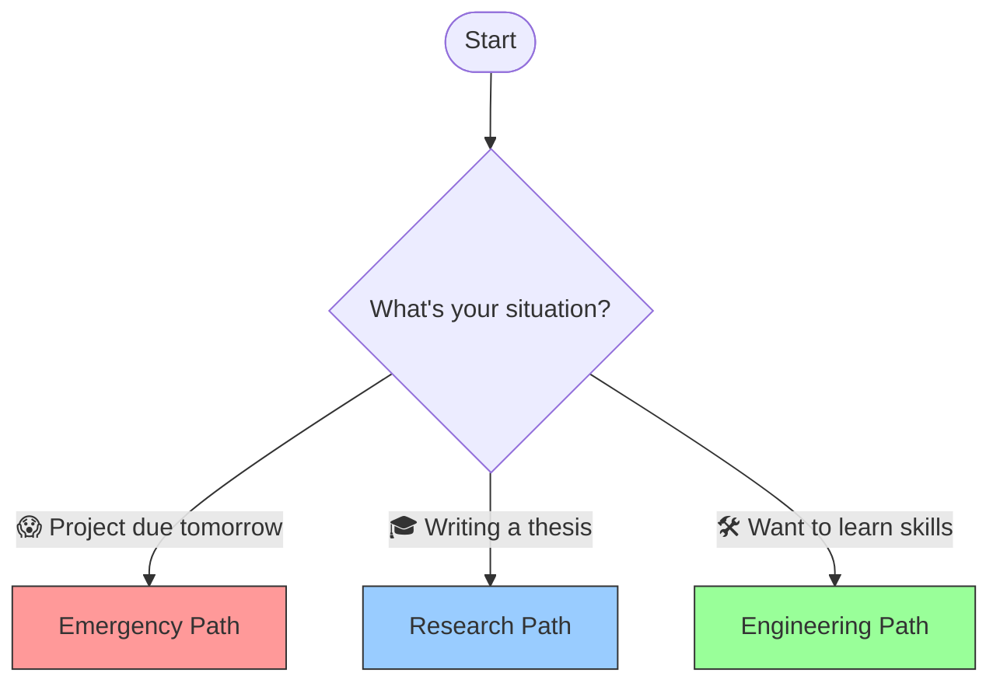

# 🗺️ Roadmap: How to Use This Handbook?
### The Learning Roadmap

[🏠 Back to Home](../../../README.md) | [Next Lesson: Mindset & Ethics >](01-mindset-and-ethics.md)

---

## 🎯 What is the Goal of This Course?

Let me put your mind at ease right away:
*   ❌ **Complex Math?** Nope.
*   ❌ **Advanced Programming?** Not needed.
*   ❌ **Expensive Subscriptions?** Most tools are free.

**Our Goal:** To turn you into a **"Hybrid Student."**
Someone who doesn't need to memorize everything, but knows how to manage "tools" to do the hardest tasks (like data analysis or writing an essay) in just a few minutes.

---

## 🚦 Where Do I Start? (Learning Paths)

This handbook is not linear. You don't have to read it from page 1 to 100. Depending on your current situation, pick one of the paths below:

### 1. Emergency Path (The Night Before Deadline) 🚑
*Situation: You are out of time, stressed, and just need to get the job done.*

1.  **File [`05-prompt-basics`](../02-prompt-engineering/05-prompt-basics.md)**: Learn how to ask the right questions so you don't get bad answers.
2.  **File [`10-academic-writing`](../03-research-writing/10-academic-writing.md)**: How to quickly generate a first draft.
3.  **File [`11-humanizing-text`](../03-research-writing/11-humanizing-text.md)**: **Crucial!** Techniques to bypass AI detection (otherwise you might get a zero).

### 2. Research Path (The Thesis Mode) 🎓
*Situation: You need deep, accurate, and scientific work (for a paper or thesis).*

1.  **File [`04-research-tools`](../01-fundamentals/04-research-tools.md)**: Tools like Consensus to find real academic references.
2.  **File [`09-academic-research`](../03-research-writing/09-academic-research.md)**: Modern note-taking and organizing data with AI.
3.  **File [`13-data-analysis`](../04-technical-skills/13-data-analysis.md)**: Statistical data analysis without needing advanced Excel skills.

### 3. Engineering Path (The Builder Mode) 🛠️
*Situation: You want to go beyond chatting and get specific outputs (code, charts, slides).*

1.  **File [`12-environment-setup`](../04-technical-skills/12-environment-setup.md)**: Installing the necessary tools (like VS Code).
2.  **File [`14-html-visualization`](../04-technical-skills/14-html-visualization.md)**: Building web-based visual outputs with the help of AI.
3.  **File [`15-python-automation`](../04-technical-skills/15-python-automation.md)**: Running Python scripts written by AI for automation.
4.  **File [`17-html-slides`](../05-presentations/17-html-slides.md)**: Creating professional slides using code (instead of PowerPoint).

---

## 🧰 What Might Be Needed? (Suggested Toolkit)

To start, you only need a "web browser." But to work like a pro, it helps to be familiar with these:

### 1. AI Models
We are not limited to ChatGPT. Depending on your needs, we use:
*   **For daily chats:** ChatGPT or Claude.
*   **For deep research:** DeepSeek (Deep Research) or Qwen.
*   **For heavy analysis:** Google AI Studio (Gemini Pro).

##### *This list is going to get much bigger :)*

### 2. Execution Tools
*   **VS Code:** A simple environment to save or run the code that AI gives you.
*   **Python:** The programming language that AI is great at (we just install it so AI can do its job).
*   **HTML:** A powerful and accessible format to get visual outputs from AI, or even to make presentation slides for your professor!

> **Note:** Don't worry! In the next sections, we will learn how to install and use these step-by-step.

---

## 🚀 Ready to Fly?

Now that you have the map, it's time to start the engines.
Before you type your first prompt, we need to do a small "update" on our mindset so we don't fall into common traps.

**[Next Step: Installing a New Mental Operating System (Mindset & Ethics) 👉](01-mindset-and-ethics.md)**

