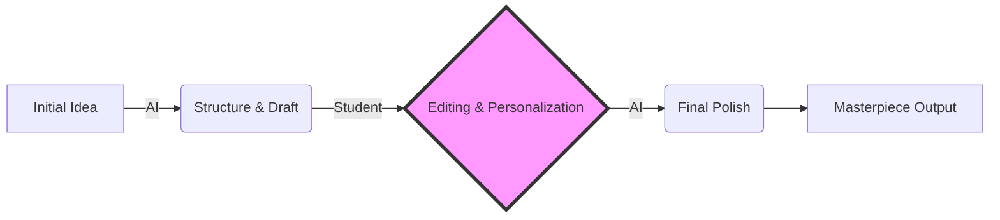

# 🧠 Mindset & Methodology: Surgical Scalpel or Kitchen Knife?
### The AI Methodology & Mindset

[🏠 Back to Home](../../../README.md) | [Previous Lesson: The Roadmap](00-roadmap.md) | [Next Lesson: How Do LLMs Work? >](../01-fundamentals/02-how-llms-work.md)

---

## 🔪 A Tool is a Tool!

AI is like a **knife**.
You can use it to peel potatoes (everyday tasks), perform heart surgery (specialized tasks), or cut your own hand (using it wrong).

We're not here to say "don't do it"; we're here to learn **"professional cutting techniques."**
The ultimate goal is to raise the quality of your output (paper, code, presentation) so high that no human alone can compete with it.

---

## ⛔ Why "Copy-Paste" Methods Don't Work Anymore

Maybe you could get a good grade by copying ChatGPT's text before, but the game has changed now. Text that comes directly from AI has 3 deadly signs that scream like a warning siren:

1.  **Monotonous Tone (Lack of Burstiness):** AI sentences are always "average" and "polished." They have no ups and downs.
2.  **Repetitive Words:** Phrases like "in today's world," "it is noteworthy that," or "in other words" are overused.
3.  **Lack of Depth:** AI usually speaks in generalities and doesn't get into specific details.

> **The result:** Your professor will know the text isn't yours after reading the first paragraph. Even without an AI detector, the "feel" of the text gives it away. Just like you can probably tell this material was made with AI ;).

---

## 🏗️ The New Methodology: From "Producer" to "Architect"

If you want to survive in university (and the future job market), you need to change your perspective.
In the old model, the student was the "laborer" (typing, translating, coding).
In the new model, you are the **"architect" (manager)**, and the AI is your **"contractor (or slave, in my opinion)."**

### What's the Difference?
*   **Architect (You):** Draws the blueprint, sets the strategy, controls the quality, and has the final responsibility.
*   **Contractor (AI):** Lays the bricks, raises the walls, and does the repetitive work.

### The Old Model (Loser) ❌
*   **Student:** "Write a paper about the history of architecture."
*   **AI:** (Generates a generic text)
*   **Student:** (Copy -> Paste -> Submit)
*   **Result:** An average grade or failure.

### The New Model (Winner) ✅
*   **Student:** "I'm working on this idea. Read these 3 articles and extract their key points."
*   **AI:** (Summarizes and analyzes)
*   **Student:** (Combines ideas, adds personal insights, and refines the text)
*   **Result:** A unique work, created 10 times faster.

> [!TIP]
> **The 80/20 Rule:**
> Spend 80% of your time "designing the right prompt" and "reviewing the output." Spend only 20% of your time on "manual writing or coding."

---

## ⚖️ The Challenge of Copyright and Citation (Plagiarism & Citation)

One of the biggest technical problems of working with AI is **intellectual property** and **citations**. Not because of "ethics," but because of "academic credibility."

### 1. What's the Problem? (The Black Box Problem)
Language Models (LLMs) build sentences based on probability, not by "copying from a specific book." So when they generate text, it might:
*   Unintentionally resemble another author's text (accidental Plagiarism).
*   Create references that don't actually exist (Hallucination).

### 2. The Technical Solution (The Citation Workflow)
To keep your work academically and legally clean, you must follow this cycle:

1.  **Find the Sources Yourself:** Use tools like **Consensus** or **Google Scholar** to find 5 credible articles.
2.  **Source Injection:** Give the text of the articles or their abstracts to the AI.
3.  **Citation Command:** Tell the AI: *"Write based only on the texts I sent you, and wherever you make a claim, cite it in APA format (Author, Year)."*

> **The Result:** You get a text written by AI, but its academic credibility is **guaranteed**, and the references are real.

---

## 🚀 What Advanced Things Can You Do? (Advanced Capabilities)

Let's raise our expectations beyond "write me a paper." Look at the amazing things you can do:

### 1. The Debate Simulator (The Devil's Advocate) 😈
Before your thesis defense, give your proposal to the AI and say:
*"You are the toughest examiner on the committee. Ruthlessly attack the logic of this text and ask me 3 questions I can't answer."*
(This will make you bulletproof for any meeting).

### 2. Format Conversion (Data Transformation) 🔄
Have a fifty-page PDF file? Copy it and say:
*"Read this text and convert all its stats and figures into a CSV file (Excel) so I can draw charts."*
(Of course, this can have accuracy issues; it's better to do it with Python!).

### 3. The Code-to-Human Translator (The Code Explainer) 💻
Found a complex piece of code and don't understand how it works?
Give the code to the AI and say: *"Analyze this code line by line and explain its logic like a simple story."*

---

## 🔑 The Golden Rule of Ownership (The Ownership Rule)

How do we know the line between "smart use" and "illiteracy"? There's one simple rule:

> [!WARNING]
> **The 30-Second Test:**
> For any part of your project (text, code, slide) that you submit, you must be able to explain in **30 seconds** "why" it's there and "how" it works.
> If the professor asks, "What does this paragraph mean?" and you can't explain it, you are not the author; you just hit the Copy button.
> **Ownership means complete understanding.**

**[Next Lesson: How Does This Machine's Engine Work? (Fundamentals) 👉](../01-fundamentals/02-how-llms-work.md)**

