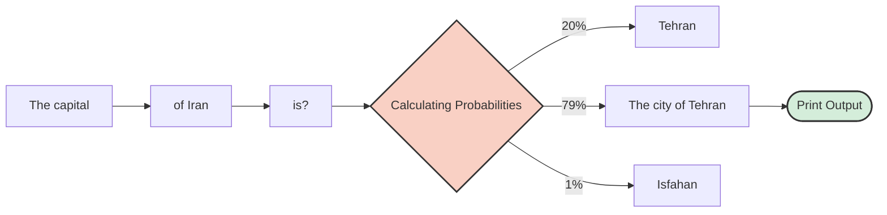

# ⚙️ How Does the Engine Work? (No Math Involved)
### Under the Hood: How LLMs Actually Work

[🏠 Back to Home](../../../README.md) |[Previous Lesson: Mindset & Methodology](../00-intro/01-mindset-and-ethics.md) | [Next Lesson: Model Comparison >](03-model-comparison.md)

---

## 🤯 The Illusion of Knowledge: This Thing Isn't "Smart" at All!

The biggest mistake students make is thinking that ChatGPT is a **"database"** or a **"smart library"** that reads information, understands it, and then provides an answer.
**That's not how it works at all.**

Let me be blunt:
Large Language Models (LLMs) are basically your **phone's keyboard autocomplete on steroids.**

Remember when you type "Hello" on your phone, and it suggests "there" as the next word?
AI does exactly the same thing, but instead of looking at the last 2-3 words, it has seen billions of words and can guess what the "most likely" next word is.

---

## 🎲 The Mechanism Behind the Curtain: Next Token Prediction

When you ask it: `What is the capital of Iran?`
It doesn't think about the meaning of "capital" or "Iran." It just calculates which word has the highest probability of coming next, based on the data it was trained on.

> **💡 Simple Definition:** AI is a **"next-word-guesser"** machine, not a "scientist" machine. It strings words together based on statistics to create text that **looks structurally correct**.

---

## ⚠️ 3 Inherent Bugs That Will Wreck You If You Don't Know Them

Because this system works on "probabilities," not "facts," it has a few major bugs you need to know about so you can work around them:

### 1. Hallucination: The Confident Liar 🤥
As we mentioned in previous sections, AI wasn't designed to "tell the truth"; it was designed to "complete the text."
If it doesn't know the answer, it doesn't stay silent (because it's learned to always guess the next word). It makes up something that **looks like** the right answer.

*   **A disastrous example:** Asking for 5 articles about "the architecture of Yazd's windcatchers."
*   **How the machine works:** It knows that the words "windcatcher," "Yazd," "climate," and the name "Dr. Pirnia" often appear together. So, it combines them and generates a completely fake reference in perfect APA format! It looks flawless, but it doesn't exist.

### 2. The Calculation and Logic Trap 🔢
AI is not a calculator! It sees numbers as if they were "letters."
When you ask `2+2`, it doesn't calculate; it just remembers that the word "4" has always followed that phrase.
But if you ask it to multiply two 6-digit numbers, it has likely never seen that specific combination before, so it will try to "guess" a number that looks like a 12-digit number!

> [!TIP]
> **Solution:** For math and logic tasks, always tell the AI: **"Write and run Python code to solve this problem."** (We'll practice this in later sections).

### 3. Goldfish Memory (Context Window) 🐟
Language models don't have a permanent memory. They have a limited "field of view" (Context Window).
Don't think that if you give it a 500-page book, it holds all the details in its mind at once. If you're on page 400 and ask a question about page 5, you'll probably get a nonsensical answer because page 5 has been pushed out of its short-term memory (Context Window) to make room for new text.

> [!WARNING]
> **The Golden Rule:** Keep your chats short and focused. Whenever the project topic or discussion changes, please start a **New Chat**. Dragging out a single chat makes the model dumber.

---

## 🎛️ The Hidden Parameter: Temperature

This is a semi-technical concept, but it's very important in tools that give you API access (like Playgrounds). There's a parameter called **Temperature** that is set between 0 and 1:

*   **Temperature near 0:** The model always chooses the most probable word. (Output: Precise, logical, boring, suitable for **coding and math**).
*   **Temperature near 1:** The model takes risks and also picks less probable words. (Output: Creative, poetic, unpredictable, suitable for **brainstorming and story writing**).

In the standard ChatGPT, this temperature is locked at around 0.7 (balanced).

---

## 🛠️ Conclusion: Change Your Strategy

Now that we understand what's under the hood, our strategy needs to change:

<table align="center" width="100%">
  <tr>
    <th align="center">❌ The Losing Method (Ignoring the Mechanism)</th>
    <th align="center">✅ The Winning Method (Engineering the Mechanism)</th>
  </tr>
  <tr>
    <td align="left">Asking the AI for "facts" (like facts and references).</td>
    <td align="left">Giving the AI facts and asking it to "process and summarize" them.</td>
  </tr>
  <tr>
    <td align="left">Asking complex math questions in plain text.</td>
    <td align="left">Asking it to write Python code to solve the problem accurately.</td>
  </tr>
  <tr>
    <td align="left">Piling up dozens of different topics in one long chat.</td>
    <td align="left">Breaking tasks into separate, short chats (managing the Context Window).</td>
  </tr>
</table>

 

Now that we know the engine, it's time to see which car on the market is best for our job. Should we always use ChatGPT? Nope!

**[Next Lesson: The Model Wars (Which AI for Which Task?) 👉](03-model-comparison.md)**

