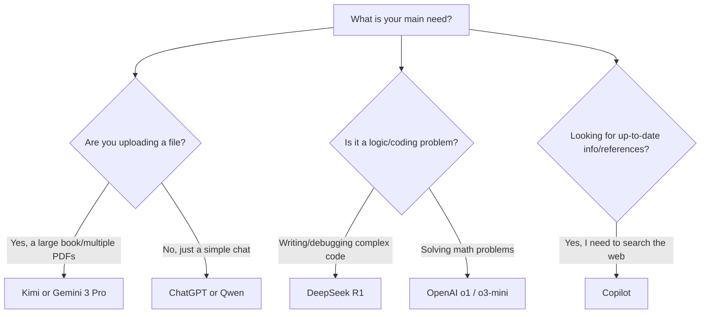

# ⚔️ Model Wars: Which AI Is Right for Your Task?
### AI Models Showdown: Pick Your Weapon
[🏠 Back to Home](../../../README.md) | [Previous Lesson: How Do LLMs Work?](02-how-llms-work.md) | [Next Lesson: AI Tools >](04-AI-tools.md)

---

## 🛑 Stop Being Biased!

The biggest mistake a student can make is to be loyal to just one tool (usually ChatGPT).
In today's world (the year 2026), using ChatGPT for everything is like trying to plow a field with a Ferrari! Each model is built for a specific job. Some are mathematicians, some are bookworms, and some are programmers.

>[!WARNING]
>In this section, we'll break down the most powerful models in the world right now, so you'll know exactly which one to use for each of your university projects.

---

## 🧠 Introducing the Champions (The Heavyweights)

### 1. ChatGPT (GPT-4o family and 'o' models)
*   **Creator:** OpenAI
*   **Key Feature:** OpenAI's new models (the 'o' family) are built for deep tasks. Unlike GPT-4o which answers quickly, the o1 model takes its time to think.
*   **Best Use for Students:** Any task that requires multi-step reasoning. If your project description is 3 pages long with lots of different conditions, o1/o3 will have the best logical understanding of it.

### 2. Gemini 3 Pro / Flash
*   **Creator:** Google
*   **Key Feature:** It has a **1 to 2 million token** context window! This means you can upload 10 reference books, all the code for a software project, or even a 1-hour video directly into it and ask questions.
*   **Best Use for Students:** Literature reviews for your thesis. Uploading dozens of PDF articles and asking it to create a comparison table. Analyzing YouTube tutorial videos.
*   **Weakness:** Sometimes it's stubborn about following very specific and restrictive instructions (Prompt Constraints).

### 3. DeepSeek (R1 and V3 family)
*   **Creator:** DeepSeek (China)
*   **Key Feature:** This Chinese model shook the world in early 2025 and 2026. R1 is a **Reasoning model**. This means before it answers, it thinks to itself in a `<think>` block, debugs its solution, and then writes the final answer.
*   **Scientific Accuracy:** It scores over 97% on the MATH-500 benchmark, which is even ahead of paid OpenAI models.
*   **Best Use for Students:** Solving complex equations, mathematical proofs, debugging heavy code (Python, C++), and solving algorithms.
*   **Weakness:** Not great for creative tasks, storytelling, or analyzing very large text files.

### 4. Qwen (2.5 Max and 3.0 family)
*   **Creator:** Alibaba Cloud
*   **Key Feature:** The Qwen 3 model has a "Hybrid Thinking" feature (you can tell it to think deeply or answer quickly). Its Coder version is also extremely powerful for programming.
*   **Best Use for Students:** If you want to run AI **on your own laptop** (without needing the internet) using local tools like Ollama or LM Studio, the lightweight versions of Qwen 3 offer the best quality for their size.
### 5. Kimi
*   **Creator:** Moonshot AI
*   **Key Feature:** This Chinese AI has a special talent for reading long documents and searching the internet accurately. Kimi can digest huge PDFs and summarize them without hallucination.
*   **Best Use for Students:** Interviewing a book! When your professor assigns a 500-page English reference book and you have an exam tomorrow, Kimi is your best bet for understanding the concepts quickly.

### 6. Copilot
*   **Creator:** Microsoft

*   **Key Feature:** It uses powerful OpenAI engines but is **directly connected to the Bing search engine**. 
*   **Best Use for Students:** Finding **up-to-date** information. If you need data on "last month's economic statistics," ChatGPT might hallucinate, but Copilot will search websites and give you links to its sources (Citations) in the footnotes.

---

## 📊 The Ultimate Matrix (Technical Comparison)

Let's compare these models in a no-nonsense table. 
*(Note: "Context Window" numbers show how many words the model can remember in a single chat. 1 million tokens is about 3,000 pages of a book).*

| Model | Context Window | Math & Logic | Programming | Large File Analysis | Internet Access |
| :--- | :--- | :--- | :--- | :--- | :--- |
| **DeepSeek R1** | 128,000 tokens | 🥇 Excellent | 🥇 Excellent | 🥉 Weak | ❌ No |
| **Gemini 3 Pro** | 1,000,000+ tokens | 🥈 Very Good | 🥈 Very Good | 🥇 Unbeatable | ✅ Excellent |
| **ChatGPT (o1/o3)** | 128k - 200k tokens | 🥇 Excellent | 🥇 Excellent | 🥈 Good | ✅ Yes |
| **Qwen 3 (Max)** | 128k - 256k tokens | 🥈 Very Good | 🥈 Excellent | 🥈 Good | ❌/✅ Varies |
| **Kimi (K2.5)** | 256,000+ tokens | 🥉 Average | 🥉 Average | 🥇 Outstanding | ✅ Excellent |
| **MS Copilot** | Relies on Web Search| 🥈 Good (GPT engine)| 🥈 Good | 🥈 Good | 🥇 Unbeatable |
---

## 🧭 Decision Tree: Which One Should I Use Now?

If you're confused, use this flowchart to decide in 3 seconds:

---

## 🏆 How to Know Which Model is *Really* Better?

AI companies always stretch the truth in their ads. The only way to know a model's true power is to use the **[LMSYS Chatbot Arena](https://lmarena.ai/)** platform.

> [!TIP]
> **What is the Chatbot Arena?**
> This site is like the FIFA rankings for AI. Two anonymous models give you answers, and you, as a human judge, vote for the better one. Based on millions of votes, the models are ranked on a Leaderboard. Always check this site before starting big projects to see who the current king of the world is.

<b>🔍 Click here: Why "Reasoning" models (like DeepSeek R1 and o1) changed everything for students</b>

 

Traditional models like GPT-4o try to guess the next word in a **fraction of a second**. That's why they make mistakes in logic puzzles.
But Reasoning models (like `o1` and `DeepSeek-R1`):
1. Pause before answering (sometimes up to a minute).
2. Build a "Chain of Thought" in their "mind."
3. Criticize their own solutions, and if they find a mistake, they go back and try a new method.

**Use case for students:** If you have a complex math or algorithm problem that regular ChatGPT gets wrong, give it to DeepSeek R1. You will see how it breaks down the formulas step-by-step to reach a definitive answer.

---

## 🎯 Conclusion

* If you **don't have money** and want the best quality for coding and math: **DeepSeek R1**
* If you want to edit your entire **50-page thesis** at once: **Gemini 3 Pro**
* If you want **free internet search** with the GPT-4o engine: **Copilot**

## Personal Opinion 
In my opinion, the best one could be Gemini Pro because it can handle large files without hallucinating. The Chinese AIs are also very good, but they can be so slow to answer that you might grow old waiting.

**[Next Lesson: AI Tools 👉](04-AI-tools.md)**

