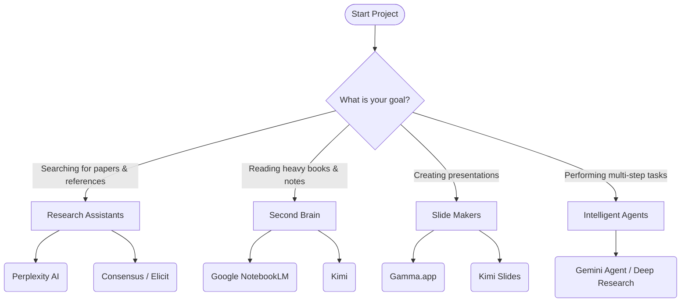

# 🛠️ AI Tools: Beyond Simple Chatbots
### AI Platforms & Specialized Tools
[🏠 Back to Home](../../../README.md) | [Previous Lesson: Model Wars](03-model-comparison.md) | [Next Lesson: Prompting Basics >](../02-prompt-engineering/05-prompt-basics.md)

---

## 🛑 Stop! ChatGPT Isn't for Everything

One of the biggest mistakes students make is using one tool (usually ChatGPT) for all their academic tasks.
The world of AI has moved toward **"specialization."** The tool that makes the best PowerPoint isn't necessarily the best one for finding scientific papers.

In this section, we'll introduce the golden toolbox for a modern student—tools that work **magic** in their specific areas.

---

## 🗺️ Decision Tree: Which Tool Do I Need Now?

---

## 🔬 Category 1: Deep Research Tools

If you need **real** references for your thesis or paper, forget about the standard ChatGPT. The tools below were built for scientific searching:

<table align="center" width="100%" border="0">
  <tr>
    <td width="50%" valign="top">
      <h3>🌐 Perplexity AI</h3>
      <b>Best for: Quick search with precise references</b> 
      Perplexity is a smart search engine. When you ask a question, it scours the internet and gives you an answer with <b>clickable links (Citations)</b> in the text. 
      <i>Pro Tip:</i> Use its <b>Focus Mode</b> and set it to Academic to search only within reputable papers.
    </td>
    <td width="50%" valign="top">
      <h3>🎓 Consensus / Elicit</h3>
      <b>Best for: Finding scientific consensus</b> 
      These tools only search through a database of scientific papers (over 200 million articles). If you ask, "Does this drug work?", Consensus will read the papers and tell you what percentage of articles agree and what percentage disagree!
    </td>
  </tr>
</table>

<b>🕵️‍♂️ New Feature: What is Deep Research?</b> <i>(Click here)</i>

In 2026, companies like OpenAI and Google introduced a feature called <b>Deep Research</b>. Instead of getting a short answer, the AI acts like a research assistant:
<ol>
  <li>It reads dozens of websites.</li>
  <li>It follows links to get to the original source.</li>
  <li>After 10 to 20 minutes, it writes a comprehensive 20-page report for you with all the sources.</li>
</ol>
<b>Gemini Deep Research</b> and <b>ChatGPT Pro</b> are the leaders in this technology.

---

## 🧠 Category 2: The Second Brain & Document Analysis

Your professor assigned a 500-page English PDF book and the exam is tomorrow? These tools will save your life.

> [!TIP]
> **🌟 Google's Masterpiece: NotebookLM**
> NotebookLM is a personal workspace. You can upload dozens of PDFs, YouTube links, or notes into it.
> <b>Why is it amazing?</b> 
> 1. <b>Zero Hallucination:</b> It only answers based on your files and even provides the exact page number as a reference.
> 2. <b>Podcast Creator (Audio Overview):</b> With one click, it turns your boring lecture notes into an engaging two-person audio podcast that you can listen to on your way to university!

>[!NOTE]
> **🤖 Kimi Assistant (The Tireless Reader)**
> The <b>Kimi</b> AI (from Moonshot AI) has a massive context window. You can give it large files and ask it to extract the book's structure or explain difficult concepts in simple language.

---

## 📊 Category 3: Create a PowerPoint in 5 Minutes (Presentation Generators)

Creating slides, adjusting fonts, and finding images is the most time-consuming part of a presentation. Leave it to these tools:

| Tool Name | Main Feature | Best for... |
| :--- | :--- | :--- |
| **Gamma.app** | Stunning graphics and web output | When you want an incredibly beautiful and modern presentation. Just give it your raw text, and Gamma will create images and design the slides itself. (Can export to PDF and PPT). |
| **Kimi Slides** | Fast and structured | When you have raw content (like a Word file) and want to quickly turn it into slides. Kimi first gives you an editable outline and then creates the slides. |

---

## 🤖 Category 4: AI Agents

Agents don't just give you a text answer; they **take action**.

> [!IMPORTANT]
> **Gemini Agent**
> Google has connected Gemini to everyday apps. An Agent can perform several tasks in a row.
> <b>Student Example:</b> <i>"Read my professor's emails from today, find the project deadline, add it to my Google Calendar, and create a Docs file to start the project."</i> 
> The AI does all of this automatically in the background!

---

## 🎯 Tool Summary

To always be prepared, save this golden combination in your browser's bookmarks:
1. **Fact & Paper Search:** `Perplexity` / `Consensus`
2. **Reading Notes & Books:** `NotebookLM`
3. **Creating Slides:** `Gamma`
4. **Writing & Reasoning:** `ChatGPT (o1)` / `DeepSeek R1`

**[Next Section: Prompting Basics (How to talk to these tools?) 👉](../02-prompt-engineering/05-prompt-basics.md)**

