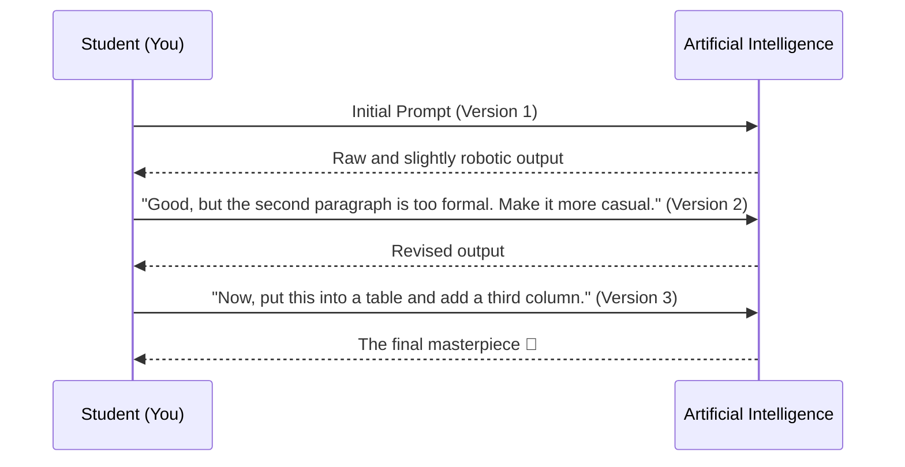

<div dir="ltr">
<div align="center">

# 🗣️ Prompting Basics: The Language of Machines
### Prompt Basics: From Chatting to Commanding

[🏠 Back to Home](../../../README.md) | [Previous Lesson: AI Tools](../01-fundamentals/04-AI-tools.md) | [Next Lesson: Advanced Frameworks >](06-advanced-frameworks.md)

</div>

---

## 💀 The Harsh Truth: Garbage In, Garbage Out (GIGO)

Let's be honest. You open a new browser tab, go to ChatGPT, and type something like this:
> *"Write an article about climate change."*

And when the AI gives you a dry, repetitive, Wikipedia-like text, you say, "This sounds so artificial!"
**Well, no! The problem isn't the AI; it's your prompt.**

> [!WARNING]
> In computer science, we have a rule called **GIGO** (Garbage In, Garbage Out). It means if your input is "garbage" and unclear, your output will definitely be "garbage." The AI can't read your mind; it only gives you exactly what you asked for.

---

## 🧠 Mindset Shift: Google vs. an Intern

Our biggest mistake is treating AI like the "Google search engine."
On Google, we type keywords (`download sustainable architecture article`). But with prompting, you need to treat the AI like a **"smart but forgetful intern."**

You wouldn't tell a new intern on their first day, "Write about architecture." You would tell them: *"I'm the manager of this department. For tomorrow, I need a 3-page report on sustainable architecture in tropical regions. Our audience is non-technical managers, so don't use difficult jargon, and give me the output in a table."*

---

## 🧱 The 4 Pillars of a Basic Prompt

Before we get to advanced formulas (like RISEN) in the next section, you need to include these four main blocks in every request you give the machine:

<table align="center" width="100%" border="0">
  <tr>
    <td width="25%" align="center">
      <h3>🎯 1. Task</h3>
      What do you want exactly? Use <b>clear verbs</b>.<br>
      <i>(Summarize, compare, write code, rewrite)</i>
    </td>
    <td width="25%" align="center">
      <h3>🌍 2. Context</h3>
      Who are you? Who is the audience? Why are you writing this?<br>
      <i>(I'm a sophomore student, I need this for a class presentation...)</i>
    </td>
    <td width="25%" align="center">
      <h3>🚧 3. Constraints</h3>
      What should it <b>not</b> do?<br>
      <i>(Don't exceed 300 words, don't use clichés)</i>
    </td>
    <td width="25%" align="center">
      <h3>🗂️ 4. Output Format</h3>
      What should the final answer look like?<br>
      <i>(A table, a list, Python code, a Markdown file)</i>
    </td>
  </tr>
</table>

---

## ⚖️ Comparing Prompts in Action

Let's see the difference between a "Googlish" (rookie) prompt and an "engineered" (pro) prompt on a real university project:

### ❌ The Rookie Prompt
```text
"Tell me the differences between traditional and digital marketing."
```
*   **Output:** A long, boring text, full of jargon that your professor will instantly recognize as AI-generated. It has no clear structure to copy into a PowerPoint.

### ✅ The Pro Prompt

* **Context**: I am a business management student and I need a quick comparison for my presentation tomorrow. The audience is my classmates.
* **Task**: Compare the differences between traditional marketing and digital marketing.
* **Constraints**: Only focus on 3 key factors (Cost, Speed, Measurability). The text should not be too formal; it should have a friendly yet academic tone.
* **Format**: Give me the output in a 3-column table.

>**Output:** A clean, ready-to-use table with a human tone that you can directly transfer to your slides.

---

## 🔄 The First Rule of Prompting: It's a Dialogue, Not a Monologue

AI is not a magician that gets the job done with a single wave of a wand. Prompting is an **iterative process**.

If the first output isn't good, don't close the chat! Refine it:



> [!TIP]
> **The Push-Back Technique:**
> Never settle for the first answer. Always give a follow-up command: *"This answer was good, but now imagine I have to send this to a very strict professor. What flaws would they find? Rewrite the text based on those flaws."*

<div align="center">

**[Next Lesson: Advanced Frameworks (RISEN & CO-STAR) 👉](06-advanced-frameworks.md)**

</div>

</div>