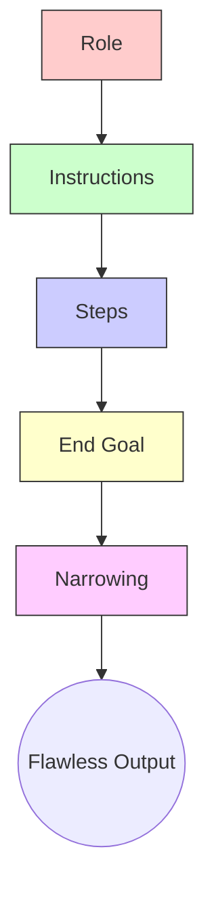

# 🏗️ Advanced Frameworks: Architecting the Machine's Mind
### Advanced Prompt Frameworks: RISEN & Beyond

[🏠 Back to Home](../../../README.md) |[Previous Lesson: Prompting Basics](05-prompt-basics.md) |[Next Lesson: System Instructions >](07-system-instructions.md)

---

## 🏛️ Why Do We Need a Framework?

In the last lesson, we learned how to move beyond "Googlish" searching. But when it comes to heavy-duty projects (like writing the second chapter of a thesis, analyzing a large dataset, or designing an application), four-line commands just won't cut it.

An AI is like a powerful but **disorganized** processor. If you don't create a mental framework for it, it gets confused, starts making things up (hallucinating), and goes off track.
Professionals use standard formulas to control this beast, and the most famous one for academic work is the **RISEN** formula.

---

## 🧬 Anatomy of a Pro Prompt: The RISEN Formula

The word RISEN is an acronym for five words. If you include these five sections in your prompt (especially for writing and analytical tasks), your output will transform from "robot text" to a "masterpiece by an expert."

### 🎭 1. Role (Who is the AI?)
**This is the most important part.** When you give the AI a role, its entire personality, vocabulary, and reasoning style change.
*   ❌ **Bad:** "Write a text about modern architecture." (Output: Wikipedia-like and boring)
*   ✅ **Pro:** `[Role]: You are a senior architect with 20 years of experience and a university professor who is a harsh critic of modern architecture. Your tone should be academic, pessimistic, and slightly humorous. Like someone who has seen it all and is no longer convinced by slogans.`

### 📝 2. Instructions & Context
The AI can't read your mind. You need to tell it exactly who the audience is and where this text will be used.
*   ✅ **Pro:** `[Instructions]: I am preparing a presentation for 5th-semester students. Our focus is on 'climatic impacts,' not history. The audience has a theoretical background but isn't highly professional.`

### 👣 3. Steps (The Execution Algorithm)
If the task is complex, **don't let the AI jump straight to the answer**. Define an "algorithm" for it. This prevents the model from getting confused (this technique is also called Chain of Thought).
*   ✅ **Pro:**
    `[Steps]: Do this step by step:`
    `1. First, write a shocking statistic to start with (a Hook).`
    `2. Analyze the problem from 3 angles (economic, social, environmental).`
    `3. Provide a real, short Case Study.`
    `4. Offer three practical solutions.`

### 🏁 4. End Goal (The Final Output)
Describe the physical shape of the answer you want.
*   ✅ **Pro:** `[End Goal]: The final output must be a Markdown file. It should include 3 comparison tables and at least 1200 words of continuous text. Do not use bullet points.`

### 🚧 5. Narrowing (What Not to Do!)
**This is the secret sauce!** Here, you prevent the AI from "waffling" and stop the text from sounding generic. Setting constraints focuses the AI's creativity within your desired framework.
*   ✅ **Pro:**
    `[Narrowing]:`
    `- Absolutely do not use cliché phrases like "in today's world," "it is worth noting," and "in conclusion."`
    `- Do not write a moral or slogan-like conclusion.`
    `- Use sentences of varying lengths (short, medium, long) to give the text a human tone.`

---

## 🔥 Complementary Techniques (Beyond RISEN)

Now that you've learned the basic structure, you need to get familiar with two golden techniques that, when combined with RISEN, turn the AI into an unbeatable powerhouse.

### 1. Few-Shot Prompting (Guiding with Examples)
Sometimes, no matter how much you describe the tone in the `[Role]` section, the AI doesn't quite get what you mean. The solution? Instead of "explaining," **"show"** it.

When you provide a few examples of your ideal output, the model quickly discovers the pattern, tone, and format and delivers an answer that matches your standard.

> [!TIP]
> **Few-Shot Example:**
> "I want you to write a paper abstract. To understand my exact tone, look at these two examples I wrote myself:
> *Example 1:* [Your sample text]
> *Example 2:* [Your sample text]
> Now, using this exact tone and structure, write an abstract on the topic 'The Impact of AI on Microeconomics.'"

### 2. Chain of Thought
Language models struggle with logic puzzles and multi-step reasoning (unless you're using specialized reasoning models like DeepSeek R1 or o1).
For standard models (like GPT-4o or Claude 3.5 Sonnet), adding one magic sentence to the end of your prompt drastically reduces their chance of making a mistake:
**"Let's think step by step."**

### 3. The "Stop and Continue" Technique (Chunking & The "Next" Protocol)
Have you ever been frustrated when you ask an AI for a long text (like a full thesis chapter), and it either suddenly cuts off mid-sentence or, even worse, rushes the content and summarizes everything poorly just to fit it into one response?

**Here's the problem:** All language models have an "output token limit" (usually around 4000 words per message). If you ask for a big task, they either hallucinate to finish it quickly or stop altogether.

**The Solution (A personal technique):** You must instruct the model to generate the text **"chunk by chunk"** and wait for your password.

> [!TIP]
> **The Magic Command for Long Texts:**
> Add this exact paragraph to the end of your prompt (in the `[Steps]` or `[Instructions]` section):
>
> *"Due to character limits in the output, do not try to finish this entire text in one message. Write the first part with full detail and depth, and at the end of a logical paragraph, **stop**. Every time I type the word **"Next"**, look at the last sentence you wrote and resume writing from that exact point."*

With this simple technique, you can get a 100-page article out of an AI without any drop in quality, interruptions, or hallucinations!

---

## 🛠️ A Complete Prompt: Combining RISEN and Techniques

Let's combine everything we've learned into a Master Prompt. you can copy and use this directly:

<b>🔥 Open a ready-to-use prompt for writing a Literature Review</b> <i>(Click here)</i>

> **Role**:

You are a senior researcher and assistant professor at a top university. Your specialty is writing ISI papers with a completely academic, impartial, and analytical tone.

> **Instructions**:

I will give you 5 article abstracts about "Central Bank Digital Currencies (CBDCs)." Your task is to write an integrated "Literature Review" section for my thesis. Use information ONLY from these 5 texts and do not add anything from your own knowledge (or the internet).

> **Steps**:

Let's go step-by-step:
1. First, read all 5 texts and find their points of agreement and contrast.
2. Write an introductory paragraph that shows the general trend of the research.
3. Synthesize the articles thematically (not author by author). For example, say "In the context of security, papers A and B argue that... but paper C disagrees."
4. At the end, propose a "Research Gap" that has not been addressed in these papers.
5. Stopping rules: Generate the text in 500-word chunks. Stop at the end of each section until I send the word "Next."

> **End Goal**:

The output should be a continuous text in fluent English. At the end of the final text, add a 3-column table (Article Name, Main Idea, Weakness).

> **Narrowing**:

- Avoid awkward, machine-like translations of technical terms (e.g., use "Blockchain," not "chain of blocks").
- Strictly avoid phrases like "It is worth mentioning," "As a result, we can say," and "Nowadays, with the advancement of technology."
- Whenever you cite a claim from the articles, mention the author's name in parentheses.

---

## 🚀 Next Step: Automating This Process

Writing such detailed prompts for every project is time-consuming. Do we have to dictate the role, tone, and constraints to the AI every time we open a new chat window?
No! This is where the hidden layer of the models, **System Instructions**, comes into play to permanently turn the AI into your personal intern.

**[Next Lesson: System Instructions 👉](07-system-instructions.md)**

