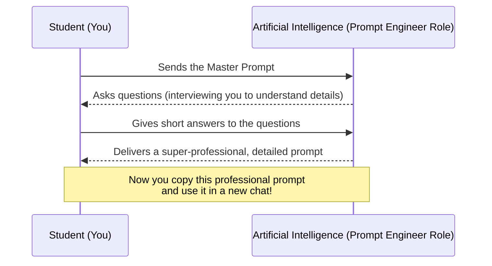

<div dir="ltr">
<div align="center">

# 🪄 Meta-Prompting: Let the AI Write the Prompt
### Prompt Generation: Let the AI Write the Prompt
[🏠 Back to Home](../../../README.md) | [Previous Lesson: System Instructions](07-system-instructions.md) | [Next Lesson: Academic Research & Writing >](../03-research-writing/09-academic-research.md)

</div>

---

## 🤯 Think Bigger! (The End of Manual Prompting)

So far, we've learned how to write prompts to "summarize a text" or "write an email." But let's take it to the next level.
Imagine you're facing huge projects like these:

*   📱 **Software Development:** You want to build a mobile app from scratch but don't know how to code and need a detailed planner.
*   🏋️ **Lifestyle:** You want to design a 16-week workout and meal plan based on your blood test results, student budget, and free time between classes.
*   📈 **Data Analysis:** You want to analyze a company's financial statements from the last 5 years, find hidden patterns, and deliver a management report with charts.
*   ✍️ **Creative Content:** You want to write a sci-fi novel and need an assistant for world-building, creating the laws of physics for that world, and developing characters.
*   **Historical Simulation:** You want to run a live debate between "Albert Einstein" and "Avicenna" about the concept of time to get ideas for a class presentation.

Writing a detailed prompt (using the RISEN formula) for such complex tasks could take hours. The human brain struggles to design all the steps, constraints, and details.

> **So what's the solution?** Don't write the prompt at all! Let the AI (which understands its own language better than you do) build the prompt for you. This technique is called **Meta-Prompting**.

---

## 🔁 How Does the Meta-Prompting Cycle Work?

The idea is very simple but extremely powerful: instead of directly asking the AI to do the task, you ask it to **"write the best possible prompt for doing that task."**


### Step 1: Have a Raw Idea
Your idea doesn't need to be structured. You just need to know what you want. For example: *"I want to give a presentation about global warming with graphics and stats that will blow my professor's mind."*

### Step 2: Use the "Prompt-Generating Prompt" (Master Prompt)
You give the AI a pre-written text (which I've provided below) and paste your raw idea at the end. The AI then becomes a "Prompt Engineer" and starts interviewing you!

### Step 3: Copy and Run
When the AI gives you the final prompt (for example, based on the RISEN formula), you copy it, open a **New Chat**, and run it.


This cycle has 3 steps:



---

## 🗝️ The Master Prompt

This prompt is your **"cheat code."** Whenever you have a big idea but don't know how to translate it into the machine's language, open a new chat and copy the exact text below:

<details open>
<summary><b>🔥 Open Master Prompt (Ready to Copy)</b></summary>

```text
You are an "Expert Prompt Engineer." Your goal is to help me write the best and most precise prompt possible for my needs. This final prompt will be used by you to give me a perfect output.

Here's how we'll work together:

1. First, you'll ask me: "What exactly is your project and what output do you want?"
2. I will give a short answer.
3. Based on my answer, you will write an initial prompt using the RISEN framework (Role, Instructions, Steps, End Goal, Narrowing).
4. Then, below that prompt, you will ask me 3 to 5 key questions to get the details I might have forgotten (like the exact tone, output format, or specific constraints).
5. We will repeat this process (refining the prompt and asking questions) until I say the prompt is complete.
6. The final prompt you give me must be inside a Code Block so I can easily copy it.

If you understand, just confirm and ask your first questions.
```

</details>

---

## 🎬 A Real Example (How to Do It)

Let's see how this process works if we want to build a **"Job/Grad School Interview Assistant."**

1.  **You:** (Copy and paste the Master Prompt above).
2.  **AI:** "Understood. Please tell me, what exactly is your project and what output do you want?"
3.  **You:** *"I have an online interview next week with a professor at the University of Toronto for a PhD position in AI. I want you to practice the interview with me."*
4.  **AI:** (Writes an initial prompt and then asks):
    *   *Question 1: Do you want the interview to be voice-based or text-based?*
    *   *Question 2: What papers has the professor worked on so I can simulate the questions better?*
    *   *Question 3: Do you want feedback after each answer or at the end of the interview?*
5.  **You:** (You answer the questions).
6.  **AI:** (Delivers the final, engineered, and incredibly detailed prompt to you).

**Final Step:** Now you have a perfect, 300-word prompt. Copy it, open a **New Chat**, paste the prompt, and enjoy the magic!

---

## 🎯 Why This Method Works Like Magic

*   **Discovers Blind Spots:** The AI asks you questions you would never have thought of yourself (e.g., "Are there any missing data (Null values) in this Excel file that I need to handle?").
*   **Speaks the Machine's Native Language:** The AI knows exactly which keywords and structures will make it perform better.
*   **Saves Time:** Instead of struggling for half an hour and getting bad results, you create the best possible command in 5 minutes.


## 💎 Advanced Technique: Generating Multi-Phase Prompts

For enormous projects (like writing a full thesis, building an app, or designing a marketing campaign), even the best single-step prompt won't work, and the AI will get confused.

In this case, you can ask the AI to generate a **"Prompt Suite"** for you instead of a single prompt! You tell the prompt generator (within the same Master Prompt conversation):
*"My project is very large. Break it down into several phases and generate a prompt suite for me at the following 3 levels:"*

1.  **System Prompt:** An instruction to set the overall rules and a consistent role (Global Rules) that I can put in the Custom Instructions so the model doesn't forget its tone throughout the project.
2.  **Master Prompt:** The very first command I'll use in the chat to explain the entire roadmap, context, and architecture of the project to the AI all at once.
3.  **Phased Prompts (Phase 1 to N Prompts):** Separate, step-by-step commands for getting the work done.
For example:
*Phase 1 Prompt: Generate the table of contents and structure*
 *Phase 2 Prompt: Write the introduction*
, *Phase 3 Prompt: Extract references*

> [!TIP]
> **The Ultimate Combo:**
> Don't forget you can use the techniques we learned in previous lessons here too! For example, you can tell the prompt generator: *"When writing the Phase Prompts, make sure to follow the RISEN structure and include the 'Stop and continue with the word Next' technique in them so the text doesn't get cut off in long outputs."*

---

## 🏁 Wrapping Up the Prompts Section

Congratulations! You are now ahead of 95% of other students when it comes to communicating with machines. You've learned how to go beyond simple chatting and instead **architect the machine's mind**, even using the AI itself to plan for the AI.

But prompt engineering was just the beginning. So far, we've learned how to give "commands." Now it's time to apply these commands to the real world and your university projects. In the next section, we'll dive into one of the toughest university challenges: **research, note-taking, and writing scientific texts without being accused of plagiarism.**

<div align="center">

**[Next Section: Research & Writing Applications 👉](../03-research-writing/09-academic-research.md)**

</div>

</div>