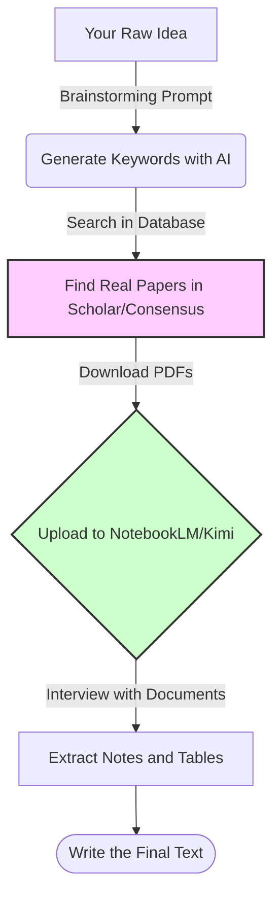

# 🔎 Academic Research: Finding, Filtering, and Synthesizing
### Academic Research: Finding, Filtering, and Synthesizing

[🏠 Back to Home](../../../README.md) |[Previous Lesson: Prompt Generation](../02-prompt-engineering/08-prompt-generation.md) |[Next Lesson: Academic Writing >](10-academic-writing.md)

---

## 🛑 The Death of Traditional Research Methods

In the past, writing a "Literature Review" or finding a fresh topic for your thesis took months. You had to download 50 PDF articles, read them line by line, and take notes on paper just to find one useful sentence on page 14 of one paper.

This method is obsolete in 2026.
Today, instead of "reading" papers, we **"interview"** them. We use AI to discard irrelevant papers in seconds and extract the essence of the useful ones for us.

---

## 🗺️ The Workflow of a Cyborg Researcher

To avoid falling into the trap of Hallucination and to ensure you have real references, you must follow this cycle exactly:

---

## 🕵️ Phase 1: Search Engineering (Finding Real Papers)

The biggest mistake: *"ChatGPT, find me five articles about the impact of AI in architecture."* (Output: 5 completely fake articles that don't exist).

**The right way:** AI is not a search engine; it is a **translator of your idea into the language of search.**

You give your idea to the AI in simple language and ask it to create **"Advanced Search Queries"** for databases like Google Scholar, Scopus, or PubMed.

> [!TIP]
> **Prompt for Keyword Engineering:**
> `"I want to research [Your Topic]. Please write 10 main keywords and 5 advanced search strings using AND/OR/" " operators for me. I need to be able to copy and paste these directly into scientific databases. The keywords should be highly specialized and in academic English."`

After getting these keywords, search for them in tools like **Consensus** or **Perplexity** (which we introduced in the tools section) to find 100% real, referenced articles.

---

## 🎙️ Phase 2: Interviewing the Papers (Chatting with Papers)

Now you have 10 PDF articles on your computer. Should you read them all? No.
This is where **"Second Brain"** tools (like Google NotebookLM, Kimi, or Claude) come in. Upload all 10 PDF files into one environment (this is called creating a Knowledge Base).

Now, instead of reading, you start asking strategic questions:

<table align="center" width="100%" border="1" style="border-collapse: collapse;">
  <tr>
    <th width="30%" align="center">Your Goal</th>
    <th width="70%" align="center">The Prompt to Give Your Uploaded Documents</th>
  </tr>
  <tr>
    <td align="center"><b>Quick Filtering</b></td>
    <td>"Read only the abstract and conclusion of these 10 papers. Which of them directly address [your specific topic]? Remove the irrelevant papers and tell me why."</td>
  </tr>
  <tr>
    <td align="center"><b>Extracting Methodology</b></td>
    <td>"What statistical methodology did papers #3 and #5 use? What was their sample size?"</td>
  </tr>
  <tr>
    <td align="center"><b>Finding Contradictions</b></td>
    <td>"Is there any scientific disagreement (contradiction) among the findings of these 10 papers? What exactly do they disagree on?"</td>
  </tr>
</table>

---

## 🧩 Phase 3: Extraction and Synthesis (Literature Matrix)

Now that you've separated the useful papers and understand what each one says, it's time to prepare the data for writing. Your thesis can't be a jumble of disconnected ideas. You need to consolidate all these papers into a **"Literature Matrix."**

> [!TIP]
> **The Magic Prompt for Creating a Matrix (Matrix Prompt):**
> Give this command to the tool where the papers are uploaded (like NotebookLM, Kimi, or Claude):
> 
> `"Based on the articles I've uploaded, create a Synthesis Matrix with the following columns:`
> `1. Author and Publication Year`
> `2. Main Research Goal`
> `3. Methodology`
> `4. Key Variables`
> `5. Most Important Findings`
> `6. Research Limitations`
> `Please extract the information from all articles and place it in this table. If the information for a column doesn't exist in an article, write 'Not Mentioned'."`

You now have a table that professors spend weeks creating manually! This table is the backbone (skeleton) of your thesis's second chapter or literature review section.

---

## ⚠️ Warning: A Calculator is Not a Writer!

Extracting and synthesizing information (what we've done so far) is completely legal, scientific, and ethical. You have only accelerated the speed of reading and information extraction. But remember: the AI has not yet written your **final text**.

The table you got in Phase 3 is just the raw material (bricks and cement). We are not allowed to copy-paste this table and hand it to our professor. Now, we must arrange and combine these raw materials in a way that turns them into a fluent, academic text.

How do we turn this raw material into a paper that is both scientific and doesn't have a robotic tone?

**[Next Lesson: Academic Writing (From Skeleton to Masterpiece) 👉](10-academic-writing.md)**

