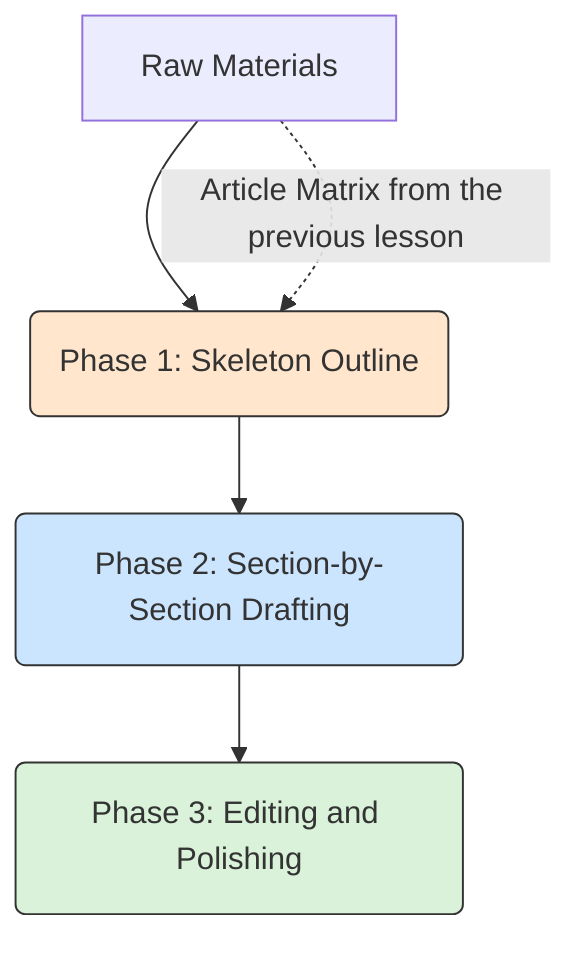

<div dir="ltr">
<div align="center">

# ✍️ Academic Writing: Drafting from Skeleton to Masterpiece
### Academic Writing: Drafting from Skeleton to Masterpiece
[🏠 Back to Home](../../../README.md) | [Previous Lesson: Academic Research](09-academic-research.md) | [Next Lesson: Humanizing Text >](11-humanizing-text.md)

</div>

---

## 📝 The White Page Syndrome and the Great Temptation

The hardest part of any project is staring at a blank white page in your Word processor.
At this moment, a devilish temptation comes to you: *"Forget it, I'll just tell ChatGPT to write all 10 pages for me!"*

**The result of this is a disaster.** When you ask an AI to write a long text all at once:
1. The logical structure falls apart.
2. It becomes filled with clichés like "In today's fast-paced world...".
3. It lacks academic depth and just pads out the word count (fluff).

> [!WARNING]
> **The Golden Rule of Writing with AI:**
> Never ask the machine to write "text"; ask it to write a **"paragraph."** We build a paper like a building: first the steel skeleton (Outline), then we lay the bricks room by room.

---

## 🏗️ The Lego Methodology

A professional (cyborg) writer divides the writing process into 3 phases:



### Phase 1: Engineering the Skeleton (The Outline)
Before writing even a single line of text, you must map out the plan with the AI.

**The Skeleton Builder Prompt:**
> `You are a harsh thesis advisor. I want to write a paper on [Your Topic], and its main goal is [Goal of the Paper].`
> `Design a very detailed tree structure (Outline) for this paper. The structure should include main headings (H1) and subheadings (H2 and H3). For each subheading, write one sentence explaining exactly what should be said in that section and what type of data (statistics, examples, theory) should be used.`

**Output:** You now have a flawless map that guarantees the paper's logic. If your professor finds a flaw, you change the skeleton at this stage, not after you've already written 10 pages!

---

### Phase 2: Building Floor by Floor (Section-by-Section Drafting)
Now that you have the map, you tell the AI: *"Just write section 2 (Literature Review) for me."*
This method gives the AI enough space to produce a coherent and in-depth text without hitting its output limit (Token Limit). Here, you must use your **"raw materials"** (the article matrix we created in the previous lesson) to ensure your text is well-supported.

<table align="center" width="100%" border="0">
  <tr>
    <td width="100%">
      <b>Section Generation Prompt (copy this):</b><br>
      <code>I am writing the [Section Title, e.g., Methodology] section of my paper. Your task is to write only and exclusively this section (including all its subheadings) in about 800 to 1200 words.</code><br><br>
      <code>Your raw materials for this section are this information: [Paste your matrix data or personal notes here].</code><br><br>
      <code><b>Constraints:</b></code><br>
      <code>- Do not use any external information other than the raw materials I have provided.</code><br>
      <code>- Start with a short introductory paragraph for this section to prepare the reader's mind.</code><br>
      <code>- Whenever you make a claim, be sure to cite its reference (according to the raw materials) in parentheses.</code><br>
      <code>- Create a logical flow between the paragraphs of this section so the text doesn't seem choppy.</code>
    </td>
  </tr>
</table>


### Phase 3: Fixing the Frankenstein Syndrome (Transitions & Flow)

When you proceed section by section, a new problem arises: your paper starts to resemble "Frankenstein's monster"! When you've generated different sections (like the introduction, literature review, and methodology) separately, a small issue appears: the seams between the building's floors are visible! The logical jump between the end of the first section and the start of the second one is jarring.

This is where we once again use AI, this time in the role of a **"linking editor."**

> [!TIP]
> **Flow Builder Prompt:**
> `This is the last paragraph of my previous section and the first paragraph of my new section. The semantic and logical connection between the end of that section and the beginning of this one is weak. Please, without changing the main content and data, add one or two transition sentences between them and rewrite the connection of these two parts so that the reader does not notice the jump in topic and the text flows like water.`

---

## 🪞 The Smart Mirror: Critique Before Submission (Peer Review Simulator)

Before you save the Word file and send it to your professor, one crucial step remains. Professors usually look for weaknesses, logical fallacies, or a lack of references.
Why not put the paper under the knife ourselves before the professor does?

**The "Harsh Reviewer" Technique (The Reviewer Persona):**
Copy the entire text of the paper you've written so far and give it to an AI (preferably a model like Claude 3.5 Sonnet or o1):

```text
[Role]: You are a very harsh reviewer for a prestigious Q1 scientific journal.
[Task]: This is my draft paper. Read it carefully and critique it mercilessly.
[Constraints]:
- Find at least 3 logical flaws, topic jumps, or weaknesses in argumentation in the text.
- If a sentence is ambiguous or makes a big claim without a reference, point it out.
- Don't just find faults; for each flaw, provide a practical suggestion for correction. Present the output in a table.
```

By doing this, you have **preemptively** eliminated all the excuses your professor might have for lowering your grade!

---

## 🚨 Final Warning

By following the Lego methodology (skeleton ➔ bricklaying ➔ linking and critique), your paper is scientifically, structurally, and logically flawless. And most importantly: **it contains real references.**

**But one deadly challenge still remains.**

Your text still "smells" like AI. The symmetry of words, the uniform sentence structure, and its excessive neatness will cause AI detectors like Turnitin or GPTZero to immediately flag it as "AI-generated."
If you submit the text as is, all your hard work will be for nothing.

To get the paper past these filters and give it a human soul, we need to inject it with **"human imperfection."**

<div align="center">

**[Next Lesson: Humanizing Text (Bypassing AI Detectors) 👉](11-humanizing-text.md)**

</div>

</div>