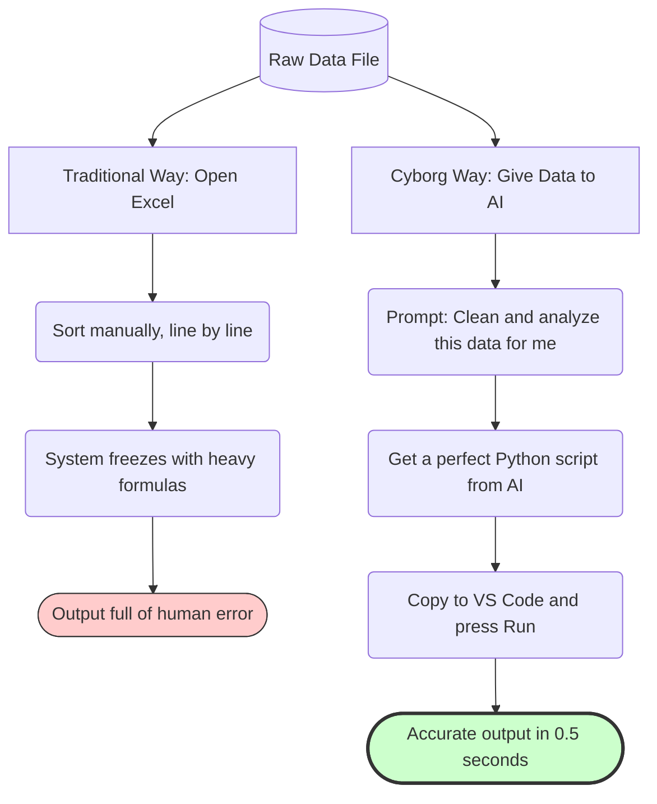

<div dir="ltr">
<div align="center">

# 📊 Data Alchemy: Analyzing CSV with Python (Without Coding)
### Data Analysis: From Messy Excel to Python Insights

[🏠 Back to Home](../../../README.md) | [Previous Lesson: Setting Up Your Workspace](12-environment-setup.md) | [Next Lesson: The Magic of HTML & Visualization >](14-html-visualization.md)

</div>

---

## 📉 The Death of Excel in University Projects

Let's imagine a common scenario: your professor gives you an Excel file with 20,000 rows of messy, raw data (like survey results or lab sensor data).
What's the traditional way? Opening Excel, writing long formulas (`VLOOKUP`), manually deleting empty cells, and eventually, your computer freezes!

**This is manual labor, not engineering.**
In the modern world, we save raw data as a `CSV` file and ask AI to write a **Python** script for us. This script can clean, filter, and analyze all the data in 2 seconds.

You don't need to know Python functions; you just tell the AI the logic, and you `Run` the code it gives you in VS Code (which we installed in the last lesson).

---

## 🗺️ Comparing Two Paths (The Laborer vs. The Architect)



---

## 🧹 Phase 1: Data Cleaning

Real-world data is always messy. It has empty columns, dates in different formats, and some numbers are outliers.
The first step is to copy a few rows from your CSV file and give them to an AI (like ChatGPT 4o or Claude 3.5 Sonnet) so it can understand the structure.

>[!TIP]
> **The Data Snippet Technique:**
> You don't need to copy the entire 20,000-line file into the chat (because of character limits). Just copy the first 5 lines (the header row + 4 data rows) so the AI knows the column names.

<table align="center" width="100%" border="0">
  <tr>
    <td width="100%">
      <b>🤖 Data Engineer Prompt (Copy This):</b><br>
      <code>You are a senior Data Scientist who works with the Pandas library in Python.</code><br><br>
      <code>I have a data file named <b>data.csv</b>. Here are the first 5 lines of my file so you can understand the column structure:</code><br>
      <code>[Paste the first 5 lines of your file here]</code><br><br>
      <code><b>Your Mission (Instructions):</b></code><br>
      <code>Write a complete Python script that performs the following tasks in order:</code><br>
      <code>1. Read the data.csv file.</code><br>
      <code>2. Remove all rows where the [Your Important Column Name] column is empty (NaN).</code><br>
      <code>3. Filter outliers in the [Your Numeric Column Name] column using the mean method.</code><br>
      <code>4. Save the cleaned data to a new file named <b>cleaned_data.csv</b>.</code><br><br>
      <code><b>Constraints:</b></code><br>
      <code>- Add comments in simple English to every line of code so I can understand what each line does.</code><br>
      <code>- Don't use any obscure libraries, only pandas and numpy.</code>
    </td>
  </tr>
</table>


### ⚙️ Phase 2: Running the Magic in VS Code

When the AI gives you the Python code, you don't need to read or understand it line by line (you are the architect, not the typist!). Just follow these 5 simple steps:

1. Create a new folder on your computer (e.g., `Uni_Project`).
2. Place your raw data file in this folder and name it `data.csv`.
3. Open **VS Code** and then open this folder inside it (`File > Open Folder`).
4. Create a new file named `cleaner.py`, paste the code the AI gave you, and save it (`Ctrl+S`).
5. In the top-right corner of VS Code, click the triangular **Run** button.

> [!TIP]
> **Result:** In a fraction of a second, a new file named `cleaned_data.csv` will appear in your folder. All the errors, empty cells, and outliers are gone! This is a task that would have taken hours in Excel.

---

## 🧮 Phase 3: Extracting Insights & Statistical Analysis

Now that we have clean data, it's time to apply some heavy statistical formulas. Your professor might ask you to find the "correlation between variable A and B" or perform a "trend prediction."

Once again, we turn to our senior employee (the AI):

<details>
<summary><b>🔥 Open the Advanced Statistical Analysis Prompt</b> <i>(Click here)</i></summary>

```text
[Role]: 
You are an expert Data Analyst specializing in biostatistics/engineering/economic statistics.

[Instructions]: 
In the previous step, we created a cleaned data file named 'cleaned_data.csv'. The columns in this file include [list the important column names here].
I want you to write a new Python script named 'analysis.py' that reads this file and performs the following calculations:

[Steps]:
1. Calculate and print the mean, variance, and standard deviation for the [Column Name X] column.
2. Calculate the Pearson Correlation coefficient between column [X] and column [Y] and state whether the relationship is significant.
3. Group the data by column [Z] and show the mean for each group.
4. Save the results of this analysis into a simple text file (results.txt) so I can copy it into my paper.

[Narrowing]:
- The code should be highly optimized and use clear error handling (Try-Except) in case of issues (e.g., file not found).
- Use the pandas and scipy/numpy libraries.
```

</details>

After running this code in VS Code, you will get a text file (`results.txt`) containing all the precise numbers and figures, with no human error.

---

## 🚨 One Step from Presentation: Numbers are Boring!

We managed to clean a messy 20,000-line file in seconds and run complex statistical calculations on it, all **without writing a single line of code**.

But there's one big problem:
Professors and reviewers don't get excited by a `results.txt` file or a list of dry numbers. If you want to get a perfect score and show that you are a cut above the rest, you need to **visualize** this data.

At this stage, most students take their data back to Excel and create a simple, lifeless pie chart.
But we are going to ask the AI to turn our data into a **3D, interactive dashboard (in HTML)**, where your professor can move their mouse over the charts and see the numbers change live!

<div align="center">

**[Next Lesson: The Magic of HTML 👉](14-html-visualization.md)**

</div>

</div>