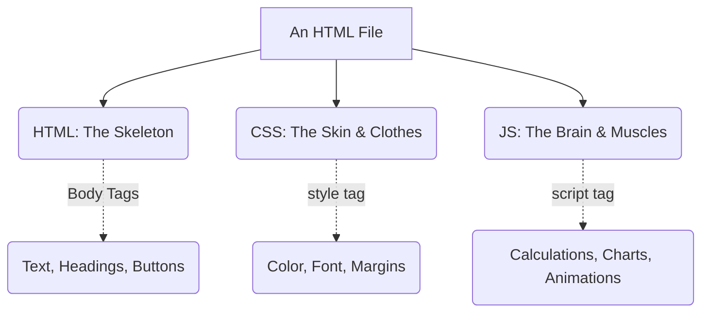

# 🌐 The Magic of HTML: Your Unlimited Canvas
### The HTML Canvas: Beyond Simple Data Visualization

[🏠 Back to Home](../../../README.md) | [Previous Lesson: Data Analysis with Python](13-data-analysis.md) | [Next Lesson: Automation with Python >](15-python-automation.md)

---

## 🛑 Word & PDF Belong to the Last Century!

You've analyzed your data with Python and have some numbers and figures. Now you want to submit them to your professor.
What's the traditional way? Copying everything into a Word file, creating a dull table, and converting it to a PDF.

**But what if I told you that you could turn your homework, lab report, or project into a "live application"?**
A file where your professor can hover over charts, change numbers to see live results, and that looks like a modern website from a tech company (like Apple or Google)!

The secret to this is using the **HTML** format.
You're not going to become a web designer; the AI writes all the code. You just need to understand the "anatomy" of this creature to know where to copy the code the AI gives you.

---

## 🦴 The Anatomy of an HTML File (The Three Musketeers)

Every webpage (or HTML file) is made of 3 different languages that work together like parts of a body. You don't need to memorize the code, just understand the concept:

1.  **The Skeleton (HTML):** This is the main structure. It tells the browser, "This is a heading," or "This is a button." Everything goes inside the `<body>` tag.
2.  **The Clothes & Look (CSS):** This makes your file look good. Colors, shadows, and curves are all handled by CSS. Its code usually goes inside the `<style>` tag in the `<head>` section of the file.
3.  **The Brain & Logic (JavaScript or JS):** This brings your page to life. If you want a chart to be drawn or a calculation to be performed (like relative error in a physics lab) when a button is clicked, this code goes inside the `<script>` tag.

> [!TIP]
> **The Golden Rule of the Web:**
> You don't need any special software to run an HTML file! Just paste the code into a simple text file (like Notepad or VS Code), save it with an `.html` extension, and **double-click** it to open it in your browser (like Chrome).

---

## 🚀 What Masterpieces Can We Create with HTML?

Don't think HTML is just for "web design." You can turn any university assignment into an interactive masterpiece. Here are 4 examples of things you can ask an AI to code for you:

### 1. "Live" Interactive Lab Reports
Imagine you have a physics lab report (e.g., measuring voltage and current).
Instead of drawing a table in Word, ask the AI to create an HTML file with fields to enter your numbers (V and I). With the click of a button, JavaScript can calculate the resistance (R) and the **relative error percentage**, and instantly draw a **linear regression chart (Best Fit Line)** using a library like `Chart.js`! (Your professor will be blown away).

### 2. Ultra-Professional Internship Reports and Documents
You can give the AI the text and images from your internship report and ask it to turn it into a super stylish web page using modern frameworks (like `Tailwind CSS`), complete with colorful cards, soft shadows, and beautiful typography. You can email this file directly to your professor.

### 3. Drawing Engineering Diagrams Without a Mouse (Mermaid.js)
If your project needs a flowchart, organizational chart, or a Gantt chart, you don't need heavy software like Visio. In an HTML file, using the `Mermaid.js` library, the AI can render precise and beautiful engineering diagrams for you just by writing text.

### 4. Creating Holographic Slides and Teleprompters (The Future of Presentations)
Did you know you can ditch PowerPoint? Using HTML files and the `Reveal.js` library, an AI can create 3D presentations with cinematic animations. You can even create a separate file to act as your "speaker notes" (a teleprompter) with a timer and font controls! *(This topic is so important that we've dedicated an entire chapter [Chapter 5] to it).*

---

## 🪄 The Magic Prompt: How to Get a Perfect HTML File from an AI

Sometimes, the AI gets lazy and gives you the HTML, CSS, and JS code in three separate files, which can be confusing for beginners to run.
To get a clean, ready-to-run output, **always use these constraints in your prompt:**

<table align="center" width="100%" border="0">
  <tr>
    <td width="100%">
      <b>🤖 Required Add-ons for Web Design Prompts:</b>  
      <code><b>[Technical Constraints]:</b></code> 
      <code>1. Deliver all code (HTML, CSS, JS) in <b>a single, unified file (Single File)</b>.</code> 
      <code>2. Do not use any external files (like local images). If you need icons, use FontAwesome (via a CDN link).</code> 
      <code>3. To draw charts, use reputable libraries (like Chart.js or Plotly.js) via a CDN link.</code> 
      <code>4. The application's appearance must be very modern, minimal, and include a Dark Mode.</code> 
      <code>5. Set the page font to a clean, sans-serif font (like 'Inter') and make sure the page direction is LTR (left-to-right).</code>
    </td>
  </tr>
</table>

### 🛠️ How to Run It in 3 Seconds:
1.  Copy the code generated by the AI.
2.  In VS Code (or even Notepad), create a new file named `project.html` and paste the code into it.
3.  Save the file.
4.  Double-click the `project.html` file. Your browser will open, and your custom application will be ready to use!

---

## 🏁 Wrapping Up the Technical Tools

So far, we've learned how to crunch data with **Python** and how to display it beautifully with **HTML**.

But Python isn't just for "calculations and statistics." Python can handle your repetitive daily tasks! (For example, automatically downloading 100 articles or renaming 500 files at once). In the next lesson, we'll dive into "automation" to see how Python can act as a personal robot assistant for us.

**[Next Lesson: Automation with Python (Letting the Machine Do Repetitive Work) 👉](15-python-automation.md)**

