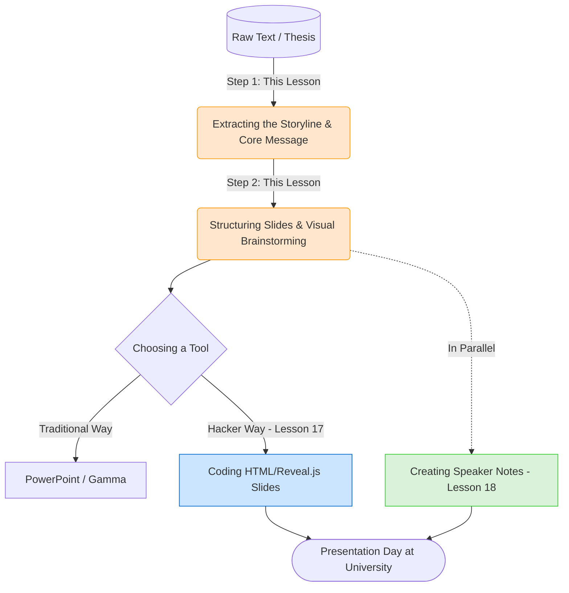

<div dir="ltr">
<div align="center">

# 🎤 Presentation Architecture: Crafting the Storyline Before Design
### Presentation Structure: Crafting the Storyline
[🏠 Back to Home](../../../README.md) | [Previous Lesson: Automation with Python](../04-technical-skills/15-python-automation.md) | [Next Lesson: Building Interactive Slides with HTML >](17-html-slides.md)

</div>

---

## 🛑 The Software Trap: Why Your Presentations Are Boring

Here's the biggest mistake students make: when they need to prepare for a defense or a seminar, **they immediately open PowerPoint!**
What's the result? They see a blank white page, panic, and start copying long paragraphs from their Word file into the slides. On presentation day, they just read the exact same text off the screen to the professor.

> [!WARNING]
> **The Golden Rule of Modern Presentations (TED Style):**
> Slides are for the **audience**, not for you to read from. If you're going to put all the text on the screen, you might as well just email the Word file to your professor. Why even present?
> Slides are meant to enhance your presentation, not be your presentation!

To create a flawless presentation, we separate the process. First, we're going to have AI act as a **"movie director"** and write the script for us.

---

## 🗺️ The Workflow: From Dry Text to the Main Stage

In this lesson and the next two, we will follow this engineered cycle:



---

## 🧠 Phase 1: Extracting the Storyline

AI is the best tool for summarizing information. Give your Word document (or the article you need to present) to the AI and ask it to turn it into a **"story."**

**Story Extraction Prompt:**
> `I've prepared this article/text for a 15-minute class presentation. I don't want to present it in a dry, academic way. Read my text and turn it into a "storytelling script" (TED Talk Style).`
> `Tell me: 1. What is a good hook to start with? 2. What is the main problem or conflict? 3. What is the climax (the key innovation of my research)?`

---

## 🏗️ Phase 2: Architecting the Slides (The Blueprint)

Now that we have the story, we need to tell the AI to break the text down into "slide blocks." This step is crucial because we are defining exactly "what needs to be seen on the screen."

> [!TIP]
> **The 6x6 Rule for Slides:** 
> Design standards suggest that a slide should have no more than 6 lines, and each line should have no more than 6 words. We will enforce this rule ruthlessly with our AI!

<details>
<summary><b>🔥 Open the Presentation Architect Prompt</b> <i>(Click here)</i></summary>

```text
[Role]
You are a senior designer of business and scientific presentations (a Presentation Architect) who creates presentations at the standard of Apple's keynotes (minimalist, impactful, no extra text).

[Task]
Based on the article text I provide, design a complete outline for a 10-slide presentation.

[Steps]
For each slide, give me these exact outputs:
1. Slide Number and Title (very short and catchy).
2. Main On-Screen Text: Only 3 keywords or one very short sentence (fewer than 10 words). Absolutely no paragraphs.
3. Visual Concept: Suggest what kind of image, color, or chart I should use on this slide to convey the message.
4. Shocking Statistic: If there is an important number in my text, suggest displaying it as a large headline for this slide.

[Constraints]
- Remember: A slide is for "seeing," not for "reading." The text on the slide must be kept to a bare minimum.
- Deliver the output in a neat table with the columns (Number, Title, On-Screen Text, Visual Concept).
```

</details>

---

## 🎨 Phase 3: Style and Theme (Visual Theme)

Besides content, AI can also give you design ideas (Design Direction).
Let's say your topic is **"Neural Network Security."** If you ask the AI to suggest a theme, you might get an output like this:

*   **Color Palette:** Deep black (background), neon blue (main text), and alert red (for the vulnerabilities section).
*   **Font Style:** Use sans-serif fonts like Inter or Vazirmatn to create a technological feel.
*   **Graphic Elements:** Use interconnected lines (like a network) in the background.

*(Note: We will use these same color ideas when we code our slides in the next lesson!)*

---

## 🎯 What's the Outcome of This Section?

By following the steps above, you now have **a complete table** in your hands.
You know exactly that you will have 10 slides, that slide three will have the number "52%" written in a large font, and that its background should be red.

**Now you have two paths forward:**
1.  **The Normal Path:** Open software like PowerPoint or websites like Gamma and manually build the slides based on this table.
2.  **The Cyborg Path:** Don't open any software at all! Inject this table into some HTML code and build the coolest, web-based presentation file of your life.

In this handbook, we're choosing the second path.

<div align="center">

**[Next Lesson: Building Interactive Slides with HTML (Death to PowerPoint) 👉](17-html-slides.md)**

</div>

</div>